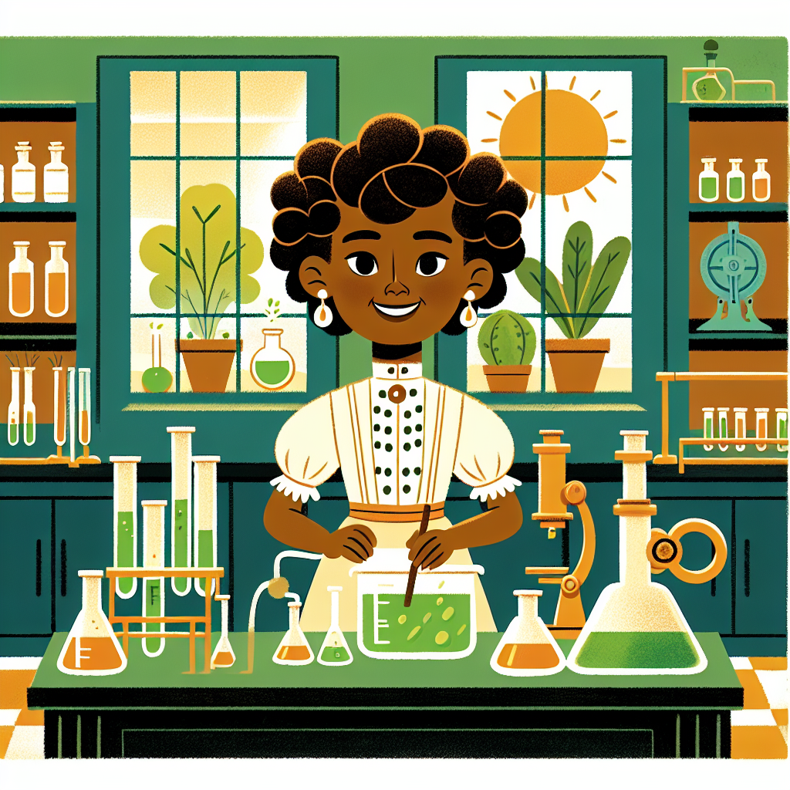

# The Brilliant Boffin Who Cracked the Leprosy Code!

Have you ever heard of leprosy? It's a disease that can cause terrible skin sores and damage nerves. For a long time, people struggled to find a cure. But one brilliant young scientist changed everything! 🔬

Her name was Alice Ball, and she was just 23 years old when she made an incredible discovery. By carefully experimenting with a special plant oil, she developed an injectable treatment that could actually heal leprosy's wounds. Imagine being that young and helping so many people!

Alice was born in 1892 and grew up in Seattle, Washington. Even as a child, she loved science and exploring how things worked. Little did she know, her curiosity would one day lead to a life-changing breakthrough! Let's dive in and learn all about Alice Ball's amazing story. 🌟

## The Big Idea

For centuries, people tried all sorts of remedies to treat leprosy, but nothing seemed to work very well. That's because leprosy is caused by a tough little bacteria that's really hard to get rid of.

Then in the early 1900s, scientists realized that the seeds from the chaulmoogra tree might hold the key. This exotic plant from Southeast Asia contained some very special oils that could fight the leprosy bacteria! But there was one big problem - the oils didn't dissolve properly in water or enter the body easily.

This is where Alice Ball came in. As a talented chemist at the University of Hawaii, she experimented with different ways to prepare the chaulmoogra oil. After months of careful tests, she discovered the perfect method - by adding it to a special fatty mixture, she could inject the oil directly and allow it to travel through the body.

Her innovative "Ball Method" finally gave doctors an effective way to deliver the healing powers of chaulmoogra oil to leprosy patients. Imagine their joy at having a real treatment at last!

## Hands-On Discovery

### Oil and Water Don't Mix! A Curious Experiment

You'll need:

- A clear glass or jar
- Water
- Vegetable or olive oil
- Food coloring (optional)

Safety first! This experiment is messy, so ask an adult before getting started. You'll also need their help with handling the glass container.

1. Fill the glass or jar about 3/4 full with water.
2. If using food coloring, add a few drops to the water and stir gently.
3. Now carefully pour in 2-3 tablespoons of oil.
4. Put the lid on and shake the container vigorously for 10-15 seconds.
5. Set it down and observe what happens!

What did you notice? The oil quickly separates from the water, forming those distinct blobs and layers. No matter how hard you shake them, the oil and water just don't want to mix together!

This is because water is made of tiny polar molecules that are attracted to each other, while oils consist of non-polar molecules that can't dissolve in water. It's like they're speaking completely different molecular languages!

Alice Ball faced a similar challenge with chaulmoogra oil. As a chemist, she had to find a way to evenly disperse those oil molecules so they could enter the body properly. Through her clever experiments, she discovered the fatty mixture solution that allowed the oil to be injected successfully.

### The Scientific Explanation

By adding the chaulmoogra oil to a special fatty liquid called "Oleic Acid Compound," Alice created what's called an "emulsion." This is a mixture where tiny droplets of oil are evenly suspended within the other liquid, almost like the way milk looks slightly cloudy.

Her "Ball Method" emulsion could then be safely injected into patients, gradually releasing the therapeutic oils throughout their bodies to fight leprosy more effectively than ever before!

## Fun Facts and Mind-Bogglers

- 🌳 The chaulmoogra tree is a type of evergreen that can grow over 100 feet tall! Its seeds were sometimes called "Ben nuts."

- 💊 Alice Ball's leprosy treatment was the most effective cure for over 20 years until modern antibiotics were developed.

- ⚗️ At just 24 years old, Alice became the first woman and first African American to receive a master's degree from the University of Hawaii.

- 🔢 There are over 200,000 new cases of leprosy detected around the world each year, mostly in India, Brazil, and Indonesia.

- 🧪 Chaulmoogra oil comes from the seeds, but the tree's leaves and roots were also used in traditional medicine to treat other diseases.

- 🥜 Fun fact: Chaulmoogra is sometimes called a "miracle tree" because the oil from its seeds was used for everything from leprosy to soap-making!

## Explorer's Challenge

Now that you've learned about Alice Ball's pioneering work, it's time to explore further!

- Research other diseases caused by bacteria and how they're treated.
- Find out what an "antibiotic" is and how it works.
- Look into the history of leprosy and how it impacted societies around the world.
- Discover more about emulsions and their uses in cooking, cosmetics, and other products.

Who knows, maybe one of you curious chemists will become the next great scientific pioneer!

## The Big Question

Alice Ball sadly passed away in 1916 at the young age of 24, before she could receive full credit for her brilliant leprosy treatment. But her remarkable legacy lives on, inspiring new generations of scientists and showing that amazing discoveries can come from anyone!

Just imagine - what if Alice hadn't been so curious and determined to find a solution? Thousands of lives might never have been transformed.

So here's the big question: What kind of curious adventure will you embark on? What problem will you try to solve? The world is waiting for the next Alice Ball! 🌎✨
