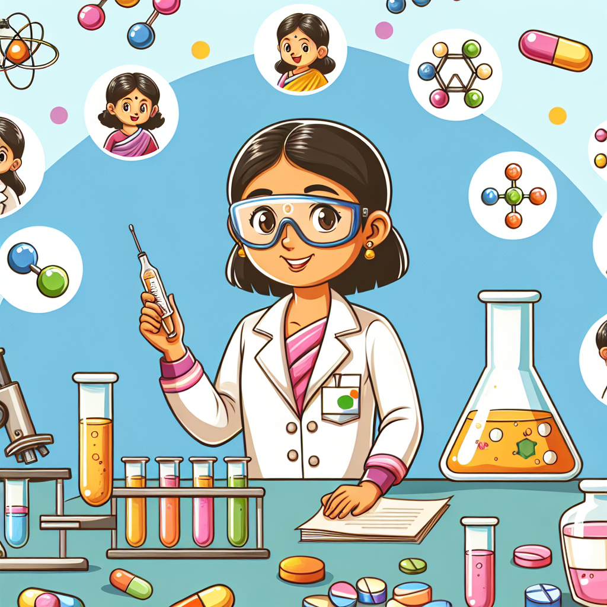

# The Medicine Maker: Asima Chatterjee's Tiny Healing Helpers! 🌿

## Let's Discover Something Amazing!

What if I told you that the plants in your garden could be used to make life-saving medicines? 🤯 That's exactly what the brilliant Indian scientist Asima Chatterjee uncovered through her pioneering work in phytochemistry - the study of chemicals from plants.

Can you imagine searching through hundreds of plants to find the special ingredients that could make people better? That's the incredible journey Asima took, and her discoveries helped develop treatments for deadly diseases like malaria and cancer. Talk about a real-life superhero!

## Time to Get Our Hands Dirty!

**Safety First!** Some plants can be poisonous, so we'll just be observing them for this activity. Ask an adult before touching any unfamiliar plants.

Let's go on a botanical treasure hunt and see if we can find evidence of phytochemicals around us!

**What You'll Need:**

- A small clear jar or zip-top bag
- Scissors or pruning shears
- Notebook and pencil

**Exploration Instructions:**

1. Head outside and look for different kinds of plants and trees.
2. Carefully snip off a small leaf or piece of the plant. Avoid anything sharp or prickly.
3. Place your sample in the jar or bag.
4. In your notebook, describe what the plant looks like and where you found it. Draw a picture too!
5. Keep collecting samples until your jar is full of plant diversity.

**What's Happening?**
The different colours, smells, and textures of the plants you collected are all clues about the unique phytochemicals inside them. Some give plants their vibrant pigments, others deter plant-eating insects, and many have incredible medicinal properties we are still discovering!

## Mind-Blowing Facts!

🤯 Did you know that over 25% of modern medicines are derived directly from plants or plant extracts?

🌿 The world's first antibiotic medication was made from a fungus that grows on mouldy cantaloupe!

💊 By studying plants from the Indian rainforests, Asima Chatterjee helped develop drugs to treat some of humanity's most devastating diseases.

👩🔬 Asima was not only one of India's most influential scientists but also the first woman to receive a Doctorate of Science from an Indian university.

## Your Turn to Explore!

Why do you think plants produce so many different chemicals? How might these special plant ingredients help keep plants healthy?

For your next botanical investigation, choose one of your collected samples and see what happens if you:

- Crush up part of the plant and smell it
- Mix a piece with a small amount of water
- Try tasting a tiny bit (with adult permission of course!)

Record your observations and think about how these properties might be useful for plant survival or human medicine.

## The Big Question

Asima Chatterjee's pioneering work showed us how many undiscovered healing powers might exist in nature. What other tiny mysteries could be waiting for the next generation of scientists and explorers to uncover?

There's a whole world of possibilities out there, waiting for curious minds like yours! What plant puzzle will you investigate next on your path of scientific discovery?
