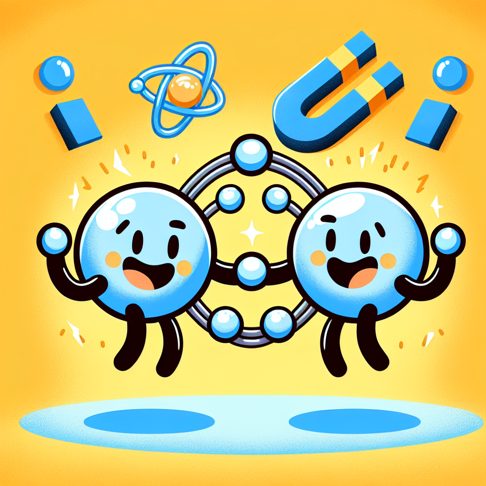

# The Sticky Secrets of Atoms

## A Tiny World of Wonders

# The Sticky World of Atoms: Nature's Building Blocks

Hey there, curious scientists! 🔬 Have you ever built something amazing with LEGO bricks? Well, guess what - everything in our world is built a bit like LEGO, but with pieces so tiny you can't even see them! These tiny pieces are called atoms, and today we're going to discover their super-cool sticky secrets!

## The Mystery Box Challenge

Before we dive in, let's try something fun! Get a box and put different objects inside - maybe a wooden block, a metal spoon, and a rubber ball. Without looking, can you feel how different they are? Some might feel hard, others soft, some smooth, others rough. But here's the mind-blowing bit - they're all made of atoms! The only difference is how these atoms stick together.

## Atoms: Nature's Tiniest LEGO

Imagine you're building a giant castle with LEGO. You need the bricks to stick together, right? Atoms work the same way! They have special ways of sticking together called 'bonds'. Let's meet these super-strong connections:

### The Best Friends Bond (Covalent Bonds)

Some atoms are like best friends who share everything. They hold hands so tightly that nothing can pull them apart! This is why diamond (made of carbon atoms holding hands super tight) is one of the hardest things on Earth.

### The Trading Partners Bond (Ionic Bonds)

Other atoms are like trading partners. One atom gives something to another, and they stick together because they both get something they want. It's like when you trade your sandwich for your friend's crisps - you both end up happy!

### The Party People Bond (Metallic Bonds)

In metals, atoms are like people at a party, sharing and passing things around. This is why metals can bend without breaking - their atoms are good at moving around while staying friends!

## Let's Be Scientists: The Magic Bouncy Ball Lab

🔬 **WARNING: Adult Scientists Required!**
This experiment needs a grown-up helper to keep everyone safe.

What you'll need:

- 1 cup of warm water
- 1 tablespoon of borax powder (ask your grown-up helper to handle this)
- 2 tablespoons of white glue
- Food colouring (if you want a colourful ball)
- Safety goggles
- Plastic gloves
- 2 mixing bowls
- Spoon for stirring

Safety First:

- Always wear safety goggles and gloves
- Never touch borax with bare hands
- Keep materials away from your mouth
- Wash hands after the experiment

Steps:

1. Put on your safety gear - you're now a proper scientist!
2. Ask your grown-up helper to mix the warm water and borax in one bowl
3. In the other bowl, mix the glue and food colouring (if using)
4. SLOWLY pour the borax mixture into the glue while stirring
5. Watch as the mixture turns into a ball!
6. Gently knead your creation (with gloves on)

What's happening? You've just created a polymer - lots of atoms holding hands in long chains. That's what makes your ball bouncy!

## Mind-Blowing Atom Facts

- If you enlarged an atom to the size of our planet Earth, its nucleus (the centre bit) would only be the size of a football stadium!
- There are more atoms in one teaspoon of water than there are teaspoons of water in all the oceans of Earth!
- Scientists are still discovering new ways that atoms can stick together

## Become an Atom Detective

Look around your room. Can you spot:

- Something hard (like wood or metal) where atoms are holding hands very tight?
- Something soft (like your teddy) where atoms are holding hands more loosely?
- Something that changes shape (like your clothes) where atoms can slide past each other?

## The Big Question

Scientists are always asking questions, so here's one for you: If everything is made of atoms, why do different things feel so different? Think about it, talk about it with your friends, and maybe do some experiments of your own to find out!

Remember: The next time you build with LEGO or play with friends who stick together, you're acting just like atoms do - creating something amazing by joining together!

---

Happy experimenting, young scientists! 🔬✨

_Safety Note for Grown-ups: Please supervise all experiments. Ensure proper safety equipment is used and maintain good ventilation during the bouncy ball experiment._

