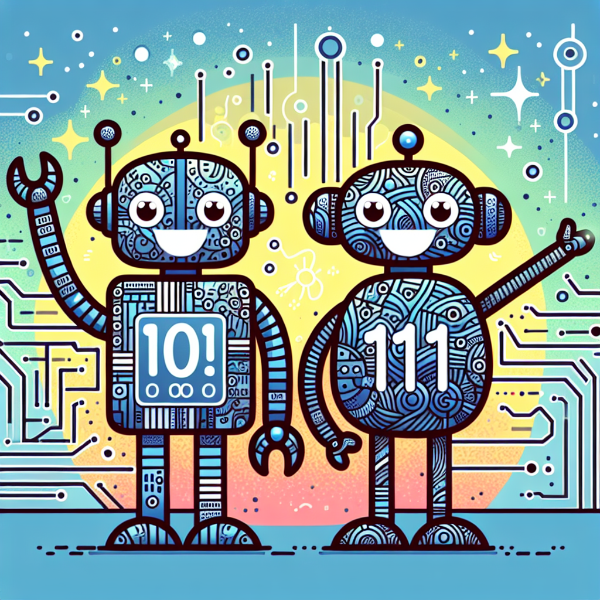

# Binary Bonanza: The Secret Code that Powers Our Gadgets! 🤖

## Let's Discover Something Amazing!

Have you ever thought about how your computer, phone, or game console works? It's almost like magic, isn't it? 🪄 Well, get ready to uncover the secret behind this wizardry – it's called binary code, and it's the hidden language that makes all our favourite gadgets come alive!

Imagine you're playing a video game, and your character needs to jump over a gap. When you press the jump button, your console instantly understands what you want it to do. But how? That's where binary code comes in! 💻🔢

## Time to Get Our Hands Dirty!

Now, it's time to become a real coding wizard! Let's try a simple experiment to see binary code in action.

### Materials Needed:

- 8 plastic cups or containers
- 8 small objects (like marbles, beads, or coins)

### Safety First:

- Be careful not to trip over the cups or choke on the small objects.
- Adult supervision is recommended for this activity.

### Step-by-Step Instructions:

1. Line up the 8 cups in a row.
2. Decide on a number between 0 and 255 (don't tell anyone yet!).
3. Convert your number into binary code by placing a small object in the cups that represent a 1, and leaving the cups empty for 0s.
4. Ask a friend or family member to decode your binary code and guess your number!

For example, if your number is 10, the binary code would be 00001010 (with objects in the 3rd and 4th cups from the right).

### What's Happening?

In binary code, each cup represents a different value (1, 2, 4, 8, 16, 32, 64, or 128). By placing objects in specific cups, you're creating a combination that represents your chosen number. Computers use billions of tiny switches (like our cups) to store and process information using binary code!

## Mind-Blowing Facts!

🤯 Did you know that the first computer programmer was a woman named Ada Lovelace, back in the 1800s? She wrote the first algorithm intended for a computer – talk about a coding pioneer!

🔢 The word "binary" comes from the Latin word "binarius," which means "consisting of two." In binary code, there are only two digits: 0 and 1!

📚 If you gathered all the books ever written and converted their text into binary code, you could store it all on just a few modern hard drives! Binary code is incredibly efficient at storing information.

## Your Turn to Explore!

Now that you've unlocked the secrets of binary code, why not try these challenges?

🔍 Look around your home and see if you can spot any devices that use binary code (hint: almost everything with a microchip!).

✏️ Create your own secret binary code messages and challenge your friends to decode them.

🧪 Experiment with different ways of representing binary code, like using colored blocks or even your own body movements!

## The Big Question

Isn't it amazing how something as simple as 0s and 1s can power all the incredible technology we use every day? 💻🤩 What other fascinating coding concepts would you like to explore next? Share your thoughts and let's keep this binary bonanza going!
