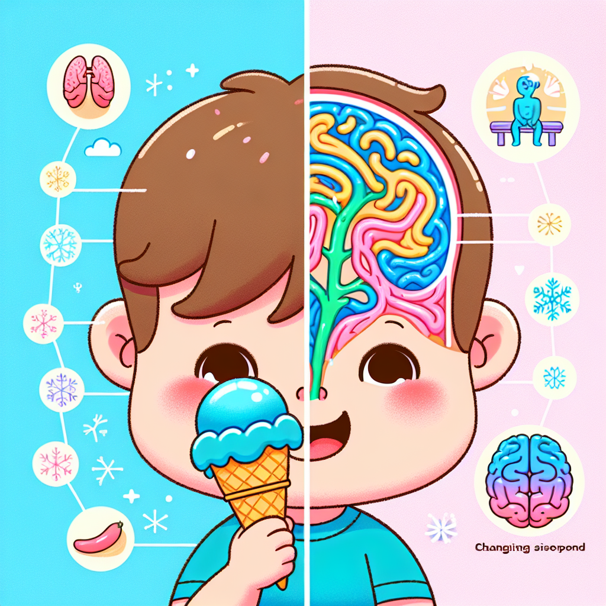

# Brain Freeze Mysteries: The Chilly Science Behind Ice Cream Headaches!

## Ouch! Why Does My Ice Cream Hurt My Head?

Have you ever been happily enjoying a delicious ice cream on a hot summer's day when suddenly—OUCH!—a sharp pain shoots through your head? That's brain freeze! 🧠❄️ It happens so quickly, doesn't it? One moment you're enjoying your favourite frozen treat, and the next you're squeezing your eyes shut waiting for that strange headache to go away.

But wait a minute... how can something so yummy cause something so ouchy? And why does it happen only when we eat cold things? Is your brain actually freezing? Don't worry—your brain isn't turning into an ice cube! There's some fascinating science behind this chilly mystery, and we're going to explore it together!

## The Big Idea: What's Really Happening in Your Head?

When you bite into an ice lolly or slurp a cold milkshake, the cold temperature touches the roof of your mouth (that's called your palate). But here's the cool part—right behind the roof of your mouth runs a super important blood vessel called the anterior cerebral artery. This blood vessel carries blood to your brain to keep it happy and working properly.

When something very cold touches the roof of your mouth, this blood vessel reacts quickly! It first narrows (scientists call this "constriction") and then suddenly widens (or "dilates"). This quick change sends a pain signal to your brain through something called the trigeminal nerve—which is like a messaging superhighway for your face.

Your brain gets confused! It thinks the pain is coming from your forehead (even though the cold is in your mouth), and that's why you feel that ice cream headache right between your eyes. Clever scientists call this "referred pain"—when you feel pain in one place even though the actual cold sensation is somewhere else!

### Did You Know?
* Brain freeze typically lasts only 20-30 seconds, though it might feel much longer!
* Not everyone experiences brain freeze—about 30% of people never get it!
* Animals like dogs can get brain freeze too when they eat cold things too quickly!
* The scientific name for brain freeze is "sphenopalatine ganglioneuralgia" (try saying that five times fast!)
* Brain freeze might actually be your body's clever way of protecting your brain from getting too cold too quickly!

### Science Spotlight: The Frozen Discoveries of Dr. Joseph Hulihan
In 1997, a scientist named Dr. Joseph Hulihan published the first proper scientific paper about brain freeze! Before his work, many people thought brain freeze was just something made up or not worth studying. Dr. Hulihan showed that these "ice cream headaches" were real and helped other scientists understand how our bodies respond to sudden cold.

His research is still important today because it helps doctors understand other types of headaches, like migraines. During the recent COVID-19 pandemic, his work even helped scientists studying how some viruses might affect our body's temperature control systems. What's really interesting is that Dr. Hulihan didn't start out planning to study brain freeze—he was actually researching other types of headaches when he made this cool discovery!

## Hands-On Discovery: The Brain Freeze Experiment

Want to see how temperature affects blood vessels? Let's try a safe experiment that shows something similar to what happens during brain freeze!

**Safety Warning**: This experiment uses hot water, so adult supervision is absolutely required!

### Materials You'll Need:
* A clear glass or jar
* Cold water
* Hot water (not boiling—just warm tap water is fine)
* Food colouring
* A spoon

### Steps:
1. Fill the glass halfway with cold water
2. Add 2-3 drops of food colouring to the cold water and stir gently
3. Very carefully and slowly, pour hot water down the side of the glass (ask an adult to help!)
4. Watch what happens to the coloured water

### What You Should See:
The coloured cold water will stay at the bottom while the clear hot water floats on top. But at the boundary where they meet, you'll see the coloured water moving up in thin streams into the hot water.

### The Science Behind It:
When liquids (or blood vessels) change temperature, they also change how they move. Cold liquids are denser and move slower, while warm liquids move faster and rise up. In your mouth, the blood vessels respond to sudden cold by first narrowing (like the cold water staying put) and then quickly expanding (like the coloured water streaming upward). This rapid change is what triggers the pain signals in brain freeze!

This experiment shows how temperature affects movement in liquids, which is similar to how temperature affects your blood vessels during brain freeze—though the actual mechanism in your body is more complex and involves nerves responding to the temperature change.

## Fun Facts and Mind-Bogglers

* If all the nerve fibres that detect cold in your mouth were laid end to end, they would stretch longer than a football pitch!

* Your brain itself cannot feel pain—it has no pain receptors! The pain of brain freeze comes from the blood vessels and nerves around your brain, not your actual brain tissue.

* The world record for eating ice cream is 16.5 pints in 6 minutes! That's enough to give anyone a massive brain freeze!

* Scientists studying brain freeze have discovered treatments that might help people who suffer from migraine headaches. Sometimes, studying something silly can lead to serious medical breakthroughs!

## Explorer's Challenge

Ready to become a brain freeze scientist? Try these activities:

1. **The Brain Freeze Journal**: Next time you eat something cold, try to notice exactly when the brain freeze starts. How long did it take? How long did it last? Does it happen with all cold foods or just some?

2. **The Warming Test**: When you get brain freeze, try pressing your tongue against the roof of your mouth. Does the warm tongue help the pain go away faster? Why do you think this works?

3. **The Temperature Detective**: Using different frozen treats (ice lolly, ice cream, slushie), which one causes brain freeze fastest? Why might that be?

4. **Brain Freeze Prevention**: Can you invent a way to enjoy ice cream without getting brain freeze? Draw your invention and explain how it works!

## The Big Question

Now that you know the science behind brain freeze, think about this: our bodies are constantly sending us signals about the world around us. Sometimes these signals, like pain, seem annoying—but they often have important jobs to do! Brain freeze might actually be protecting your brain from sudden temperature changes.

What other "annoying" things might our bodies do that are actually helping us? Could yawning, sneezing, or even hiccups be secret superheroes in disguise? The next time you get brain freeze, remember—your body is doing some amazing science, right inside your head!

So go ahead and enjoy that ice cream... just maybe take smaller bites! 😊
