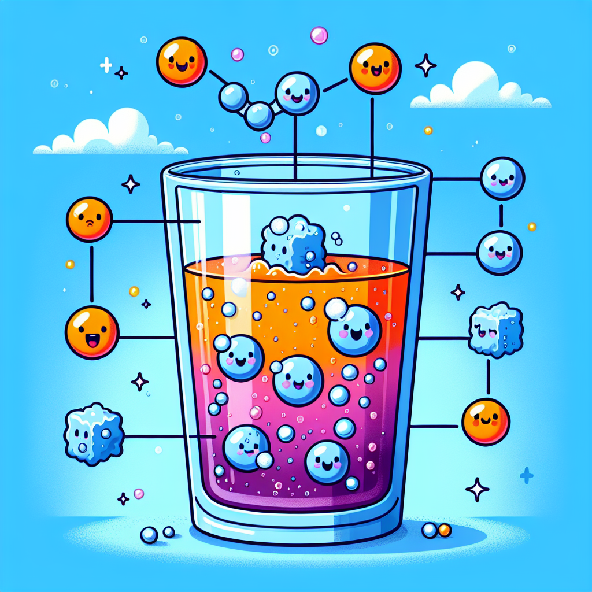

# Bubble Trouble: The Fizzy Science Behind Your Favourite Drinks!

## Let's Discover Something Amazing!

Have you ever wondered why fizzy drinks make that exciting *psssssst* sound when you open them? Or why they tickle your nose when you take a sip? 🥤 Perhaps you've noticed how bubbles race to the top of your glass like tiny underwater rockets! These bubbly beverages are hiding an amazing scientific secret right under our noses (quite literally!). 

Every time you enjoy a fizzy lemonade or a glass of sparkling water, you're actually holding a fascinating science experiment in your hand! Those magical bubbles that dance and pop are the result of something called carbonation—a special process that combines ordinary water with an extraordinary gas. Today, we're going to uncover the bubbling mysteries behind your favourite fizzy drinks and discover why they're so wonderfully... well, fizzy!

## The Big Idea: Carbonation Station

Imagine you could shrink down to the size of an ant and dive into a glass of fizzy lemonade. What would you see? You'd be surrounded by millions of tiny bubbles, all racing upward! These bubbles are actually made of a gas called carbon dioxide (or CO₂ for short).

Carbon dioxide is the same gas that we breathe out, and that plants use to make their food. But when it's trapped in a liquid under pressure, something magical happens!

Here are some fizz-tastic facts about carbonation:

1. A single glass of fizzy drink can contain billions of carbon dioxide bubbles!
2. Carbonated drinks stay fizzy longer in the fridge because cold liquids can hold more gas.
3. The first fizzy drinks were actually natural mineral waters from springs.
4. Those tingles you feel on your tongue are tiny bubbles popping and stimulating your taste buds.
5. Shaking a fizzy drink makes bubbles form faster because it helps the gas escape from the liquid.
6. The "pop" sound when opening a bottle is actually the pressure equalising as gas rushes out.

**Did You Know?** 
* The pressure inside an unopened bottle of fizzy drink can be three times higher than the pressure in your car tyres!
* Fish can actually get "bubble disease" if there's too much carbon dioxide dissolved in their water.
* Some deep-sea volcanic vents naturally create carbonated water on the ocean floor!

### Science Spotlight: Joseph Priestley's Sparkling Discovery

In 1767, a British scientist named Joseph Priestley made a brilliant discovery while living next to a brewery in Leeds. He noticed that gas produced during beer brewing would hover over liquid, and when he dissolved this gas in water, it created a refreshing drink! Priestley had invented artificially carbonated water—the grandfather of all modern fizzy drinks!

Priestley's work with gases didn't just give us tasty beverages. His research on different types of air (gases) helped us understand the atmosphere and breathing. Today, the same carbonation principles he studied are used in fire extinguishers and even in some modern medical treatments that help deliver medicines more effectively into the bloodstream. Interestingly, Priestley didn't start as a scientist at all—he was actually a minister and teacher who became curious about the natural world, showing that anyone with curiosity can make amazing discoveries!

## Time to Get Our Hands Dirty!

### Experiment: The Raisin Elevator

Let's watch carbon dioxide bubbles in action with this simple but fascinating experiment!

**Materials:**
* A clear glass
* Fizzy lemonade or sparkling water (clear is best for observing)
* A handful of raisins
* A spoon

**Safety Note:** This experiment is safe, but please have an adult help with pouring if you're using a large bottle of fizzy drink.

**Steps:**
1. Pour the fizzy drink into the clear glass, filling it about three-quarters full.
2. Observe the bubbles in the drink. What do they look like? Where do they go?
3. Drop a few raisins into the glass and watch carefully.
4. Observe what happens to the raisins over the next few minutes.
5. Try different items like pasta pieces or small pieces of fruit to see if they behave the same way.

**What You'll See:**
The raisins will sink to the bottom at first, but then something magical happens! They'll start dancing up and down in the glass, rising to the surface and then sinking again in a continuous cycle.

**The Science Behind It:**
Raisins have a wrinkly surface with tiny nooks and crannies. Carbon dioxide bubbles from the fizzy drink attach themselves to these rough surfaces (this is called "nucleation"). As more bubbles collect on the raisin, they act like tiny life jackets, making the raisin buoyant enough to float to the surface. When the raisin reaches the top, the bubbles pop and release their gas into the air. Without its bubble "life jackets," the raisin sinks back down, and the cycle begins again!

This is actually similar to how scuba divers control their buoyancy underwater with their diving vests—adding air makes them rise, releasing air makes them sink!

## Mind-Blowing Facts!

* If you could collect all the carbon dioxide from a 2-litre bottle of fizzy drink, it would fill a balloon about 5 times larger than the bottle itself!

* The bubbles in fizzy drinks actually grow as they rise to the surface. They start microscopically small at the bottom (smaller than a grain of sand) and can grow to be 30 times larger by the time they reach the top!

* Astronauts can't drink normal fizzy drinks in space! Without gravity, the bubbles don't rise to the top, so they just mix with the liquid in your stomach, causing uncomfortable bloating.

* The world's largest fizzy drink fountain created a soda geyser that reached over 10 metres high—that's taller than a double-decker bus standing on top of another double-decker bus!

## Your Turn to Explore!

### Explorer's Challenge: Become a Fizz Wizard!

1. **Fizz Race:** Get different brands of fizzy drinks (with adult permission). Pour them into identical glasses at the same time. Which one loses its fizz fastest? Why do you think that happens?

2. **Temperature Test:** Pour the same fizzy drink into three glasses: one with ice, one at room temperature, and one that's been warmed slightly. How does temperature affect how quickly the drinks lose their bubbles?

3. **Bubble Catcher:** Can you design a device to capture the carbon dioxide gas from a fizzy drink? (Hint: Think about using a balloon, a bottle, and some tubing!)

4. **Questions to Ponder:** 
   * Why do some drinks seem fizzier than others?
   * What happens to a fizzy drink left open overnight?
   * Could you re-carbonate a flat drink at home?

## The Big Question

The next time you hear that satisfying *psssst* when opening your favourite fizzy drink, remember the amazing science happening right in your glass! Carbon dioxide gas, dissolving under pressure and then escaping in millions of tiny bubbles, creates that magical experience we call carbonation.

But here's something to think about: scientists are constantly inventing new types of drinks with different flavours and even different kinds of bubbles. What kind of fizzy drink would you invent if you could? Would it have super-sized bubbles or tiny ones? Would the bubbles taste of something special? Would they change colour or make funny sounds?

The wonderful world of fizzy science is just waiting for the next generation of curious minds—like yours—to make the next big bubbly breakthrough
