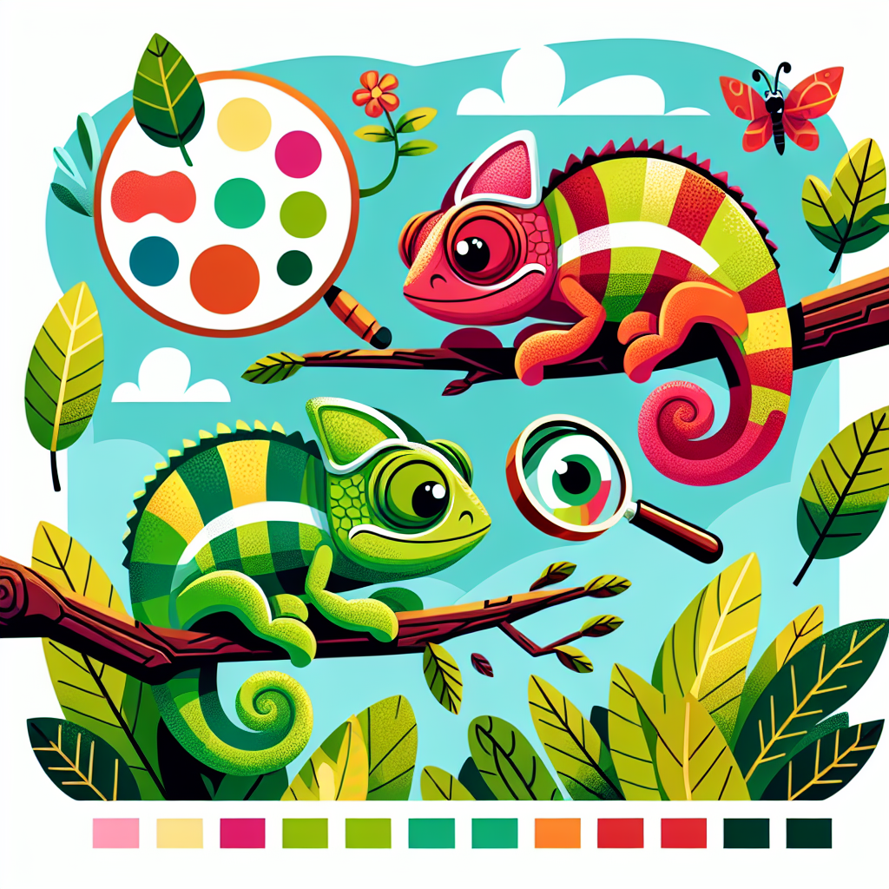

# Chameleons' Colour-Changing Capers: A Rainbow Reptile Riddle!

## Let's Discover Something Amazing!

Have you ever seen a chameleon? 🦎 These quirky little lizards are famous for their incredible ability to change colour right before our eyes! But how do they do it? Is it some kind of magic trick? 🎩✨

Well, grab your goggles and lab coats, because we're about to go on a colourful adventure to uncover the secrets of these master camouflage artists. Get ready to be amazed by the bonkers biology behind chameleons' kaleidoscopic wardrobe changes!

## Time to Get Our Hands Dirty!

Before we dive into the science, let's try a fun experiment to see colour-changing in action. Here's what you'll need:

### Materials

- A white cabbage or red cabbage (ask a grown-up to help with the cutting)
- A pot or bowl
- Water
- A small clear cup or jar
- White vinegar or lemon juice

### Safety

- Be careful when using knives or handling hot water. Ask a parent or teacher for help.

### Let's Go!

1. Tear up some cabbage leaves into small pieces and put them in the pot or bowl.
2. Pour just enough water over the cabbage to cover it.
3. Bring the water to a boil (with an adult's help), then let it cool down a bit.
4. Once cooled, pour some of the purple cabbage water into your clear cup or jar.
5. Now for the magic! Add a few drops of vinegar or lemon juice and watch what happens. 🧪🌈

Did you see the cabbage water change colour? That's because of the same amazing chemical process that allows chameleons to shift their hues. Isn't science awesome?

## Mind-Blowing Facts!

- 🦎 Chameleons don't actually change colour to camouflage themselves from predators. The colour changes are mostly used to communicate with other chameleons!
- 🌡️ Their colour can also change based on temperature, light conditions, and even their mood!
- 🔍 Chameleons have specialised cells called chromatophores that contain different pigments. By contracting or relaxing these cells, they can mix and match colours like a tiny reptilian artist.
- 🥇 The record for the most colour changes in one minute goes to the panther chameleon, which can shift through 200 different shades!

## Your Turn to Explore!

Now that you know the basics, why not try some more colour-changing fun?

- 🎨 Make your own "chameleon" by mixing different food colourings or paints. Can you create new colours by blending them together?
- 👀 Go on a nature walk and see if you can spot any animals or plants that use camouflage to blend in with their surroundings.
- 🌳 Try the cabbage experiment again, but this time use different liquids like baking soda or vinegar to see how the colours change.

## The Big Question

Isn't it amazing how nature can pull off such incredible tricks? Chameleons' colour-changing abilities are just one example of the countless wonders waiting to be discovered in the world around us. So, what other mind-boggling mysteries do you think are out there, just waiting for a curious explorer like you to unravel them? 🕵️‍♀️

Happy investigating, and remember: the greatest adventures often start with the simplest questions!
