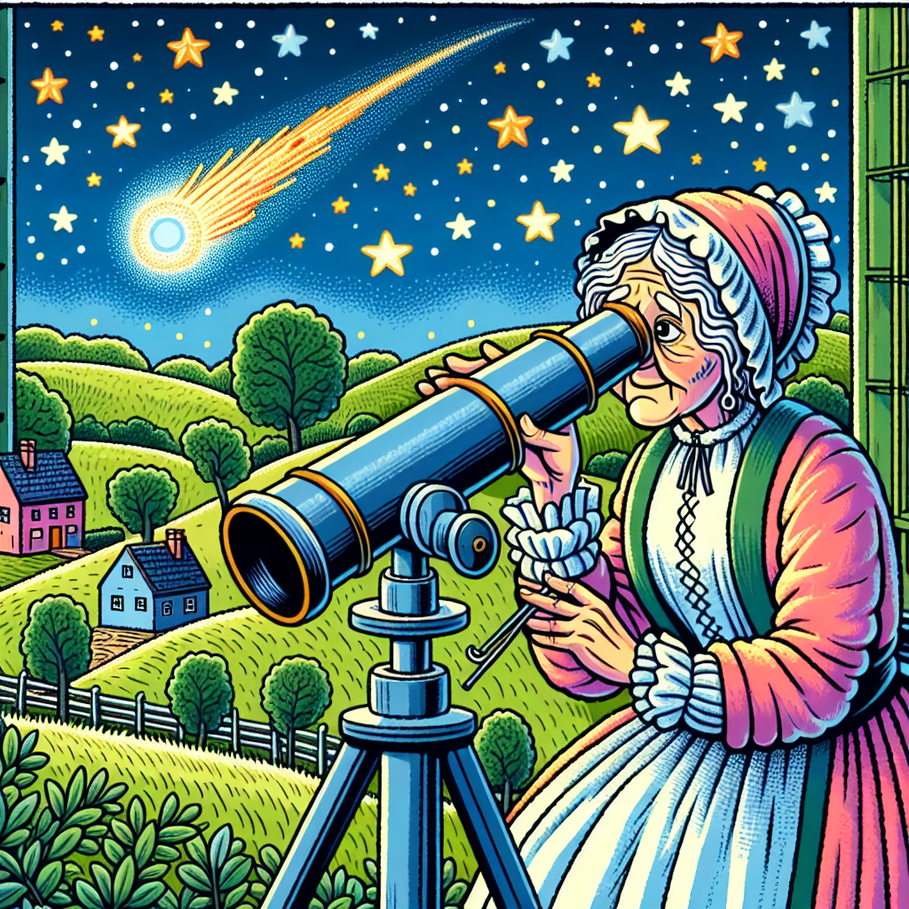

# Caroline Herschel: The Comet-Hunting Queen of the Night Sky 🌠

## Let's Discover Something Amazing

Have you ever looked up at the night sky and wondered what's really out there? 🤔 Well, one woman spent her entire life exploring the cosmos and making incredible discoveries - her name was Caroline Herschel, and she was an absolute star!

Back in the 1700s, before telescopes were a thing, Caroline used to gaze at the twinkling sky just like you. But her curiosity took her much further than anyone could have imagined. With her brilliant mind and a little help from her brother William, she became the first woman to be paid for her contributions to science. How awesome is that?

## Time to Get Our Hands Dirty

Tonight, let's step into Caroline's shoes and try some stargazing of our own! Here's what you'll need:

- 🔭 A telescope or binoculars (if you don't have one, no worries - your eagle eyes will do!)
- ✏️ A notebook and pencil
- ⭐ A starry night (check the weather forecast!)

Safety tips:

- Always have an adult with you when going outside at night
- Never look directly at the sun through a telescope or binoculars

Now, follow these steps:

1. Find a dark spot away from bright lights
2. Give your eyes 10-15 minutes to adjust to the darkness
3. Scan the sky slowly and make notes of anything interesting you see
4. See if you can find any shooting stars or moving lights (they could be comets or asteroids!)
5. For an extra challenge, try sketching the positions of the stars and planets

What did you observe? Comets are made of ice, dust and rocks, and they orbit the sun in long, oval paths. As they get closer to the sun, they heat up and develop a glowing tail. This tail is what makes them so easy to spot!

## Mind-Blowing Facts

🤯 Did you know that Caroline Herschel discovered 8 comets in her lifetime? That was more than any other woman until the late 20th century!

🤩 One of the comets she found was so amazing that it was named "Comet Herschel" in her honor. How cool is that?

👀 With her skilled eyes and telescope, Caroline was also the first person to see the Andromeda Galaxy and realize it was its own separate galaxy, millions of light years away!

🔭 Caroline didn't just observe the night sky - she was incredibly skilled at building telescopes too. In fact, she helped her brother William construct some of the largest telescopes of their time.

## Your Turn to Explore

Now that you're an official comet-hunting cadet, here are some challenges to take your astronomy adventures even further:

🕵️ Be a night sky detective! Keep a log of your observations over several nights or weeks. Can you spot any patterns or moving objects?

📝 Research famous comets throughout history and create fun fact cards about them.

✏️ Design your own comic strip about Caroline Herschel's life and discoveries.

🛠 If you're feeling really handy, try building your own telescope or model of the solar system!

## The Big Question

Caroline Herschel was a true pioneer who opened up the universe for all of us to explore. But her story makes me wonder - what other brilliant minds are out there right now, searching for answers to life's biggest mysteries? Maybe you'll be the next great astronomer or scientist to help unravel the secrets of the cosmos! How will you leave your mark on the night sky?

