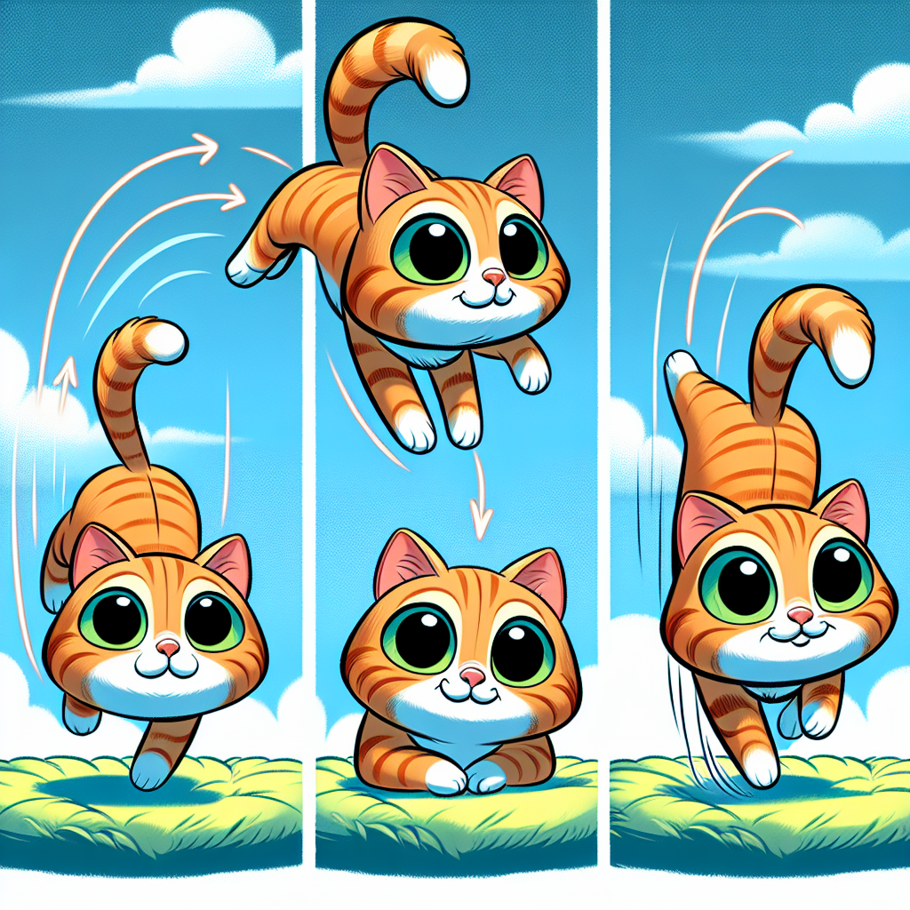

# The Amazing Cat Flip: How Our Feline Friends Defy Gravity!

## Have You Ever Wondered?

Have you ever watched a cat fall and noticed something incredible? Whether they slip off the sofa or jump from a bookshelf, cats almost always land perfectly on their feet! 😮 It's like they have a superpower! But how do they do it? Is it magic, or is it science? 

This amazing ability has puzzled humans for centuries. Even when dropped upside-down (which you should NEVER try at home!), a cat can twist its body in mid-air and land safely on its paws. Imagine if you could do that on the trampoline or in the swimming pool! Today, we're going to uncover the fascinating science behind this feline superpower.

## The Big Idea: Cat Acrobatics Explained!

Cats are nature's perfect gymnasts! Their ability to land on their feet is called the "righting reflex," and it's something they're born with. Kittens start showing this amazing skill when they're just 3-4 weeks old, and by 7 weeks, they've mastered it completely!

Here are some fascinating facts about this cat superpower:

1. Cats have an incredible inner ear system that works like a built-in balance detector, telling them which way is up, even when they're spinning through the air!
2. A cat's spine has 30 vertebrae (the small bones that make up the backbone), while humans only have 24. This gives cats extraordinary flexibility.
3. Cats can rotate the front half of their body independently from the back half—imagine if you could turn your shoulders one way while your hips stayed facing another direction!
4. They can rotate up to 180 degrees in just 0.1 seconds. That's faster than you can blink!
5. Cats use their tails as balancing tools, but even cats without tails can usually land on their feet!
6. This ability works best when cats fall from heights of at least 30 centimetres, giving them enough time to complete their twist.

**Did You Know?** Scientists once attached cameras to falling cats (in safe, controlled experiments) to study exactly how they moved. The footage showed that cats don't actually "push off" anything to flip over—they create the turning motion just by changing their body shape!

### How the Cat Flip Works

When a cat begins to fall, several amazing things happen in sequence:

First, the cat's inner ear balance system (called the vestibular apparatus) instantly detects that something's wrong. Think of it like a super-sensitive spirit level inside their head that sends alarm signals when they're not right-side up!

Next, the cat bends in the middle and twists its front paws toward the ground. Because of their flexible spine, cats can bend their bodies much more than we can. Imagine being able to touch your toes without bending your knees—cats can do even more extreme moves!

Then, the cat tucks in its front legs and extends its back legs, which causes the back end to rotate. It's a bit like when figure skaters pull in their arms to spin faster, then extend them to slow down.

Finally, the cat extends all four legs to prepare for landing, using their legs as shock absorbers—like tiny, furry landing gear!

### Science Spotlight: The Falling Cat Problem

In 1894, a French scientist named Étienne-Jules Marey became one of the first people to study the cat-righting reflex scientifically. He used a special camera that could take 60 photographs per second to capture the exact movements of falling cats. His work was revolutionary because it showed that cats weren't breaking the laws of physics—they were using them cleverly!

Marey's photographic techniques later helped scientists understand not just animal movement but also human movement. Today, similar high-speed photography helps doctors understand how our bodies move when we're injured, which has led to better treatments for people who have accidents. His work reminds us that sometimes studying animals can help us learn about ourselves too!

## Hands-On Discovery: Be a Cat Scientist!

### The Towel Twist Test

Let's investigate how cats twist without pushing against anything. This activity demonstrates the same physics principle that cats use!

**Safety Note:** This activity involves spinning. Make sure you have plenty of space and are not dizzy or unwell before starting.

**Materials:**
- A swivel chair that spins
- A heavy book or small weight
- Adult supervision

**Steps:**
1. Sit on the swivel chair with your feet off the ground, holding your arms straight out to the sides.
2. Ask an adult to gently spin you slightly.
3. While spinning, pull your arms in close to your body (like hugging yourself).
4. Then extend your arms out wide again.
5. Repeat a few times, observing what happens to your spinning speed.

**Expected Results:**
When you pull your arms in, you should spin faster. When you extend them, you slow down.

**The Science Behind It:**
This demonstrates the conservation of angular momentum—the same principle cats use! When a cat tucks in parts of its body, those parts spin faster, and when it extends others, it can control which direction different parts of its body face. The cat doesn't need to push against anything to change its orientation—just like you didn't need to touch anything to change your spinning speed!

### The Flexible Spine Model

**Materials:**
- A pipe cleaner or bendy straw
- Small balls of modelling clay or blu-tack
- Paper

**Steps:**
1. Bend the pipe cleaner or straw into an arch shape (like a cat's back).
2. Attach small clay balls at both ends to represent the front and back of the cat.
3. Hold the middle of the pipe cleaner and try to twist one end while keeping the other still.
4. Now try twisting both ends in opposite directions.

**Expected Results:**
You'll notice how the flexible middle allows different movements at each end—just like a cat's spine!

**The Science Behind It:**
Cats' super-flexible spines allow them to twist their front half independently from their back half. This is crucial for their righting reflex. Human spines are much stiffer, which is why we can't perform the same mid-air acrobatics!

## Fun Facts and Mind-Bogglers!

- If a cat falls from a very great height (please remember, NEVER test this!), they actually spread their legs out like a flying squirrel to increase air resistance and slow their fall.

- Cats can survive falls from incredible heights—sometimes even better from higher falls than shorter ones! This is because they have more time to prepare their landing position and reach their terminal velocity (maximum falling speed).

- The world record for a cat surviving a fall is 32 stories high! A cat named Sabrina fell from a New York apartment building and survived with only minor injuries. That's like falling from a building taller than 100 metres!

- A cat's legs can absorb impact forces up to 60 times their weight when landing. That would be like you jumping off a building and landing without getting hurt!

## Explorer's Challenge

1. **Cat Watch:** If you have a cat at home (or can visit someone who does), observe how it jumps and lands. Does it always land on its feet? How does it prepare before jumping? (Remember: NEVER drop or throw a cat to test this—just watch their natural movements!)

2. **Slow-Motion Scientists:** With an adult's help, use a smartphone's slow-motion video feature to record a toy being dropped. Can you see it tumble differently than a cat would? Why?

3. **Spine Comparison:** Look at pictures of human, cat, and dinosaur
