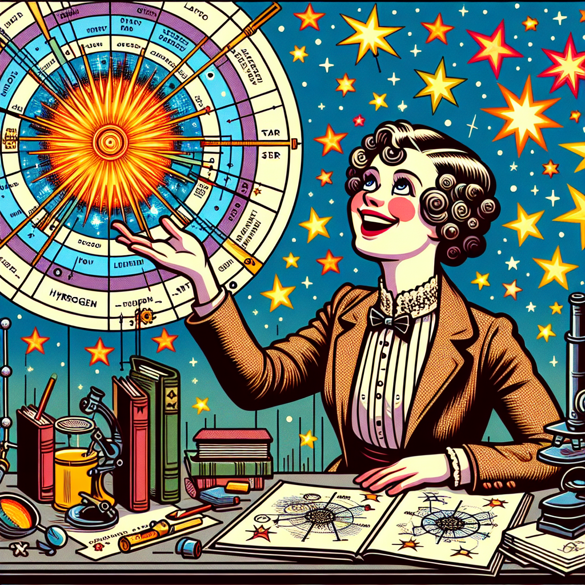

# The Curious Case of Star Colours 🔎

## Let's Discover Something Amazing!

Have you ever looked up at the night sky and noticed that stars come in different colours? Some shine bright white, others have a warm orange glow, and a few even appear bluish. But why is that? What makes the stars look so different?

One scientist was determined to find out. Her name was Cecilia Payne-Gaposchkin, and she became a star detective like no other! Let's follow the clues and see how she solved the mystery of stellar chemistry.

## Time to Get Our Hands Dirty!

To understand Cecilia's discovery, we need to do a little experiment ourselves. Here's what you'll need:

📋 **Materials**

- A few different light sources (torch, lamp, phone flashlight, etc.)
- Coloured cellophane or transparent sweet wrappers in different colours

🛑 **Safety Note:** Be careful with hot light bulbs and don't look directly into bright light sources.

📝 **Instructions**

1. Darken the room you're in by closing blinds/curtains.
2. Turn on one of your light sources and look at it closely. What colour does it appear?
3. Now cover the light with a coloured cellophane/wrapper. How does the colour change?
4. Try using different coloured filters over the light.

You should notice that the filters make the light look like it's a different colour altogether! This is because the filters only allow certain colours of light to pass through while blocking others.

🔍 **What's Happening?** Light is made up of a rainbow of different colours (wavelengths). When we see a red light, it means that source is giving off (emitting) mostly red wavelengths. The coloured filters work by only letting through the wavelengths that match their colour.

## Mind-Blowing Facts!

- 🤯 Stars are made up of incredibly hot gases, just like the lights we experimented with.
- 💡 Different elements in stars (like hydrogen and helium) emit different colours of light.
- 🌄 That's why we see stars as different colours - it depends on what elements they contain!

## Your Turn to Explore!

Now that you're a star colour detective too, try these challenges:

🕵️‍♀️ Use different combinations of coloured filters over your lights. Can you make new colours appear?

🔭 Go outside on a clear night and observe the colours of stars with the naked eye or binoculars. How many different colours can you spot?

⭐ Research what elements produce specific star colours. For example, blue stars have lots of oxygen!

## The Big Question

Cecilia Payne-Gaposchkin showed that most stars are made up of the same basic elements as Earth, just in different amounts and combinations. Isn't it amazing that we're all made of star stuff? What other cosmic mysteries could you help solve?

The universe is full of unanswered questions just waiting for curious kids like you to explore them! Who knows what you might discover...
