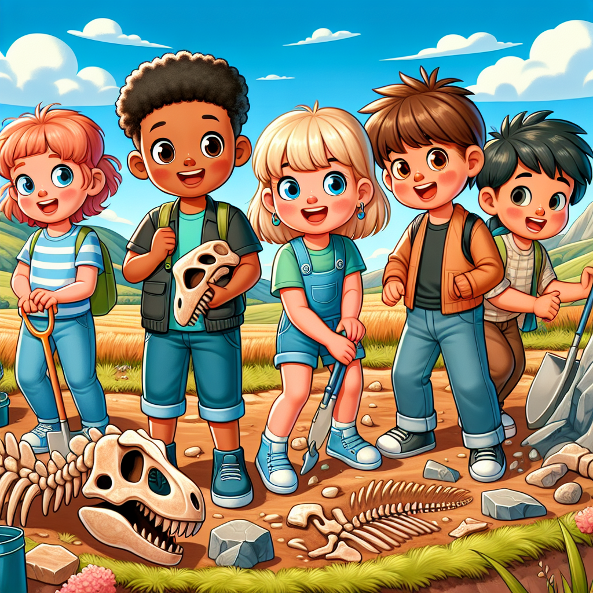

# The Mystery of Dinosaurs: Uncovering Nature's Giants 🦖

## Let's Discover Something Amazing!

Have you ever wondered what it would be like to travel back in time and meet real-life dinosaurs? 🕰️ These incredible creatures roamed our planet millions of years ago, and scientists are like dinosaur detectives, piecing together clues to unravel their mysteries! Just imagine – ginormous beasts taller than buildings, with teeth as big as bananas. How bonkers is that?

## Time to Get Our Hands Dirty!

Put on your explorer's hat and let's become **Dinosaur Detectives** for a day! For this experiment, you'll need:

* A large piece of paper or cardboard
* Pencils, crayons, or markers
* Plaster of Paris (you can find this at craft stores)
* A mixing bowl and spoon
* Water

🔍 **Safety Tip:** Ask a grown-up to help with this activity, and be careful not to get plaster in your eyes.

1. Draw your favourite dinosaur on the paper or cardboard. Get creative – give it cool patterns, spikes, or wings!
2. In the mixing bowl, combine the plaster of Paris with water, following the instructions on the package.
3. Pour the plaster mixture over your dinosaur drawing, spreading it evenly.
4. Let it dry completely (this may take a few hours or overnight).
5. Once dry, gently peel off the hardened plaster from the paper to reveal your very own dinosaur fossil print!

**What's Happening?** The plaster captured the shape of your drawing, just like how real fossils are formed when minerals replace the bones or imprints of ancient creatures over time. Pretty cool, right?

## Mind-Blowing Facts!

🤯 Did you know that the longest dinosaur was the Argentinosaurus, measuring a whopping 40 metres – that's longer than three double-decker buses!

🦴 Scientists have discovered over 700 different species of dinosaurs so far, and they're still finding more every year. Who knows what other bonkers beasts are waiting to be uncovered?

🌍 Dinosaurs lived on every continent, even Antarctica! Can you imagine a freezing, icy world filled with giant reptiles?

## Your Turn to Explore!

Now that you're an expert Dinosaur Detective, try these challenges:

* Research your favourite dinosaur and make a fact file about its size, diet, and any special features.
* Go on a fossil hunt in your backyard or local park (with an adult's permission, of course!). You might just uncover some ancient treasures.
* Design your own unique dinosaur species, complete with a cool name and description of its abilities.

## The Big Question

With so many incredible dinosaurs that once roamed our planet, which one would you most like to meet face-to-face? Just don't get too close to those sharp teeth! 😉

Remember, the more we explore and learn about these amazing creatures, the more we can appreciate the wonders of Earth's history. Who knows what other mind-blowing discoveries await us, Dinosaur Detectives?
