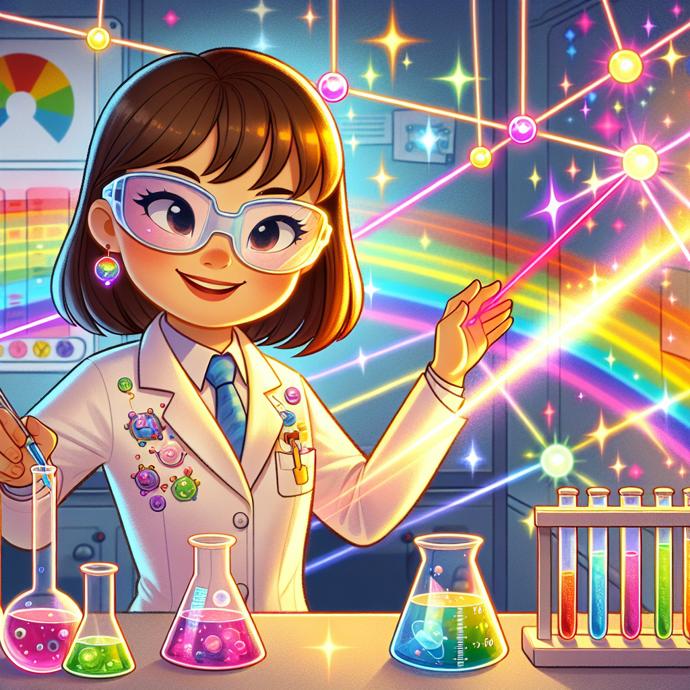

# Laser Light Magic: How Donna Strickland Made Super-Powerful Light Beams!

## Let's Discover Something Amazing!

Have you ever shined a torch on the wall and wondered why the light spreads out? Or maybe you've seen a laser pointer create a tiny red dot that stays small even from far away? 🔴 What if I told you that one brilliant scientist figured out how to make laser beams a million times more powerful than anyone thought possible?

That's exactly what Donna Strickland did! She's a physics superstar who won the Nobel Prize (the biggest award in science) for creating ultra-powerful laser beams that can cut through materials with incredible precision. But how did a girl who once played with ordinary light become the master of the world's most extraordinary beams? Let's shine some light on her brilliant story!

## The Big Idea: Laser Light is Super Special!

Lasers aren't like ordinary light from the sun or a torch. Regular light contains all the colours of the rainbow mixed together, travelling in all directions. But laser light is special in three amazing ways:

1. It's one colour only (like pure red, green, or blue)
2. All the light waves travel perfectly together, like soldiers marching in step
3. The beam stays narrow, even over long distances

Donna Strickland was fascinated by these special light beams. As a university student in Canada, she loved studying how light works. Later, while working on her PhD with another scientist named Gérard Mourou, she tackled a big problem: powerful lasers kept breaking because they were too strong for the materials they passed through!

**Did You Know?**
* The word "laser" is actually short for "Light Amplification by Stimulated Emission of Radiation"
* The first working laser was created in 1960, just a few years before Donna was born
* Lasers can be made from gases, crystals, or even tiny electronic chips

### Science Spotlight: Donna's Brilliant Breakthrough

In 1985, Donna Strickland and her supervisor Gérard Mourou invented something called "chirped pulse amplification." That's a fancy name for a clever trick! Here's how it works:

1. Start with a short pulse of laser light
2. Stretch it out to make it less powerful (like stretching chewing gum)
3. Amplify it (make it stronger) without breaking anything
4. Compress it back to a short pulse (now super-powerful!)

This brilliant idea solved the problem of lasers damaging themselves. Today, Donna's invention helps doctors perform eye surgery, engineers cut precise materials, and scientists study things happening in incredibly tiny fractions of a second. Her work is especially important for medical treatments - the precise lasers she helped create are now used in millions of eye surgeries every year, helping people see clearly again!

What makes Donna's story even more inspiring is that she was only the third woman ever to win the Nobel Prize in Physics, receiving this honour in 2018 - more than 30 years after her groundbreaking discovery!

## Time to Get Our Hands Dirty: Make Your Own Light Bender!

Let's explore how light travels with a simple experiment!

**You'll need:**
* A clear glass or plastic cup
* Water
* A pencil or straw
* A torch (flashlight)
* A darkened room

**Safety first!** This experiment is safe, but ask an adult to help if you're using a glass cup.

**Steps:**
1. Fill the cup about ¾ full with water
2. Place the pencil or straw in the water at an angle
3. Look at the pencil from the side of the cup
4. What do you notice? The pencil appears to bend where it enters the water!
5. Now shine your torch through the side of the cup in a darkened room
6. Can you see how the light beam changes direction when it hits the water?

**The Science Behind It:**
Light travels at different speeds through different materials. When light moves from air into water, it slows down and changes direction - we call this "refraction." This is similar to how special optical materials in lasers can control light beams. Donna Strickland's work involved carefully controlling how laser light interacts with different materials to make super-powerful beams without damaging the equipment!

## Mind-Blowing Facts About Lasers!

* The most powerful lasers today can create pulses with more power than all the world's electrical grids combined—but only for a tiny fraction of a second! That's like having all the energy of 10,000 lightning strikes concentrated into one tiny light beam.

* Laser light from Earth has been bounced off reflectors left on the Moon by astronauts. Scientists time how long it takes the light to return to measure the exact distance to the Moon!

* The barcode scanners at supermarkets use lasers to read the black and white lines on packaging.

* Some lasers are so precise they can cut individual cells without damaging neighbouring cells—imagine being able to pop just one bubble in a bubble wrap without touching the others!

## Your Turn to Explore!

Ready to become a light scientist like Donna? Try these challenges:

1. **Rainbow Hunter:** Use a prism or CD to split white light into a rainbow. How many colours can you identify? How is this different from laser light?

2. **Laser Detective:** With an adult's help, look for lasers in your home or community. You might find them in DVD players, computer mice, or presentation pointers. Make a list of all the ways lasers help us every day.

3. **Light Path Tracker:** In a darkened room, use a torch and mirrors to create a path of light around obstacles. Can you make the light beam turn three corners?

4. **Question Explorer:** Why do you think lasers are different colours? What might happen if you tried to amplify sunlight the same way Donna amplified laser light?

## The Big Question

Donna Strickland once said she was just "following her joy" when she made her amazing laser discovery. What scientific questions make you curious and joyful? Perhaps someday you'll create something as brilliant as Donna's powerful lasers!

Next time you see a laser pointer or hear about laser eye surgery, remember Donna Strickland—the scientist who figured out how to make light more powerful than anyone thought possible. And remember, the most brilliant scientific minds are those that stay curious and keep asking "What if...?"

What light-based mysteries will YOU solve?
