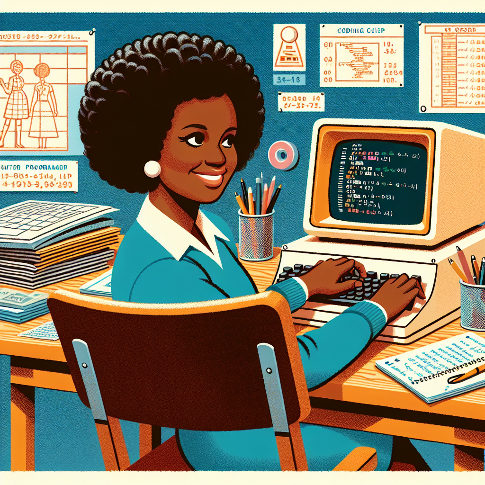

# The Fun Coding Adventures of Dorothy Vaughan

## Let's Discover Something Amazing

Have you ever watched a rocket blast off into space? 🚀 Those amazing machines don't just fly by themselves – they need special instructions called computer programmes to tell them what to do. But who writes those programmes? Today, we're going to meet a brilliant boffin who was a real-life coding wizard!

Her name was Dorothy Vaughan, and she was one of the first African American women to work as a computer programmer at NASA. Can you imagine how cool that must have been? 🤯 Let's take a journey back in time and learn all about her incredible life!

## Time to Get Our Hands Dirty

You know what's really fun? Learning to code like Dorothy did! Here's a simple activity you can try at home (with an adult's help, of course):
**Materials Needed:**

- A deck of cards
- A friend or family member

**Safety Notes:**

- Be careful not to throw the cards!
- Make sure you have enough space to move around.

**The Coding Challenge:**

1. Shuffle the deck and spread out the cards face down.
2. One person is the "Programmer," and the other is the "Computer."
3. The Programmer has to guide the Computer using only these instructions:
   - Move one step (any direction)
   - Turn left
   - Turn right
   - Pick up a card
4. The goal is for the Computer to pick up as many cards as possible by following the Programmer's code!

**What's Happening?** You're practicing the same skills that early computer programmers like Dorothy Vaughan used. By breaking down instructions into simple steps, you can create complex behaviours – just like how computer programmes work!

## Mind-Blowing Facts

- 🤯 Dorothy Vaughan was one of the first African American women to work as a computer programmer at NASA in the 1940s!
- 💻 In the 1960s, she led the team of human "computers" who calculated the trajectories for the first American astronauts in space.
- 🌍 Her work was so important that it was featured in the book and movie "Hidden Figures."
- 📚 Dorothy taught herself and her team how to use the first electronic computers at NASA – amazing!

## Your Turn to Explore

Want to keep coding like Dorothy? Here are some fun challenges to try:

- Create a new set of instructions for your "Computer" friend to follow.
- Use household objects to create a simple maze, then write a programme to navigate through it.
- Research other coding pioneers and share what you learned with your family or classmates.

## The Big Question

Wasn't Dorothy Vaughan's story incredible? Her work helped make space exploration possible, and she did it all while breaking down barriers. Now it's your turn: how will you use your coding skills to change the world? 🌎
