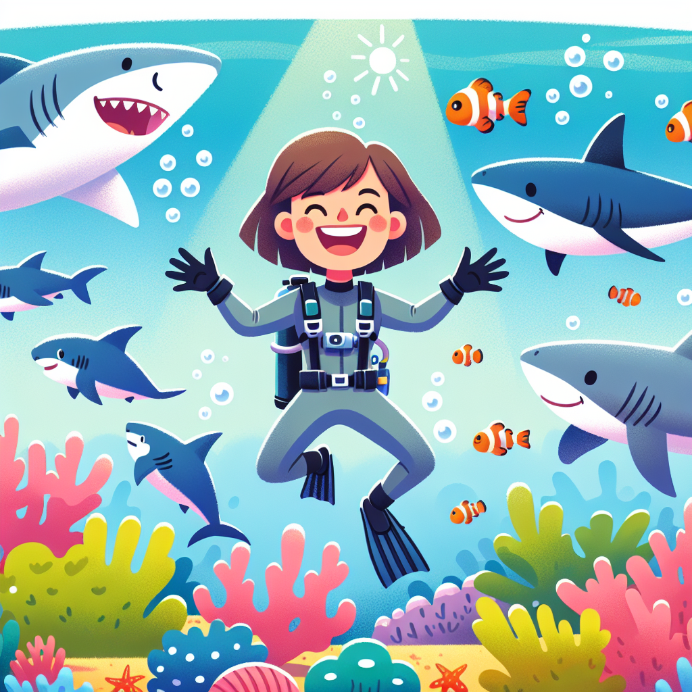

## Have You Ever Wondered What It's Like to Swim with Sharks? 🦈

Imagine gliding through the ocean, surrounded by sharks of all shapes and sizes. Sounds terrifying, right? Well, not for Eugenie Clark – she spent her life proving that sharks aren't the scary "sea monsters" we think they are!

_Eugenie Clark, the original "Shark Lady," fearlessly swimming with her sharky friends!_

## The Big Idea: Sharks Are Misunderstood Marine Marvels

When Eugenie Clark was a kid, she was obsessed with the ocean and its incredible creatures. Back then, people thought sharks were vicious killers. But Eugenie knew there was more to these mighty marine marvels than met the eye.

- 🦷 Did you know? Sharks have an incredible sense of smell that's 10,000 times better than humans'. They can sniff out a single drop of blood from almost a mile away!

- 🌊 Sharks have been around for over 400 million years – that's before the dinosaurs! They're one of the most ancient creatures on our planet.

- 🧠 Sharks are much smarter than we think. Some species can use tools, learn from experience, and even form social bonds!

**Science Spotlight:** In the 1950s, Eugenie Clark discovered that sharks weren't the mindless killing machines people thought. By studying their behaviour, she showed that sharks only attack humans when they're threatened or mistake us for prey. Her work helped change the way we see these amazing animals.

## Time to Get Our Hands Dirty!

Let's try a simple experiment to understand how sharks use their super senses to hunt!

**The Shark Smell Test**

_Materials:_

- A blindfold
- A piece of food with a strong smell (like a banana or some cheese)
- An adult helper

_Instructions:_

1. Ask your adult helper to hide the smelly food somewhere in the room while you're blindfolded.
2. Put on the blindfold and try to find the food using only your sense of smell!

_Expected Result:_ It's really hard to find the food, even with your nose working overtime!

**The Science Behind It:** Sharks have an incredible sense of smell that helps them detect prey from far away. Their nostrils are lined with millions of tiny scent receptors that can pick up the faintest whiff of blood or fish in the water. This experiment shows how tricky it is to hunt using just your nose – sharks are true masters of smelling their way to a meal!

## Mind-Blowing Facts!

- 🦷 The deadly great white shark has over 300 razor-sharp teeth in its mouth at any given time!
- 💨 Many sharks have to keep swimming constantly, even while they sleep, or they'll sink to the bottom of the ocean.
- 👶 Baby sharks (called "pups") are born ready to hunt and fend for themselves from the moment they hatch!

## Your Turn to Explore!

- Try making a shark model using recycled materials and label all its amazing body parts.
- Research the different types of sharks and create a "Shark Spotter's Guide" with fun facts about each one.
- Design a new piece of shark-safe diving gear that would allow you to explore their world up close.

## The Big Question

Sharks have been around for millions of years, surviving everything from ice ages to asteroid strikes. Yet today, many shark species are in danger because of human activities like overfishing and pollution. How can we help protect these incredible ocean giants for future generations to enjoy and learn from?
