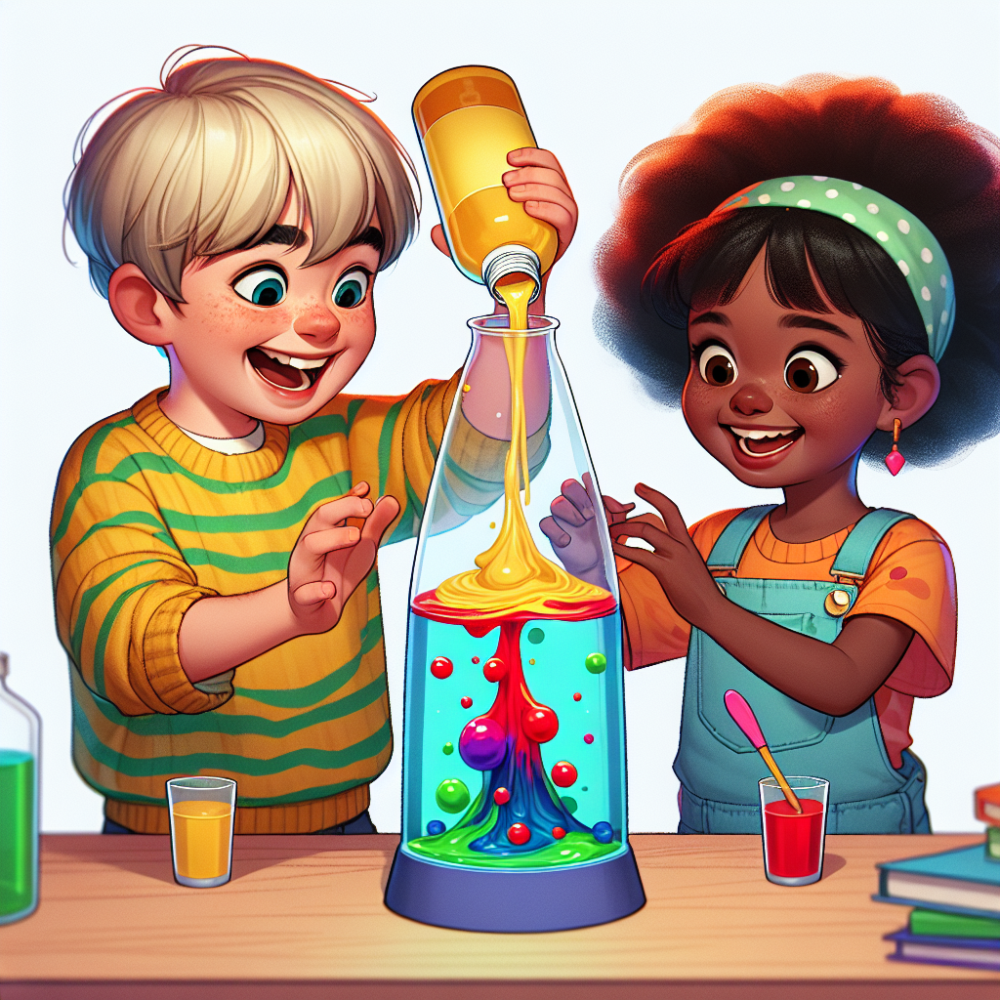

# Make Your Own Lava Lamp: Exploring Density's Dazzling Dance

## Let's Discover Something Amazing

Have you ever watched a lava lamp and wondered how those colourful blobs move up and down so mysteriously? 🤔 It's like they're dancing to a secret rhythm! Today, we're going to unlock the secrets behind this captivating display by making our very own lava lamps. Get ready to explore the fascinating world of density!

## Time to Get Our Hands Dirty

### Materials Needed

- A clear plastic bottle (or jar)
- Vegetable oil
- Food colouring
- Alka-Seltzer tablets
- Water
- Adult supervision

### Safety First

- Ask a grown-up to help with any cutting or handling hot water.
- Be careful not to get any oil or food colouring on your clothes or surfaces.

### Let's Make a Lava Lamp

1. Fill the bottle about 3/4 full with vegetable oil.
2. In a separate container, mix a few drops of food colouring with 1/4 cup of water.
3. Carefully pour the coloured water into the bottle, allowing it to sink to the bottom.
4. Break an Alka-Seltzer tablet into a few pieces and drop them into the bottle one at a time.
5. Watch as the coloured blobs start to rise and fall, creating a mesmerizing lava lamp effect!

**What's Happening?** The oil and water don't mix because they have different densities. The water is more dense, so it sinks to the bottom. When you add the Alka-Seltzer, it starts to fizz and release gas bubbles. These bubbles attach to the coloured water blobs, making them less dense than the oil. As a result, the blobs rise up through the oil until the gas bubbles pop, allowing the blobs to sink back down. It's a continuous cycle of rising and falling, all powered by density!

## Mind-Blowing Facts

- Did you know that the first lava lamp was invented in 1963 by a British inventor named Edward Craven Walker? 🤯
- The blobs in a lava lamp can move as slowly as every 6 hours or as quickly as every 30 seconds, depending on the temperature and the type of wax used.
- Some lava lamps have been known to operate continuously for over 40 years! Talk about a long-lasting party! 🕺

## Your Turn to Explore

- Try experimenting with different types of oils or liquids to see how the density affects the movement of the blobs.
- Add more food colouring or try different colours to create your own unique lava lamp design.
- Can you think of other household items that could be used to create a similar density-based effect?

## The Big Question

Now that you've witnessed the mesmerizing dance of density, what other natural phenomena or everyday situations can you think of where density plays a crucial role? Share your thoughts and discoveries with your family and friends, and keep exploring the wonders of science all around you! 🔬✨

