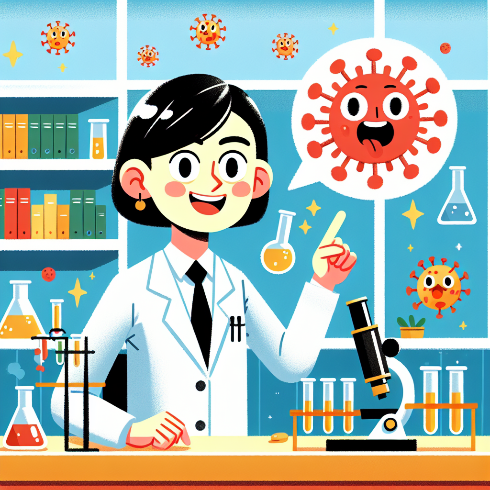

# The Scientist Who Cracked the Code

## Let's Discover Something Amazing

What if I told you a tiny, microscopic code held the key to understanding one of the world's most devastating diseases? 🔬 And that a curious scientist used her brilliant brain to decipher that code and change the course of history? Her name was Flossie Wong-Staal, and she was a molecular explorer extraordinaire!

Back in the 1980s, a mysterious illness was sweeping across the globe, leaving scientists utterly baffled. People were getting very sick, their immune systems simply stopped working properly, and nobody knew why. That's when Flossie and her team of code-crackers got to work!

## Time to Get Our Hands Dirty

**GROWN-UP SUPERVISION REQUIRED!**

Just like Flossie, we're going to do some seriously cool science and extract DNA from everyday objects. You'll need:

- 🍌 1 ripe banana
- 🥤 Splash of water
- 🧴 Liquid soap
- 🧂 Pinch of salt
- 🥃 Cold rubbing alcohol
- 🥄 Spoon
- 🥤 Clear plastic cup

Here are the steps:

1. Mash up the banana in the cup with a fork until it's nice and squishy.
2. Add a tiny bit of liquid soap and salt, then stir gently.
3. Top up with cold alcohol until it reaches about 3/4 full.
4. Give it a stir and...MIND-BLOWN! 🤯 You should see fine, spidery white strands appearing - that's the banana's DNA!

The soap helps to break down the banana's cell membranes, while the alcohol causes the DNA to clump together so we can see it with our eyes. Just like Flossie, you're a DNA detective now!

## Mind-Blowing Facts

- DNA stands for deoxyribonucleic acid - what a brilliant brainteaser of a name!
- If you unraveled the DNA from just one tiny cell and linked it all together, it would be over 2 meters long. 🧬
- Your DNA contains around 20,000 different genes that provide the code for everything that makes you, YOU!
- Flossie's team identified HIV as the virus causing AIDS by mapping its entire genetic code sequence.

## Your Turn to Explore

- Use a microscope to take a closer look at your banana DNA sample. What patterns and structures can you observe?
- Try the same experiment with other fruits or vegetables - do you notice any differences?
- Conduct your own DNA research by extracting samples from your cheek cells, hair, or even your pet's fur!

## The Big Question

Flossie's breakthrough helped develop HIV testing and get us one step closer to better treatments. But her work didn't stop there - the secrets of DNA are still being unraveled every day. What other amazing genetic mysteries could you help solve next? Maybe you'll crack the code on the cure for cancer, or how to grow super-veggies that could feed the world! The future of science awaits your curiosity...

Remember, just like Flossie, you're a brilliant explorer. So keep investigating, keep asking questions, and who knows what mind-blowing discoveries you might make? The answers could be right there, waiting to be decoded!

