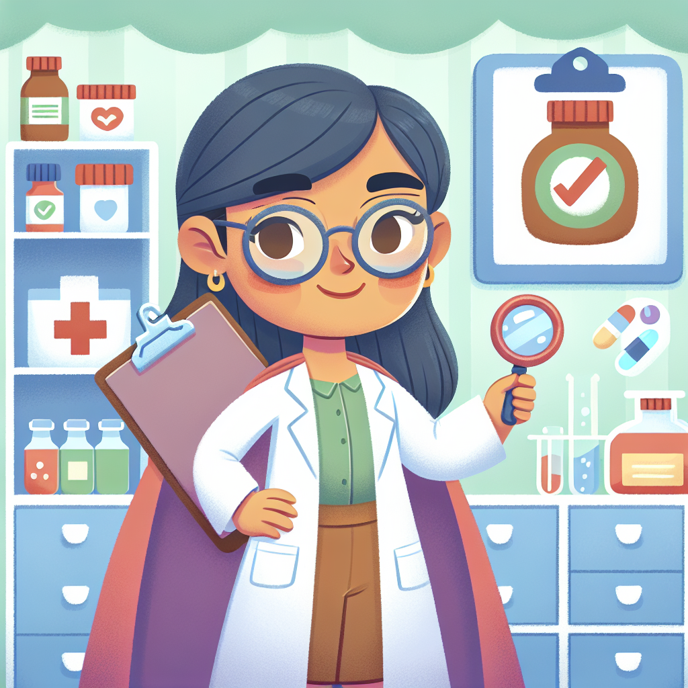

# Medicine Detective: How Frances Kelsey Saved Thousands of Babies

## The Mystery of the Dangerous Medicine! 

Have you ever taken medicine when you felt poorly? Maybe it was a spoonful of medicine for a sore throat or a tablet for a headache? We trust that medicines will help make us better, not worse. But who makes sure that medicines are safe before they reach our chemist shops?

Meet Frances Kelsey, a real-life medicine detective! 🔍 In the 1960s, when a new medicine called thalidomide was supposed to help pregnant mums feel better, Frances wasn't convinced it was safe. While everyone was rushing to approve this "wonder drug," she asked tough questions and demanded better evidence. Her detective work and bravery saved thousands of babies from being born with serious health problems!

Imagine if your job was to spot dangerous things that others missed. That's exactly what Frances did – and her story shows how one person who stands up for what's right can save many lives.

## The Big Idea: Medicine Safety Superheroes

When you're poorly and take medicine, have you ever wondered how we know it's safe? Before any medicine reaches your local chemist, it goes through a long journey of testing. Scientists like Frances Kelsey are the superheroes who stand guard, making sure only the helpful medicines – not the harmful ones – make it to you.

Frances Kelsey wasn't always a medicine detective. Born in Canada in 1914, she studied science at university when many women were told they shouldn't. When she applied for a research position, the professor thought "Frances" was a man's name and hired her! By the time he realised she was a woman, he was so impressed with her qualifications that he kept her on anyway.

Years later, in 1960, Frances started a new job at the FDA (Food and Drug Administration) in America. Her very first assignment was to review a medicine called thalidomide that was already being used in Europe to help pregnant women with morning sickness.

### Did You Know?
- Frances noticed something odd that others had missed: the company hadn't properly tested how the medicine affected unborn babies.
- She refused to approve the medicine even when her bosses pressured her to hurry up.
- While Frances held firm in America, thousands of babies in other countries where the medicine was approved were born with missing or shortened limbs.
- Her careful work saved about 10,000 American babies from these terrible side effects.
- For her bravery, President John F. Kennedy gave her a special award for government service!

### Science Spotlight: From Tragedy to Better Medicine
The thalidomide tragedy changed medicine forever. Before this happened, medicines weren't tested nearly as carefully as they are today. Frances Kelsey's work helped create our modern system of medicine testing that requires:
- Testing medicines on pregnant animals before giving them to pregnant women
- Collecting information about side effects even after medicines are approved
- Having multiple safety checks before a medicine reaches the public

During recent health challenges like the COVID-19 pandemic, these safety systems that Frances helped establish ensured that vaccines and treatments were thoroughly tested before being given to the public. Her legacy continues to protect people worldwide every time a new medicine is developed!

## Hands-On Discovery: Be a Medicine Detective!

Let's play medicine detective like Frances Kelsey! In this activity, we'll explore how scientists test whether something is safe or dangerous.

### The Invisible Evidence Experiment

**Safety Warning:** This experiment uses household cleaning products. Adult supervision is required. Wear gloves if available and wash hands thoroughly afterwards.

**Materials:**
- 3 clear glasses or jars
- Water
- Red cabbage (fresh or frozen)
- Lemon juice
- Bicarbonate of soda (baking soda)
- Spoons for stirring

**Steps:**
1. Ask an adult to help you make red cabbage indicator: Chop up some red cabbage and boil it in water for 5 minutes, then strain the purple liquid into a container.
2. Pour your cabbage indicator into three glasses, filling each about halfway.
3. In the first glass, add a teaspoon of lemon juice and stir.
4. In the second glass, add a teaspoon of bicarbonate of soda and stir.
5. Leave the third glass as is for comparison.

**What You'll See:**
- The lemon juice will turn the liquid pink or red.
- The bicarbonate of soda will turn it blue or green.
- The plain indicator stays purple.

**The Science Behind It:**
What you're seeing is a chemical reaction that reveals whether something is an acid (like lemon juice) or a base (like bicarbonate of soda). The red cabbage contains special molecules called anthocyanins that change colour depending on what they mix with.

Frances Kelsey used scientific tests (though more complicated ones!) to reveal hidden dangers in medicines. Just like our indicator showed invisible properties through colour changes, scientists use special tests to reveal if medicines might harm developing babies or cause other problems that aren't immediately obvious.

In real medicine testing, scientists look for evidence of safety through many different kinds of tests – some in test tubes, some with cells, some with animals, and finally careful tests with human volunteers. Only when a medicine passes all these tests is it considered safe for everyone to use.

## Mind-Blowing Facts about Medicine Safety!

- It takes an average of 10-15 years to develop a new medicine from start to finish – that's longer than you've been alive!
- Before a medicine reaches your local chemist, it's tested on about 5,000 to 10,000 different compounds, but only 1 will actually become a medicine people can use.
- The thalidomide disaster led to over 10,000 babies being born with serious birth defects worldwide – that's about the same as the population of a small town!
- Modern medicine testing costs about £1 billion per successful new medicine – you could buy 100 million ice creams with that money!
- Frances Kelsey worked until she was 90 years old, protecting people from unsafe medicines for nearly half a century!

## Your Turn to Explore!

Want to be like Frances Kelsey? Try these explorer challenges:

1. **Medicine Cabinet Investigation:** With an adult's help, look at the information leaflets that come with medicines in your home. What warnings can you find? Who shouldn't take the medicine? What side effects might happen? Create a poster showing what you learned about medicine safety.

2. **Testing Detective:** Design your own test to see if something is safe. For example, if you wanted to test if a new plant food helps or harms plants, how would you set up an experiment? Remember to include a "control" (something to compare with) like Frances would have done!

3. **Think about this:** Frances stood her ground when many people were telling her to hurry up and approve the medicine. When might it be important for you to stand up for what you think is right, even if others disagree?

4. **Wonder question:** Many medicines that were once thought dangerous are now used safely for different purposes. Thalidomide is now used to treat certain cancers and skin conditions (but never for pregnant women). Can you think of other things that might be harmful in one situation but helpful in another?

## The Big Question

Imagine you're a scientist like Frances Kelsey, and you've been asked to approve a new medicine that might help thousands of people feel better. But you're not completely sure it's safe, and more testing would take another year. What would you do?

Frances Kelsey showed us that sometimes being careful and asking tough questions is the most important job of all. She reminds us that science isn't just about making exciting discoveries – it's also about making sure those discoveries are safe for everyone.

The next time you take medicine when you're feeling poorly, remember Frances Kelsey, the medicine detective who made sure that what goes into your body has been carefully checked to keep you safe and healthy!
