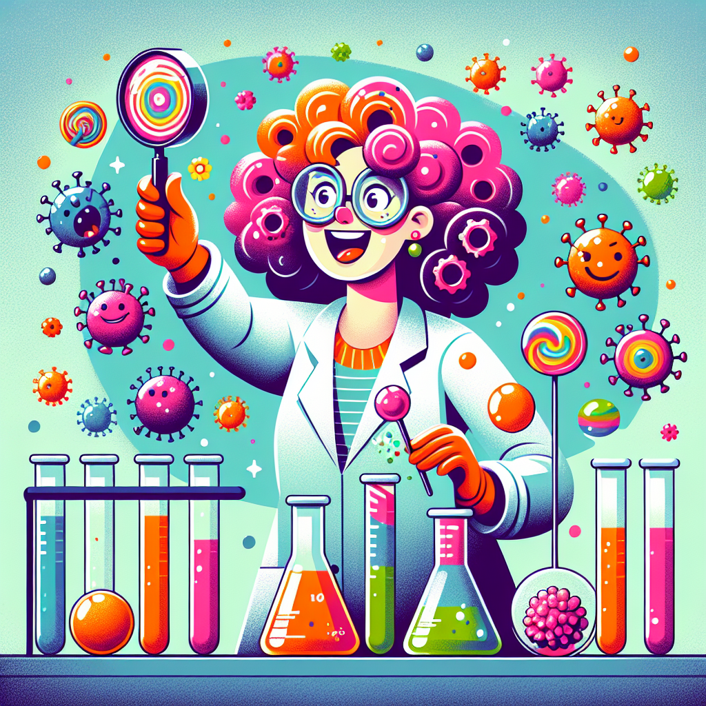

# The Case of the Century!

Have you ever played detective games or read mystery books? 🕵️ Well, get ready for a real-life scientific mystery that stumped experts for years - until one brilliant scientist cracked the case wide open!

## Let's Discover Something Amazing!

Back in the 1980s, a strange illness was making people really sick. Their immune systems (the body's defense force against germs) just stopped working properly. At the time, no one knew what was causing it. That's when Françoise Barré-Sinoussi, a French virologist (a scientist who studies viruses), stepped in to investigate. 🔬

Just like detectives study clues to solve crimes, Françoise examined samples from patients under powerful microscopes. And that's when she spotted something suspicious - a weird virus lurking inside their cells!

## Time to Get Our Hands Dirty!

Here's a fun way to see viruses in action (don't worry, it's totally safe!):

**Materials Needed:**

- 1 clear plastic bottle with a cap
- Water
- Liquid dish soap
- Pepper or dried herbs

**Adult Supervision Required: Ask a parent or teacher to help with this activity.**

1. Fill the bottle about 3/4 full with water.
2. Add a few drops of dish soap and a pinch of pepper or dried herbs. This represents the viruses.
3. Screw the cap on tightly and shake well to spread the "viruses" around.
4. Remove the cap and try to touch the water's surface with your finger - the "viruses" should stick together and move away! This is because the soap causes the water molecules to spread apart, pushing the "viruses" away.

What's happening? Just like real viruses trying to invade cells, the dish soap disrupts the "viruses" in the water, not letting them stick around!

## Mind-Blowing Facts!

🤯 Did you know that there are more viruses on Earth than stars in the universe?
🌌 Some viruses are incredibly tiny - millions could fit on the period at the end of this sentence!
💪 Your awesome immune system can recognize and fight off millions of different viruses.

## Your Turn to Explore!

To learn more about viruses and the immune system, try these challenges:

- Research how vaccines work to train your immune system.
- Design a comic strip following a white blood cell as it hunts down a virus invader.
- Come up with an analogy to explain how antibodies recognize and neutralize viruses.

## The Big Question

Françoise's detective work allowed scientists to identify the virus causing AIDS and develop treatments to help patients. But the big mystery remains: Where did this virus come from in the first place? Maybe you'll be the one to solve that case next! 🕵️
