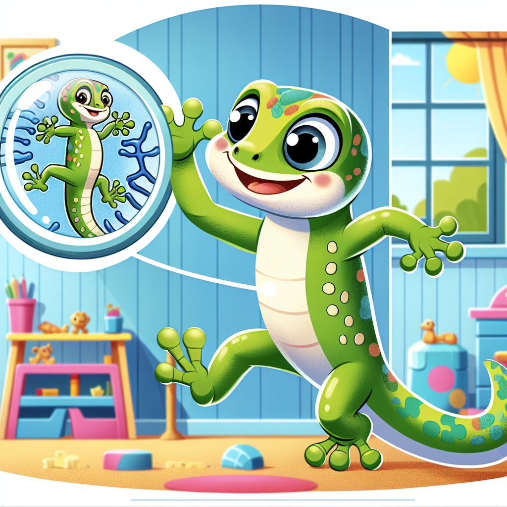

# Sticky Feet Superheroes: How Geckos Defy Gravity!

## Let's Discover Something Amazing!

Have you ever watched a gecko scurry up a wall and wondered, "How on earth do they do that?" 🦎 These amazing little lizards can climb up smooth glass windows, race across ceilings, and even hang upside-down with just one toe! If you tried to walk up your bedroom wall, you'd slide right down—but geckos have a superpower that seems like magic. 

Imagine having shoes so sticky that you could climb like Spider-Man, but that don't get covered in fluff and dirt like sticky tape. That's exactly what geckos have! Their incredible climbing ability isn't because they're sticky like glue or suction cups like an octopus. It's actually a brilliant bit of nature's engineering that scientists are still trying to copy today.

## The Big Idea: Tiny Hairs, Massive Power!

Geckos can climb walls because their toes are covered with millions of microscopic hairs called "setae." These hairs are so tiny that you would need a powerful microscope to see them properly. Each gecko toe has about 500,000 of these setae, and each seta splits into hundreds of even tinier tips called "spatulae." If we could see them up close, they would look a bit like tiny tree branches that end in flat pads.

But here's the really fascinating part: geckos don't use glue or suction to stick to walls. Instead, they use something called "van der Waals forces." These are special forces that happen when molecules get extremely close to each other. The millions of tiny spatulae on a gecko's foot get so close to the wall surface that these forces become strong enough to hold the gecko up!

**Did You Know?**
* A gecko can support its entire body weight with just one toe!
* Geckos can attach and detach their feet from surfaces in milliseconds (that's faster than you can blink).
* If a human had gecko-like feet, we could hang from the ceiling by just one finger!

What makes gecko feet even more brilliant is that they don't get sticky with dirt or lose their stickiness over time. A gecko can walk through dust and still climb a glass window straight after. This is because the stickiness works through physics, not like the chemical stickiness of glue or tape.

**Science Spotlight: The Gecko Detectives**
In the early 2000s, scientists Professor Kellar Autumn and Dr. Robert Full solved the mystery of gecko stickiness after years of careful research. They discovered that the tiny spatulae create the van der Waals forces that let geckos stick to almost any surface. Their work has inspired engineers to create "gecko tape" – super-strong adhesives that can be used over and over without losing stickiness. Today, this research is helping to create climbing robots, better medical plasters, and even equipment that might be used by astronauts in space! Their discovery shows how studying nature can lead to amazing new inventions that help people.

## Time to Get Our Hands Dirty!

### Make Your Own Sticky Feet Experiment

Let's explore the difference between suction, glue and gecko-style stickiness with this simple experiment!

**Materials:**
* A piece of clear plastic (like a plastic folder)
* A suction cup toy
* A small piece of sellotape
* A clean, dry glass or window
* Water

**Safety Note:** Always have an adult help with experiments. Be careful with glass surfaces.

**Steps:**
1. First, try sticking the suction cup to the dry glass. Does it stick? Now wet it slightly and try again. What happens?
2. Next, stick a small piece of sellotape to the glass. Does it stick well? Try to remove and reattach it 5 times. What happens?
3. Now for the gecko-style test: Take your piece of clear plastic and press it flat against the clean glass. Try to slide it down – it might stick slightly!
4. For an even better gecko effect, try this: rub the plastic on your jumper to create static electricity, then press it against the wall. Does it stick better?

**The Science Behind It:**
Suction cups work by pushing out air to create a vacuum, which is why they need a smooth surface and often work better when wet. Sellotape uses chemical adhesives that leave residue and collect dirt, making them less sticky over time. 

The plastic sheet experiment demonstrates a very simplified version of what happens with geckos. When the plastic gets very close to the glass, weak attractive forces develop between the molecules. This isn't exactly the same as gecko feet (which work with van der Waals forces), but it gives you an idea of how something can stick without glue or suction. The static electricity helps create an even stronger attraction, similar to how the millions of tiny hairs on gecko feet create a combined strong force.

## Mind-Blowing Facts!

* If all the tiny hairs on a gecko's feet could make perfect contact with a surface at once, a gecko could theoretically hold up to 130 kg – that's heavier than an adult human!

* Geckos can unstick their feet so quickly that they can take 15 steps in just one second.

* Scientists have discovered that geckos can even stick to surfaces underwater, though not as well as on dry land.

* Gecko-inspired adhesives are being developed that could one day help robots climb walls or allow astronauts to easily grab tools in space.

## Your Turn to Explore!

**Gecko Detective Challenge:**
* Find a smooth wall at home and place your hand flat against it. Can you feel any stickiness? Now try with just your fingertips. Which feels stickier?

* With permission from an adult, observe different sticky things around your house. Test sellotape, blu-tack, a wet suction cup, and a dry suction cup. Which is easiest to attach and detach quickly like a gecko?

* Look at different surfaces around your home. Which do you think a gecko could climb and which would be too difficult? (Hint: geckos can climb glass, wood, and painted walls, but struggle with some plastics and very rough surfaces.)

**Questions to Ponder:**
* Why do you think geckos evolved this amazing ability to climb walls?
* What other animals have special ways of sticking to things?
* If you could design your own gecko-inspired invention, what would it be?

## The Big Question

Isn't it amazing how something as tiny as microscopic hairs can solve such a big problem as climbing smooth surfaces? Geckos have perfected this ability over millions of years of evolution, and now scientists are learning from these little lizards to create new technologies.

The next time you see a gecko zipping up a wall or hanging from a ceiling, remember that it's not magic—it's magnificent science! Its feet are using forces that exist between molecules, forces so small we can't see them, but when combined become strong enough to hold up the entire animal.

What other secrets might animals be hiding that could inspire new inventions? Nature has been solving problems for millions of years, and we're only just beginning to understand all its clever solutions. Perhaps you'll be the scientist who discovers the next amazing animal superpower!
