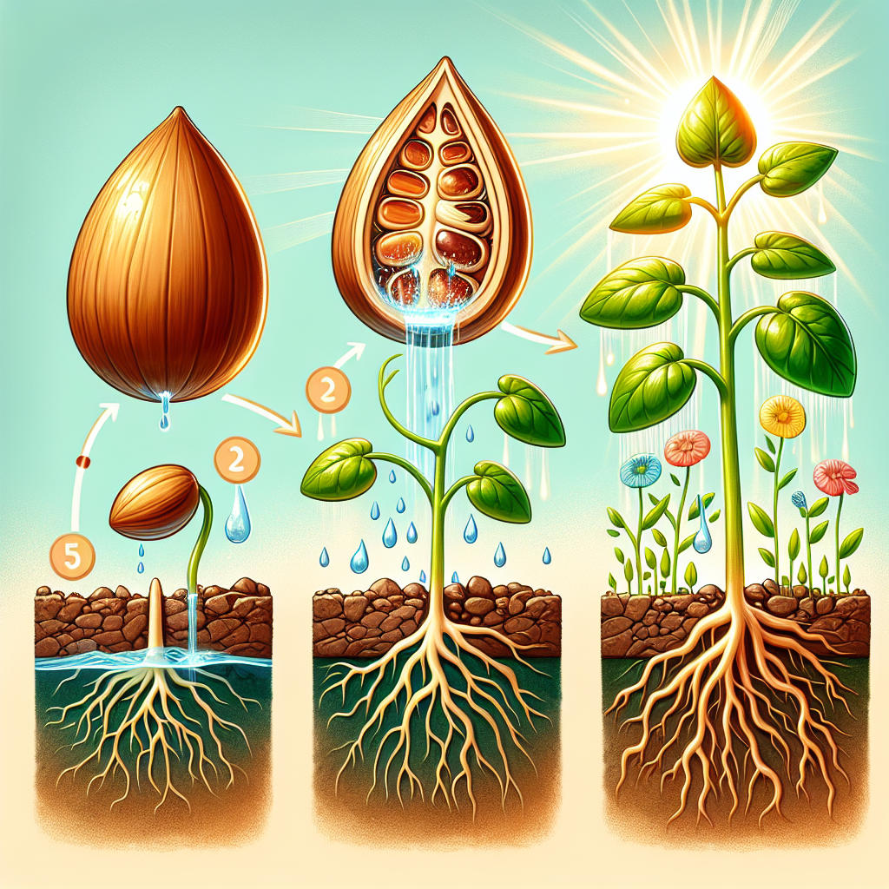

# Seeds' Sensational Journey: The Magical Path to Plant Power!

## Let's Discover Something Amazing!

Have you ever looked at a tiny seed and thought, "How can something so small become a huge plant?" 🤔 Well, get ready for an adventure into the miniature marvels of germination – the amazing process that turns a humble seed into a blossoming beauty!

Just imagine: locked inside that little seed is a whole plant, patiently waiting to sprout. But it needs the right ingredients to wake up and start growing. What could those ingredients be? 🥫

## The Big Idea: From Tiny Seed to Towering Tree

When a seed finds the perfect cosy spot with water, air, and warmth, it kicks off an incredible transformation called germination. The seed's tough outer coat softens, allowing a tiny root to emerge and anchor itself in the soil. Then, a teeny shoot pokes through, reaching up towards the sun's rays.

**Did You Know?**

- 🌰 Some seeds can survive for centuries before germinating! The oldest seed to sprout was a 32,000-year-old campion plant.
- 🥕 Carrots are biennial plants, meaning their seeds won't sprout until their second year of growth.
- 🌳 The largest seed in the world is the coco de mer, weighing up to 30kg – that's as heavy as a small kid!

As the seedling grows, it develops leaves to capture sunlight and perform an amazing trick called photosynthesis, creating its own food from sunlight, water, and air. 🌱 With the right ingredients, that tiny seed can become a towering tree, providing us with fruits, nuts, and shade for years to come!

**Science Spotlight:** Over 300 years ago, an English scientist named John Ray was one of the first to study seed germination. His discoveries about how different plants reproduce helped shape our understanding of botany. Ray's work inspired future botanists and still influences how we grow crops today – helping provide food for millions worldwide, even during challenging times. 🌍

## Time to Get Our Hands Dirty!

Ready to see germination in action? Let's grow our very own beans!

**Magical Bean Experiment**
_Materials:_ Dried beans, paper towels, plastic bag, water

1. Soak 5-6 beans in water overnight.
2. Wet a paper towel and place the soaked beans on one side.
3. Carefully roll up the towel and place it in a plastic bag.
4. Every few days, unroll and mist the towel with water to keep it damp.
5. In 5-7 days, you should see roots and shoots emerging!

**Safety Note:** This experiment is safe, but seeds and soil should never be eaten. Ask a grown-up to help you set it up.

**The Science Behind It:** As the seeds absorb water, their outer coating softens, allowing the embryo (baby plant) inside to start growing. The emerging root anchors the plant and absorbs water and nutrients, while the shoot stretches towards light to start photosynthesis.

## Mind-Blowing Facts!

- 🌽 One corn plant can produce up to 1,000 seeds (kernels)!
- 🥑 It takes around 9 months for an avocado seed to germinate – that's as long as a human pregnancy. 🤰
- 🌺 Some seeds need to go through a fire before they'll sprout. The heat helps crack their tough coats.

## Your Turn to Explore!

Now that you're a seed scientist, try these explorer challenges:

- Grow seeds from different fruits or veggies. Which ones sprout fastest?
- Design a mini greenhouse to create the perfect growing environment.
- Investigate how factors like temperature or soil type affect germination.

The possibilities are endless when you unlock the power of seeds! 🌱

## The Big Question

As we've discovered, every giant tree was once a tiny seed waiting for the right moment to unleash its potential. So, what incredible plant is hiding inside the seeds you eat every day? The journey from seed to sprout is just the beginning of nature's miracles!
