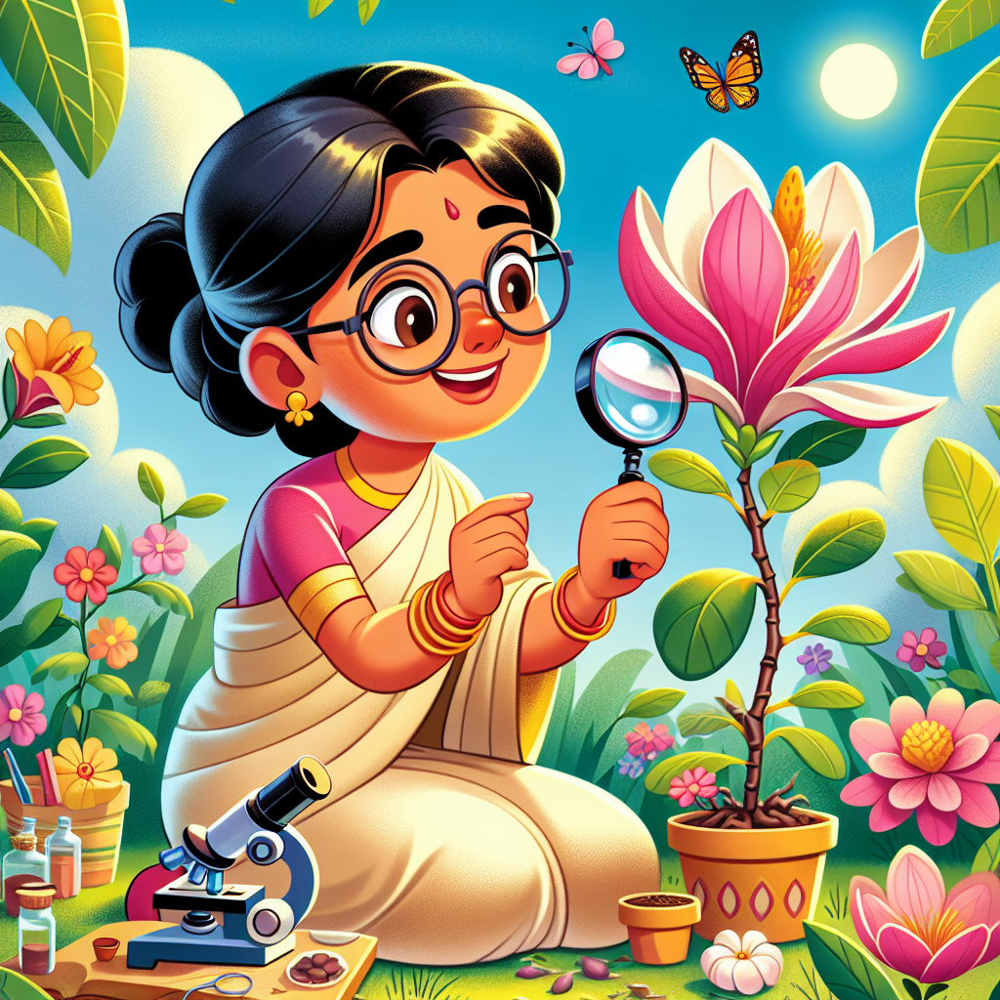

# Plant Detective: How Janaki Ammal Unlocked Nature's Sweetest Secrets!

## Have You Ever Wondered Where Sugar Comes From?

Have you ever taken a big bite of your favourite cake or stirred sugar into your hot chocolate and wondered, "Where does all this sweet stuff actually come from?" 🌱 Well, long before sugar reaches your biscuit tin, it starts as a tall, grassy plant called sugarcane! But did you know that once upon a time, growing sugarcane in India was becoming really tricky until a brilliant plant scientist named Janaki Ammal came along? 

Imagine being a plant detective, looking through a magnifying glass at tiny cells, mixing different plants together, and creating new varieties that can grow better and stronger. That's exactly what Janaki did! She didn't wear a detective's hat or carry a magnifying glass everywhere (though that would have been quite cool), but she did have something even better – a powerful microscope and an amazing brain that could solve plant puzzles!

## The Big Idea: Plant Science to the Rescue!

Plants might seem like they just sit around doing nothing much, but they're actually super busy growing, making food from sunlight, and even defending themselves from bugs and diseases. Janaki Ammal knew this better than almost anyone else. Born in 1897 in Kerala, India, she became fascinated with plants when she was just about your age!

Here are some fascinating facts about Janaki and her work:

1. Janaki became one of the first women in India to earn a doctorate in science – at a time when most girls weren't even sent to school!
2. She travelled all the way to England and America to study plants when travelling that far was a really big deal.
3. She worked with sugarcane plants to create new types that could grow better in Indian soil.
4. She helped make a special map of all the plants in India, called the Botanical Survey of India.
5. She discovered many new plant species that nobody had ever recorded before!
6. She stood up against people who wanted to build a dam that would destroy rare plants.

**Did You Know?** Janaki studied over 150 different types of sugarcane plants to find the perfect ones to cross together! That's like trying every possible sandwich combination to find the tastiest one!

### Science Spotlight: Sweet Solutions for Sugary Problems

In the 1930s, India was having a sugar crisis. The sugarcane plants weren't growing well, and the country had to buy sugar from other places. Janaki Ammal came to the rescue by studying chromosomes – the tiny structures inside cells that contain DNA instructions for how plants grow.

By carefully crossing different types of sugarcane, she created new varieties that were sweeter and could grow in Indian soils and climate. Her work meant farmers could grow more sugar locally, making sweets and treats more affordable for everyone. Even today, when you enjoy sugary foods in India, you're benefiting from Janaki's clever plant breeding! During recent challenges like climate change, her research on creating resilient plant varieties has become even more important as farmers face unpredictable weather patterns.

What's really inspiring about Janaki is that she didn't just work in laboratories. She loved climbing mountains and trekking through forests to find and study wild plants. She showed that being a scientist isn't just about working indoors – it can be a grand adventure!

## Hands-On Discovery: Become a Plant Detective!

Ready to be a plant scientist like Janaki Ammal? Let's investigate how plants drink water in this simple experiment!

### Colourful Plant Transport Investigation

**Materials you'll need:**
* 3 white carnations or celery stalks with leaves
* 3 clear glasses or jars
* Food colouring (different colours)
* Water
* Scissors
* Ruler or measuring tape
* Notebook and pencil

**Safety first!** Ask an adult to help with the scissors. Food colouring can stain clothes and surfaces, so wear old clothes or an apron.

**Steps:**
1. Fill each glass halfway with water.
2. Add 10-15 drops of different food colouring to each glass (one colour per glass).
3. Ask an adult to help you cut the stems of the carnations or celery at an angle.
4. Place one stem in each coloured water glass.
5. Observe what happens after 1 hour, 3 hours, and 24 hours.
6. Draw or write your observations in your notebook.

**What to expect:** The white petals of the carnations (or the celery leaves) will slowly change colour as they suck up the coloured water!

**The Science Behind It:** Plants have tiny tubes inside their stems called xylem vessels. These work like drinking straws, pulling water up from the roots to the leaves and flowers through a process called capillary action. The coloured water travels up these tubes, eventually reaching the petals or leaves, making them change colour. This is the same way that sugarcane plants transport the sweet sugary solution that Janaki Ammal studied!

In real plants, this water transport system is crucial for delivering nutrients from the soil to all parts of the plant. Janaki studied how different sugarcane varieties transported sugar through these systems to find the most efficient plants.

## Fun Facts and Mind-Bogglers!

* Janaki Ammal collected and studied over 25,000 plant specimens during her lifetime! If you lined them all up, they would stretch longer than 25 football pitches!

* She discovered a special type of magnolia flower that was named after her: Magnolia Kobus Janaki Ammal.

* Janaki was so respected as a scientist that the King of England invited her to work at the famous Kew Gardens in London.

* Wow statistic: Sugarcane, which Janaki studied, can grow up to 3 centimetres in a single day during its growing season! That's faster than your fingernails grow in a whole month!

* When Janaki started her career, there were almost no women scientists in India. Today, thousands of women in India are plant scientists, continuing her important work!

## Explorer's Challenge: Your Turn to Investigate!

Want to continue your plant science adventure? Try these activities:

1. **Plant Diary:** Choose a plant in your garden or a nearby park. Visit it every few days and keep a diary of how it changes. Measure how tall it grows, count new leaves, and draw pictures of what you observe.

2. **Seed Collection:** Collect different types of seeds from fruits and vegetables you eat at home. Try planting some in small pots and see which ones grow best. What do different seeds need to sprout successfully?

3. **Plant Protection Plan:** Janaki Ammal worked hard to protect wild plants. Can you make a poster about a plant that needs protection in your area? Research why it's important and what people can do to help it survive.

**Questions to ponder:**
* Why do you think some plants grow better in certain places than others?
* How might climate change affect the plants that grow near your home?
* If you could create a brand new plant like Janaki did, what special features would it have?

## The Big Question

Janaki Ammal showed us that plants are not just pretty things to look at—they're fascinating living creatures with amazing abilities! She dedicated her life to understanding them better and making sure we protect the incredible variety of plants on our planet.

The next time you taste something sweet or walk past a beautiful garden, remember Janaki Ammal and her plant detective work. Without scientists like her, we might not have as many delicious fruits, vegetables, and yes—sweet treats—to enjoy!

What plant mysteries will YOU solve when you grow up? Perhaps
