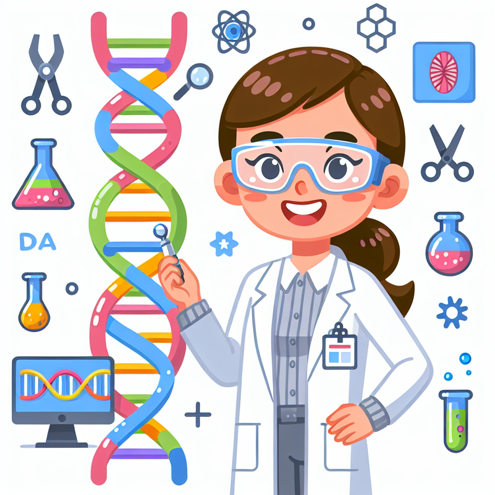

# Cracking the Code of Life: Jennifer Doudna's Gene-Editing Adventures

## Let's Discover Something Amazing!

Have you ever wondered what makes you... well, YOU? 🤔 It's all thanks to a tiny, twisty molecule called DNA – the code of life! Imagine if you could edit that code like a computer program, changing the instructions to create something entirely new. That's exactly what Jennifer Doudna has been working on, and her discoveries are blowing scientists' minds!

## The Big Idea

DNA is like a secret recipe book, with instructions for everything that makes up a living thing – from the color of your eyes to how tall you'll grow. But sometimes, those instructions can get a little scrambled, leading to diseases and other problems. That's where Jennifer Doudna's work comes in!

She discovered a way to edit DNA using a tool called CRISPR, which acts like tiny molecular scissors. With CRISPR, scientists can snip out the parts of the code they don't want and even add new instructions! 🔀

> **Did You Know?** CRISPR technology was actually discovered by studying the immune systems of bacteria! These tiny organisms use CRISPR to fight off viruses that try to infect them.

> **Science Spotlight:** In the 1950s, scientists James Watson and Francis Crick first uncovered the double-helix structure of DNA. Their work laid the foundation for understanding how genetic information is stored and passed on. While Watson and Crick are credited with the initial description and model, the discovery was also heavily influenced by the work of [Rosalind Franklin](https://stem-buddies.co.uk/blog/rosalind-franklin/), who took crucial X-ray diffraction images of DNA. Today, Doudna's CRISPR technology is allowing us to edit that information in ways we never thought possible!

## Time to Get Our Hands Dirty!

Now it's your turn to explore the world of DNA! In this experiment, you'll extract the DNA from a strawberry and see it with your own eyes. 👀

**Materials Needed:**

- 1 ripe strawberry
- Plastic bag
- Dish soap
- Salt
- Cold rubbing alcohol (Adult supervision required!)

**Safety Note:** Be careful when handling rubbing alcohol, and don't ingest any of the materials.

**Steps:**

1. Place the strawberry in the plastic bag and seal it.
2. Use your hands to gently crush the strawberry inside the bag.
3. Add a few drops of dish soap and a pinch of salt to the bag.
4. Reseal the bag and gently mix the contents.
5. Carefully pour in the cold rubbing alcohol until it makes up about 1/3 of the mixture.
6. Gently tilt the bag from side to side to mix the contents.
7. Look closely, and you should see fine, stringy white strands – that's the strawberry's DNA! 🍓

> **The Science Behind It:** Soap helps break down the cell membranes in the strawberry, releasing the DNA. Salt helps the DNA strands stick together, and the alcohol makes them precipitate (separate) from the other materials in the strawberry.

## Mind-Blowing Facts!

- A single DNA molecule is about 2 meters long – that's taller than most adults! 🧬
- If you could line up all the DNA in your body, it would stretch 10 billion miles – that's to the sun and back over 600 times! 🌞
- There are approximately 3 billion base pairs in the human genome – that's more than the number of stars in the Milky Way galaxy! ✨

## Your Turn to Explore!

- Try extracting DNA from other fruits or vegetables. Does the process work differently?
- Research how CRISPR technology is being used to help treat diseases or improve crops.
- Design your own imaginary organism and describe what genetic traits you would give it using CRISPR.

## The Big Question

With the power to edit DNA, we can create amazing solutions to many problems. But it also raises important questions: How far should we go in changing the code of life? What are the potential risks and ethical concerns? As future scientists, it's up to you to explore these questions and help shape the responsible use of this incredible technology!
