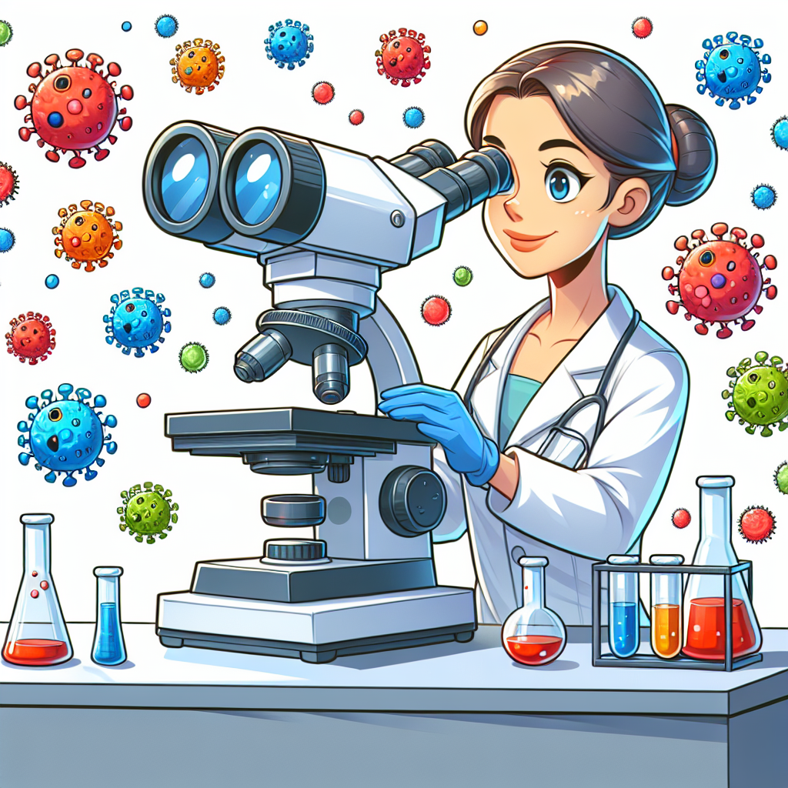

# June Almeida: The Virus Explorer Who Uncovered Tiny Treasures!

## Let's Discover Something Amazing!

Have you ever wondered what viruses look like? 🦠 These tiny creatures are too small to see with our eyes, but they're all around us! Imagine trying to spot something millions of times smaller than a grain of sand. That's the challenge June Almeida faced as she peered through her microscope, searching for these miniature marvels.

In 1964, while studying a sample of the common cold virus, June noticed something strange – a set of fuzzy blobs with spiky edges. Little did she know, she had just become the first person to see a virus's true shape! Her discovery opened up a whole new world of "Bonkers Biology" and helped scientists understand how viruses spread and cause illness.

## The Big Idea (Virus Basics)

Viruses are tiny creatures made of genetic material (like DNA or RNA) surrounded by a protective coat. They're smaller than bacteria and can only be seen with powerful microscopes. Unlike other living things, viruses can't reproduce on their own – they need to hijack the cells of other organisms to make more copies of themselves!

**Did You Know?**

- There are millions of different types of viruses on Earth 🌎
- Some viruses only infect certain species, like humans or plants
- The largest virus is the Mimivirus, which is wider than some bacteria!
- Viruses can survive in extreme environments like hot springs and glaciers

**Science Spotlight: June Almeida's Revolutionary Discovery**
June Almeida was a Scottish virologist (a scientist who studies viruses) working at a hospital in London. In 1964, she used a technique called electron microscopy to capture the first clear images of the influenza virus and a coronavirus (the family that causes illnesses like the common cold). Her work helped scientists understand how viruses spread and develop treatments. Today, her methods are still used to study emerging viruses and develop vaccines to keep us safe and healthy. 👩‍⚕️

## Time to Get Our Hands Dirty!

**The Pepper & Soap Experiment** 🧼
(Adult supervision required)

**Materials:**

- A shallow dish or plate
- Water
- Black pepper
- Liquid soap

**Instructions:**

1. Fill the dish with water and sprinkle black pepper over the surface.
2. Dip your finger in the soap, then touch the center of the pepper-covered water.
3. Watch what happens!

**Expected Result:**
The pepper should scatter away from your soapy finger, leaving a clear circle in the middle.

**The Science Behind It:**
Water molecules are attracted to each other (a force called surface tension), which allows the pepper to float. Soap disrupts this surface tension, causing the water molecules to pull away from your soapy finger, dragging the pepper along with them!

While this experiment doesn't show actual viruses, it demonstrates how soap can break up the protective coating around viruses, helping to stop their spread. That's why washing your hands with soap is so important! 🧼

## Mind-Blowing Facts!

- The smallest known virus (Circoviridae) is only 16 nanometers wide – that's 20,000 times thinner than a human hair! 🤯
- If all the viruses on Earth were lined up side by side, they could stretch beyond the nearest 60 galaxies! 🌌
- Some viruses have been found frozen in glaciers for over 30,000 years and can still infect cells when thawed. ❄️

## Your Turn to Explore!

**Explorer's Challenge:**

- Research other famous virus discoveries and the scientists behind them.
- Design your own experiment to test how different household items (like vinegar or salt) affect surface tension.
- Imagine what viruses might look like on other planets. How would their shapes and structures differ?

## The Big Question

Viruses may be tiny, but they play a massive role in our world. From causing illnesses to helping develop new medicines, these miniature marvels are truly fascinating! What other secrets do you think viruses might be hiding, just waiting to be uncovered by the next generation of curious scientists like you? 🔬
