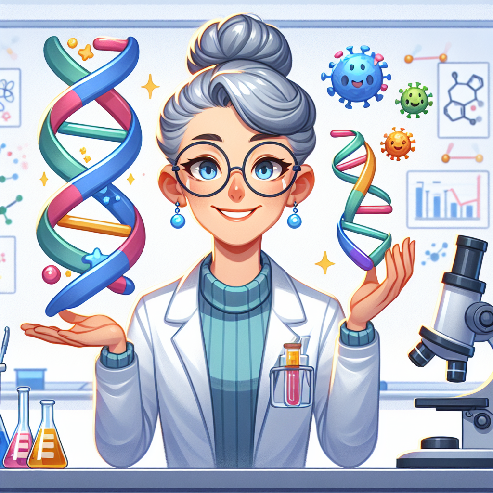

# Vaccine Superheroes: How Katalin Karikó's Tiny Messengers Save Lives!

## The Mystery Messenger in Our Bodies

Have you ever wondered how your body knows how to fight off nasty germs? 🧫 Imagine if you could send a secret message to all the cells in your body, teaching them exactly how to spot bad invaders before they make you poorly! That's exactly what scientist Katalin Karikó figured out how to do!

When the whole world needed help during the coronavirus pandemic, her amazing discovery became one of the most important medicines ever made. But did you know that for many years, almost nobody believed her ideas would work? Let's discover how this brilliant scientist never gave up and eventually changed medicine forever with something called "mRNA" - tiny messengers that can teach your body amazing new tricks!

## The Big Idea: Tiny Messengers with Superpowers

Inside your body right now are billions of cells, and they're all following instructions to keep you healthy. These instructions come from something called mRNA (messenger ribonucleic acid). Think of mRNA like tiny postmen delivering important letters that tell your cells what to make.

Katalin Karikó had a brilliant idea: what if we could write our own messages and send them into the body? These special messages would teach your cells to recognise bad germs and fight them off before they make you poorly!

### Fascinating Facts About mRNA:
1. Your body makes mRNA messages all the time - it's how your cells know what to do
2. mRNA is like a temporary sticky note - it delivers its message and then disappears
3. mRNA vaccines don't change your DNA - they just deliver temporary instructions
4. Your body reads these messages and creates "wanted posters" of germs to watch out for
5. Once your body learns what the germ looks like, it can spot it quickly if the real one arrives
6. mRNA vaccines work like a training programme for your immune system

### Did You Know?
- If you stretched out all the mRNA in one of your cells, it would be about 2 metres long!
- Scientists had to keep the mRNA vaccines super cold (colder than a freezer at home) to stop them from breaking down.
- The COVID-19 mRNA vaccines were created in just a few days after scientists learned about the virus - but testing them properly took months.

### Science Spotlight: Katalin Karikó's Amazing Journey

Katalin Karikó grew up in Hungary in a small house with no running water or refrigerator. She became fascinated by science and eventually moved to America to continue her research. For many years, other scientists didn't believe her ideas about mRNA would work. Her funding was cut, she was demoted from her university position, and she even had to sell her car to pay bills!

But Katalin never gave up. She kept experimenting and eventually made a crucial discovery: how to sneak mRNA into cells without the body attacking it. This breakthrough made mRNA vaccines possible, which helped save millions of lives during the COVID-19 pandemic. In 2023, she was awarded the Nobel Prize in Medicine - one of the biggest honours a scientist can receive!

Her determination shows us that great ideas sometimes take years to be recognised, and that we should never give up on something we truly believe in.

## Hands-On Discovery: Make Your Own Cell Messenger System!

Let's create our own model of how mRNA vaccines work in your body! This activity helps you understand how these clever vaccines teach your body to spot nasty germs.

**You'll need:**
- Paper and coloured pens/pencils
- Scissors
- Sticky notes
- A parent or guardian to help

**Safety note:** This is a drawing activity, but please be careful with scissors!

**Instructions:**
1. Draw a large circle on your paper - this is your cell.
2. In the middle of the circle, draw a smaller circle - this is the cell's nucleus where your DNA lives.
3. On sticky notes, write or draw simple pictures of things you might find around your house (like "cat," "book," or "spoon").
4. These sticky notes are like mRNA messages that tell your cell what to make!
5. Now create a special sticky note that has a picture of a germ on it - this is your "vaccine message."
6. Place your "vaccine message" sticky note into your paper cell.
7. Draw some small Y-shaped antibodies that your cell is now making because it read the message.
8. Cut out some germ shapes that match your "vaccine message" germ.
9. Show how your Y-shaped antibodies can attach to these germs to stop them!

**The Science Behind It:**
When you get an mRNA vaccine, it delivers a message to your cells with instructions to make a small, harmless piece of a virus (not the whole virus!). Your cells read this message and make these harmless pieces. Your immune system sees these pieces and learns to recognise them as invaders. It then creates antibodies (the Y-shaped defenders) that will remember how to spot the real virus if it ever enters your body. The mRNA message disappears quickly, but the memory of what the germ looks like stays with your immune system!

## Fun Facts and Mind-Bogglers

- If you made a model of an mRNA molecule the thickness of your little finger, it would stretch longer than a football pitch!
- Scientists had been working on mRNA technology for over 30 years before it was used in vaccines.
- The instructions in the COVID-19 mRNA vaccine are made of just 4,284 "letters" - that's shorter than many bedtime stories!
- WOW STATISTIC: The COVID-19 mRNA vaccines prevented at least 20 million deaths worldwide in their first year - that's like saving everyone in a city bigger than London!
- Katalin Karikó's discovery isn't just for fighting COVID-19 - scientists are now working on mRNA medicines for cancer, malaria, and even allergies!

## Explorer's Challenge

Ready to learn more about vaccines and your amazing immune system? Try these activities:

1. **Germ Detective**: Wash your hands with soap and water, then touch different surfaces around your home. Make predictions about which surfaces might have the most germs. Ask a grown-up about which surfaces need cleaning most often and why.

2. **Immune System Art**: Draw a comic strip showing how an mRNA vaccine teaches your immune system to fight germs. Include characters like "Captain mRNA," "Cell Defenders," and the "Antibody Army."

3. **Questions to Ponder**: 
   - Why do you think it's important for scientists to keep trying even when others don't believe in their ideas?
   - Can you think of other ways we might use special messages to teach our bodies new things?
   - If you could create an mRNA vaccine, what would you want it to protect against?

## The Big Question

Imagine being told your idea won't work for decades, but believing in it anyway. Katalin Karikó's determination to keep researching mRNA has saved millions of lives and changed medicine forever. Her tiny messengers teach our bodies to protect themselves in ways we never thought possible.

The next time you hear about a new vaccine or medicine, remember that it might have taken years of hard work by scientists who never gave up. Perhaps someday you might discover something amazing too! What message would you like to send to the cells in your body? What problems do you think future scientists like you might solve using mRNA technology?

Science is all about asking questions and being curious - just like you're doing right now!
