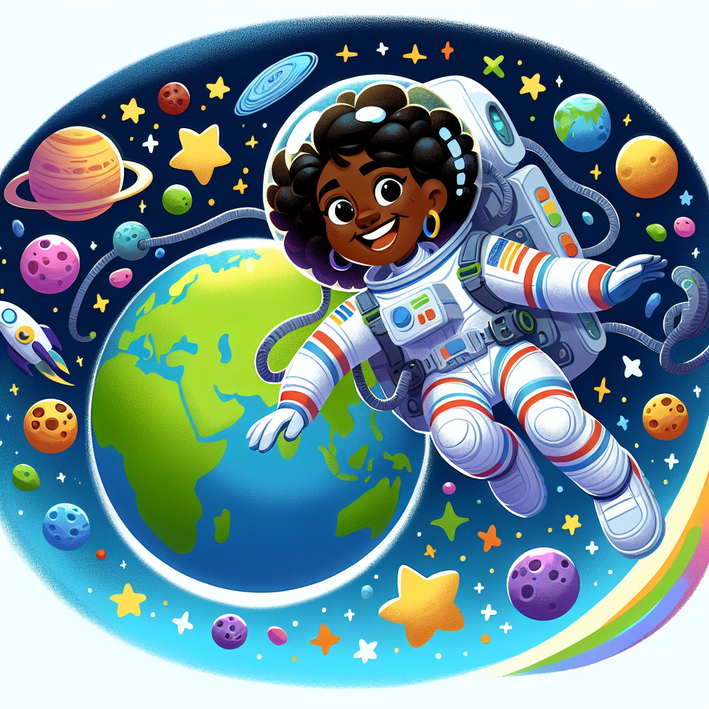

# Mae Jemison: The Space Explorer Who Reached for the Stars

## Introduction

Have you ever gazed up at the twinkling stars and wondered what it would be like to soar among them? Well, Mae Jemison didn't just dream about it – she made it a reality! As the first African American woman to travel into space, she embarked on an incredible journey that shattered barriers and inspired countless others to reach for the stars.

## Educational Points

1. **Defying Gravity**: In 1992, Mae Jemison blasted off aboard the Space Shuttle Endeavour, becoming the first African American woman to venture into the vast expanse of space. During her eight-day mission, she conducted experiments and proved that even in the weightlessness of space, scientific research can thrive.

2. **A Multitalented Trailblazer**: Before her groundbreaking space voyage, Mae Jemison had already achieved remarkable feats. She earned degrees in chemical engineering and African studies, and even served as a Peace Corps medical officer in West Africa. Her diverse talents and unwavering determination paved the way for her to become an astronaut and break down barriers for women and people of color in STEM fields.

3. **Inspiring Future Explorers**: Even after her historic space mission, Mae Jemison continued to inspire others through her work. She founded the Dorothy Jemison Foundation for Excellence, which aims to promote science literacy and encourage young people, especially girls and underrepresented groups, to pursue careers in science, technology, and engineering.

## Simple Experiment: Rocket Balloon Blast-Off

Let's recreate the excitement of Mae Jemison's space journey with a fun rocket balloon experiment!

Materials:

- A balloon
- A drinking straw
- A piece of string or yarn
- Tape

Instructions:

1. Blow up the balloon and tie it off.
2. Thread the string through the straw.
3. Tape the straw to the tied end of the balloon.
4. Hold the balloon by the free end of the string and let go!

Watch your rocket balloon blast off as the air rushes out of the balloon, propelling it forward. Just like Mae Jemison's space shuttle, your balloon will soar through the air, defying gravity for a brief moment.

## Fun Facts

- Mae Jemison was born in Alabama in 1956 and grew up fascinated by science and space exploration.
- She was inspired by the brave actions of civil rights leaders like Martin Luther King Jr. and the achievements of pioneering African American scientists like Percy Julian.
- In addition to her groundbreaking space mission, Mae Jemison has also appeared on television shows like "Star Trek: The Next Generation" and "The Big Bang Theory."

## Conclusion

Mae Jemison's remarkable journey serves as a testament to the power of perseverance, determination, and the pursuit of knowledge. Her achievements have paved the way for future generations of explorers, scientists, and dreamers. So, the next time you gaze up at the stars, remember the inspiring story of Mae Jemison and let your imagination soar to new heights!
