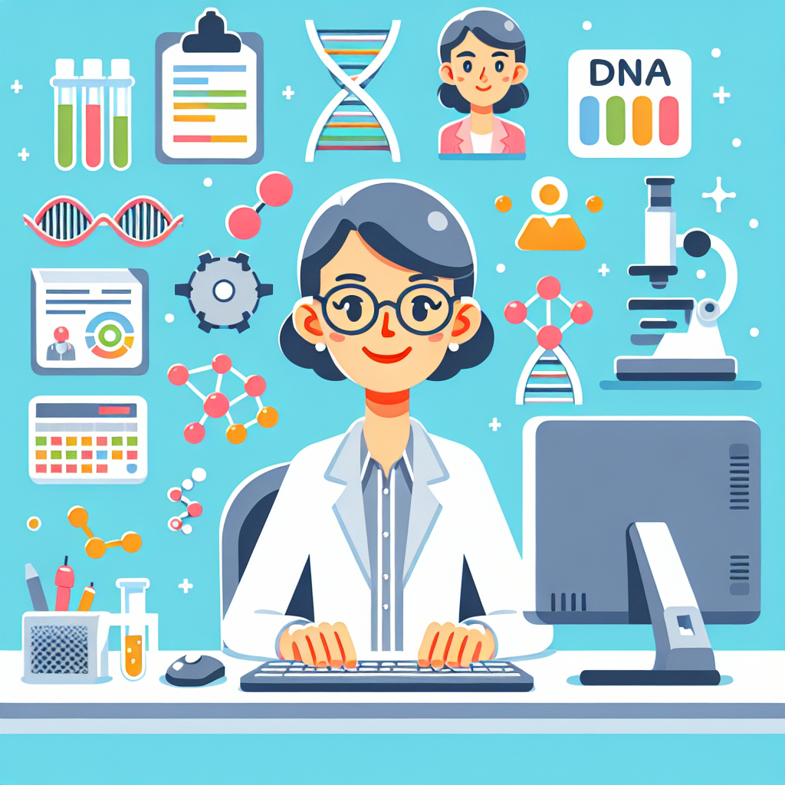

# Margaret Oakley Dayhoff: The Code-Cracking Queen of Biology

## An Exciting Introduction

Have you ever wondered how scientists can read the secret code that makes up all living things? Well, get ready to meet Margaret Oakley Dayhoff, the amazing code-cracker who helped unlock the mysteries of life itself!

## Educational Points

1. **The Code of Life**: Every living thing on Earth, from the tiniest bacteria to the mightiest blue whale, is made up of a special code called DNA. This code is like a set of instructions that tells cells how to grow, function, and reproduce.

2. **Cracking the Code**: In the 1960s, Margaret Oakley Dayhoff was one of the first scientists to figure out how to read and compare the DNA codes of different organisms. She created a special system called the "Atlas of Protein Sequence and Structure" that allowed scientists to study and understand the similarities and differences between different living things.

3. **The Impact**: Margaret's work was a huge breakthrough in the field of biology. It helped scientists understand how different species evolved and how they are related to each other. It also laid the foundation for modern fields like bioinformatics, which uses computer programs to study and analyze DNA codes.

## Simple Experiment: Secret Code Messages

Want to try your hand at cracking codes? Here's a fun activity you can do at home!

Materials needed:

- Paper
- Pencil or pen
- A secret code (you can create your own or use a simple one like the alphabet code, where A=1, B=2, etc.)

Instructions:

1. Write a secret message using your chosen code.
2. Exchange messages with a friend or family member and see if they can crack your code!
3. Once you've both cracked each other's codes, try creating more complex codes or even invent your own code system.

## Fun Facts

- Margaret Oakley Dayhoff was born in 1925 in Philadelphia, USA.
- She was one of the first people to use computers to study and analyze biological data.
- Her work helped establish the field of bioinformatics, which combines biology, computer science, and mathematics.
- She was also a talented musician and played the violin and piano.

## Conclusion

Margaret Oakley Dayhoff was a true pioneer in the field of biology. Her work in cracking the code of life paved the way for countless discoveries and advancements in modern science. So, the next time you see a scientist studying DNA, remember the amazing code-cracking queen who helped make it all possible!

If you're curious to learn more about Margaret Oakley Dayhoff and her groundbreaking work, there are plenty of books and online resources available. Who knows, maybe you'll be inspired to become a code-cracking scientist yourself one day!

