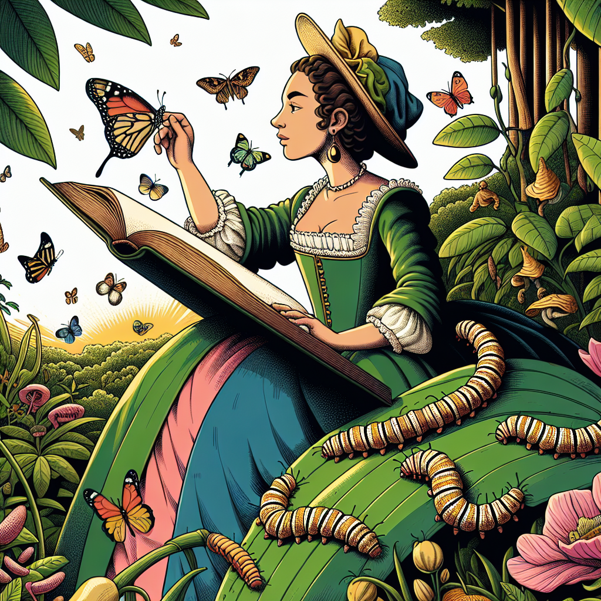

# Maria Sibylla Merian: The Amazing Bug Artist

Have you ever looked closely at a caterpillar or a butterfly? I mean, really closely? If you have, you'll know that these tiny creatures are absolutely amazing! Their colors, patterns, and strange shapes are like works of art. And that's exactly what a woman named Maria Sibylla Merian thought too!

## A Passion for Painting Petite Critters

Maria was born in 1647 in Germany, and from a very young age, she was fascinated by the natural world around her. She spent hours upon hours observing insects, studying their life cycles, and painting incredibly detailed pictures of them. At a time when most people thought bugs were gross or scary, Maria saw them as beautiful, intricate, and worthy of being studied closely.

## Making Groundbreaking Discoveries

But Maria didn't just paint bugs – she made groundbreaking discoveries about them too! For example, she realized that caterpillars turn into butterflies, which might seem obvious to us today, but back then, it was a huge revelation. She also studied the relationships between insects and the plants they lived on, which helped us understand the importance of different habitats and ecosystems.

## A Hands-On Activity: Become a Bug Observer

Would you like to follow in Maria's footsteps and become a bug observer yourself? Here's a fun activity you can try:

1. Grab a notebook and a pencil or crayon.
2. Head outside and find a plant or tree with some insects living on it.
3. Sit quietly and observe the insects for at least 10 minutes. Watch how they move, what they eat, and how they interact with their environment.
4. In your notebook, draw a detailed picture of one or more of the insects you observed. Try to capture all the little details, like their colors, patterns, and shapes.
5. Write down any interesting behaviors or facts you noticed about the insects.

## Fun Facts About Maria Sibylla Merian

- She was one of the first scientists to study insects in their natural habitats, rather than just in laboratories.
- Her beautiful illustrations were so accurate that they are still used by scientists today, over 300 years later!
- She traveled to the Dutch colony of Suriname (now part of South America) to study the insects and plants there, which was very unusual for a woman at the time.
- Her work helped inspire a greater appreciation for the beauty and importance of insects and their role in nature.

So, the next time you see a bug, remember Maria Sibylla Merian and take a closer look – you might be amazed by the incredible details and behaviors you discover!

