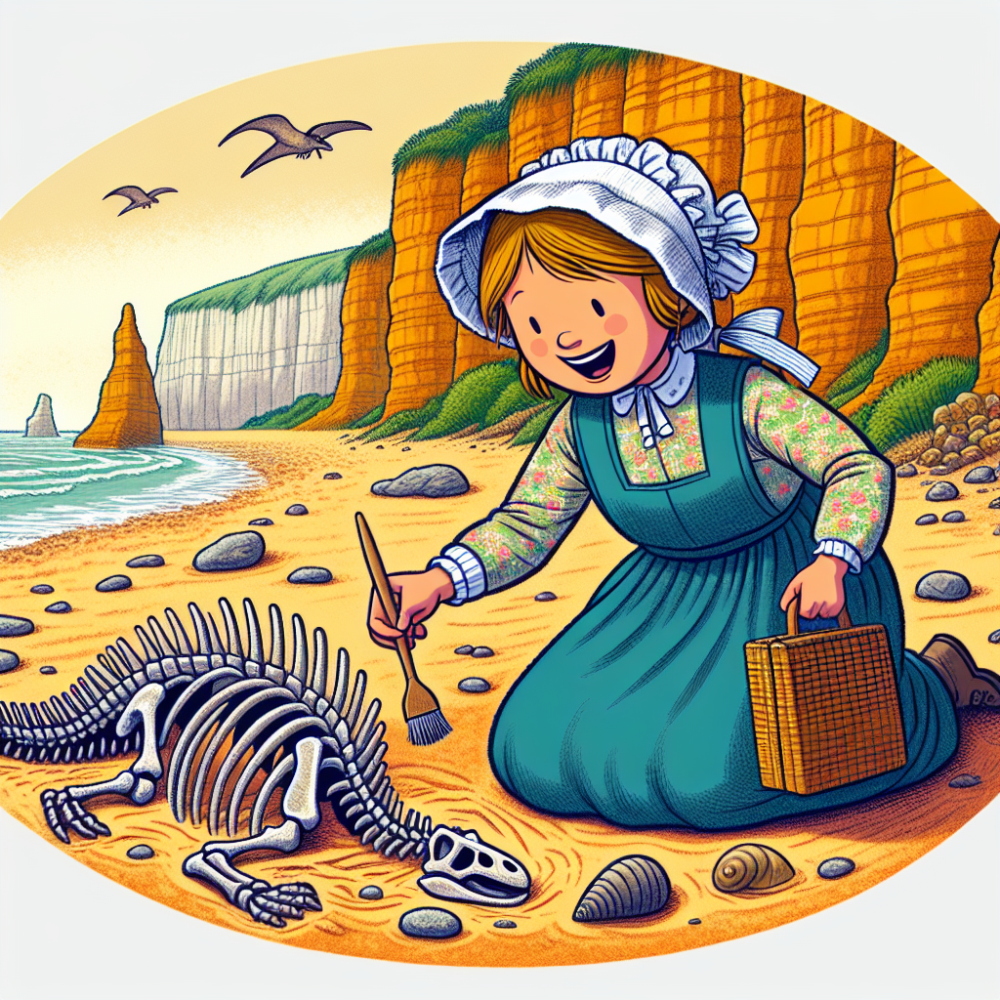

# Mary Anning: The Daring Dinosaur Detective

## Let's Discover Something Amazing

Have you ever dreamed of travelling back in time to when dinosaurs roamed the Earth? 🦖 Well, get ready to meet a real-life explorer who did just that... but not in the way you might expect! Mary Anning was a brilliant fossil hunter who uncovered the remains of incredible creatures that lived millions of years ago.

Just imagine - with each fossil she found, Mary was like a detective, piecing together clues about the prehistoric world. Her curiosity and keen eye helped reshape our understanding of life on Earth long before humans existed. Let's dive into her fascinating story!

## Time to Get Our Hands Dirty

One of the coolest things about Mary Anning is that she started her fossil hunting adventures as a child, just like you! She would comb the cliffs and beaches near her home in Lyme Regis, looking for amazing treasures hidden in the rocks.

**Try this!** Go on a fossil hunt in your own backyard or local park. Here's what you'll need:

### Materials

- A small gardening trowel or sturdy stick
- A bucket or bag to collect your finds
- An adult to join in the fun!

### Steps

1. With an adult's help, carefully dig around in areas with exposed rocks or soil. Be gentle - you don't want to damage any potential fossils!
2. Keep your eyes peeled for interesting shapes, patterns or textures in the rocks.
3. If you find something promising, carefully brush away any dirt or debris to get a better look.

**Safety Note:** Don't try to pry rocks apart, and be very careful around cliff edges or unstable ground.

Even if you don't find a dinosaur bone, you might discover some amazing patterns in ordinary rocks that give you clues about their incredible journey over millions of years!

## Mind-Blowing Facts

- 💥 When Mary was just 12 years old, she uncovered the fossilized skull of an Ichthyosaur - an amazing marine reptile that was totally unknown to science at the time!
- 🦴 Some of the most important fossils Mary found were the first complete Plesiosaur skeletons. These long-necked prehistoric creatures looked like the famous "Loch Ness Monster"!
- 🌍 Mary's fossil discoveries helped scientists understand that many of the creatures we now call "dinosaurs" actually lived at the same time as the ichthyosaurs and plesiosaurs she found.

## Your Turn to Explore

Now that you've learned about the incredible Mary Anning, here are some challenges to keep your inner dinosaur detective sharp:

- Research what other amazing prehistoric creatures Mary discovered during her lifetime. Which one fascinates you the most?
- Design your own "fossil museum" by creating labels and displays for any cool rocks or patterns you collected during your fossil hunt.
- Come up with a curious question about dinosaurs or prehistoric life that you'd like to investigate further.

## The Big Question

While we can learn so much from the fossils Mary Anning found, there are still countless mysteries waiting to be uncovered about life on Earth millions of years ago. What do you think the next big dinosaur discovery might be? Let your imagination run wild!

No matter what, just remember - with curiosity, determination and a keen eye for details, you too can be an amazing dinosaur detective, just like the daring Mary Anning. The prehistoric world is waiting for you to unravel its secrets! 🔍
