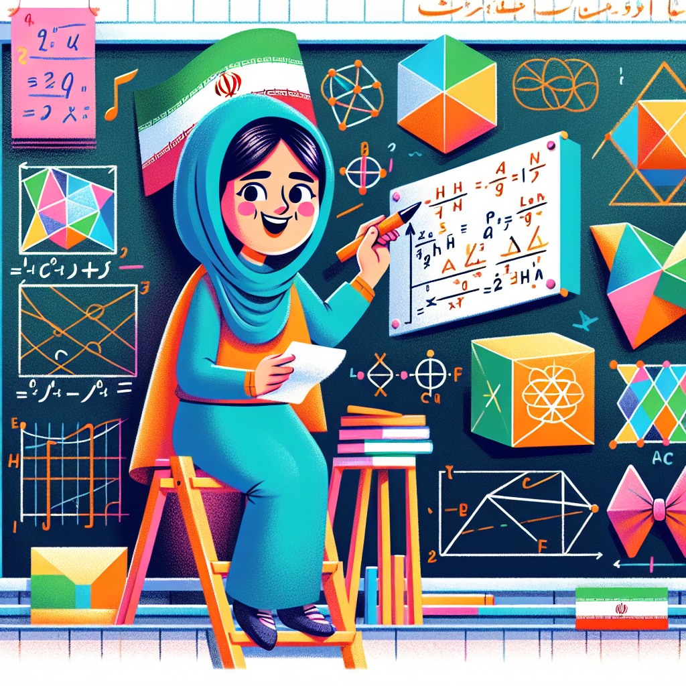

# Maryam Mirzakhani: The Mathematics Magician 🧙‍♀️

## Let's Discover Something Amazing!

Have you ever wondered how video games create those cool 3D worlds you explore? Or how animated movies make characters move so smoothly? The secret lies in the magical world of mathematics! 😲

One brilliant mathematician, Maryam Mirzakhani, unlocked some of these mysteries. She was a real-life "Maths Magician" who saw patterns and shapes in a way that few others could. Let's follow her amazing journey!

## Time to Get Our Hands Dirty!

One of Maryam's biggest discoveries involved doughnuts! 🍩 No, not the tasty kind – we're talking about strange doughnut shapes in higher dimensions. Here's a fun way to explore them:

### The Doughnut Dimension Adventure

**Materials Needed:**

- Modelling clay or playdough
- Toothpicks or skewers

**Safety Note:** Adult supervision required when using toothpicks or skewers.

**Steps:**

1. Take a piece of clay and roll it into a long snake.
2. Curve the snake into a circle and join the ends to make a doughnut shape.
3. Now try adding more "holes" to your doughnut by poking toothpicks through it.
4. Can you make a doughnut with two holes? Three holes? More?

**What's Happening?** You've just created doughnuts in higher dimensions! Each new hole adds another dimension to the shape. Maryam studied these weird, multi-dimensional doughnuts to understand the geometry of curved spaces.

## Mind-Blowing Facts!

🤯 Maryam was the first woman and the first Iranian to win the prestigious Fields Medal – considered the Nobel Prize of mathematics!

👩‍🔬 She solved mysteries about the behaviour of curved surfaces that had puzzled mathematicians for over 150 years.

🌍 Her work helps explain how the universe behaves on a massive scale and how tiny subatomic particles move.

## Your Turn to Explore!

- Create your own multi-dimensional doughnut sculptures using different materials. What's the highest number of holes you can make?
- Imagine a video game world made up of these strange doughnut shapes. What would it look like? How would you move through it?
- Maryam loved reading novels and dreamed of becoming a writer. Can you write a short story set in a multi-dimensional doughnut universe?

## The Big Question

Maryam Mirzakhani proved that mathematics is an art form – one that reveals the hidden beauty and patterns of our universe. The next time you see a stunning animation or play an immersive video game, remember the "Maths Magicians" like Maryam whose brilliant minds made it possible! 💫

What other mind-blowing mysteries do you think mathematics could help us solve? The possibilities are endless when you start looking at the world through a mathematical lens! 🔭
