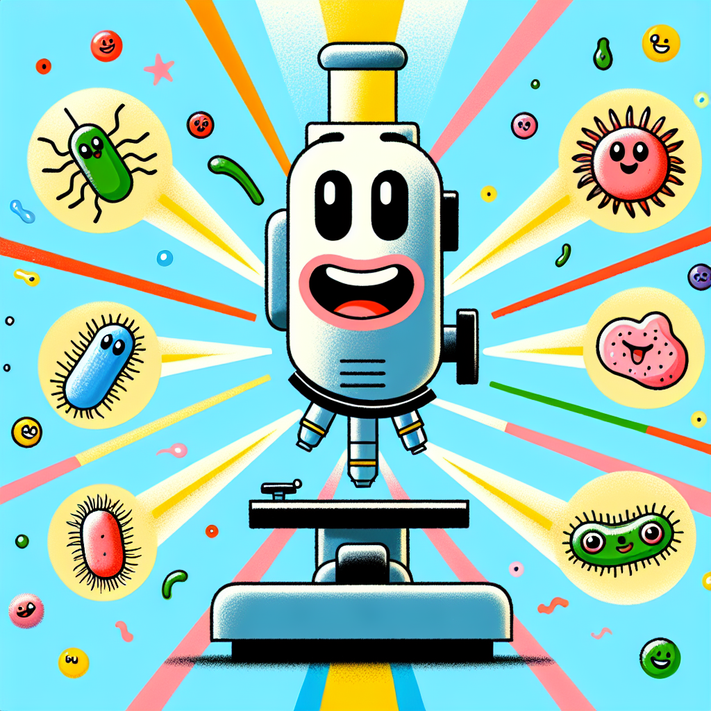

## The Smallest Secrets, the Biggest Wonders! 🔍

Have you ever tried to look at something reeeally tiny, like a speck of dust or a single grain of salt? It's almost impossible to see those minuscule details with just our eyes. But what if I told you there's an amazing machine that can make even the tiniest things appear huge? Get ready to discover the incredible world of microscopes!

## Let's Discover Something Amazing!

A microscope is like a super-powered magnifying glass that uses lenses and light to enlarge the smallest objects. By passing rays of light through these special lenses, microscopes can make things appear hundreds or even thousands of times bigger than they really are! 🤯

Did you know that the first microscope was invented way back in the 1590s by a Dutch spectacle maker named Zacharias Janssen? His simple device opened up an entirely new world of exploration and discovery. Here are some fascinating facts about microscopes:

1. The smallest thing the human eye can see without a microscope is about 0.1 millimetres wide. That's roughly the thickness of a single strand of human hair!
2. Microscopes use two types of lenses: the objective lens (closest to the specimen) and the eyepiece lens (which you look through).
3. There are many different kinds of microscopes, like compound microscopes, stereo microscopes, and even electron microscopes that use a beam of electrons instead of light!

### Science Spotlight: Antonie van Leeuwenhoek 🌟

Speaking of microscope pioneers, let's shine a light on Antonie van Leeuwenhoek, a Dutch scientist who lived in the 1600s. He was one of the first people to make incredibly detailed observations of microscopic life! Using his handcrafted lenses, Antonie discovered tiny organisms like bacteria and protozoans, which he called "animalcules." His work helped lay the foundations for the study of microbiology and inspired many other scientists to explore the unseen world. Isn't it amazing how one person's curiosity can lead to such groundbreaking discoveries?

## Time to Get Our Hands Dirty!

Now it's your turn to become a microscope explorer! For this activity, you'll need:

- A microscope (a basic toy microscope works great)
- A few different household items like a piece of cloth, a leaf, a pencil shaving, etc.
- A blank notebook and pencil for sketching

**Safety Note:** Be careful when handling the microscope and small objects. Ask an adult for help if needed.

1. Start by placing one of your items on the microscope's stage (the flat surface where you put the specimen).
2. Look through the eyepiece and slowly adjust the focus knobs until the image becomes clear.
3. Observe the intricate details and patterns you can see up close. Draw sketches of what you find in your notebook.
4. Switch to a different item and repeat the process.

**The Science Behind It:** Microscopes use a combination of lenses to bend and focus light rays, creating a magnified image of the specimen. The objective lens collects light from the sample, while the eyepiece lens acts like a magnifying glass to enlarge the image even further.

## Mind-Blowing Facts!

- 🔸 The smallest objects you can see with a basic optical microscope are about 0.2 micrometres wide. That's 500 times smaller than the width of a human hair!
- 🔸 Some powerful electron microscopes can magnify objects up to 2 million times their actual size. 🤯
- 🔸 If you lined up all the microscopic creatures found in a single handful of soil, they would stretch for over a mile!

## Your Turn to Explore!

Now that you've had a taste of the microscopic world, here are some challenges to take your exploration even further:

- 👉 Try looking at different types of fabrics, papers, or even your own skin under the microscope. Can you spot any patterns or textures you've never noticed before?
- 👉 Collect samples from different environments (like a park, your backyard, or even a puddle) and examine them under the microscope. What kinds of tiny organisms can you find?
- 👉 Experiment with different lighting techniques and see how it affects the visibility of your samples.

## The Big Question

Isn't it incredible to think that there's an entire universe of intricate details and hidden wonders all around us, just waiting to be discovered? By using microscopes, we can unlock secrets that are too small for our eyes to see. So, the next time you look at something ordinary, remember to ask yourself: "I wonder what that looks like up close?" Who knows what amazing discoveries you might make!
