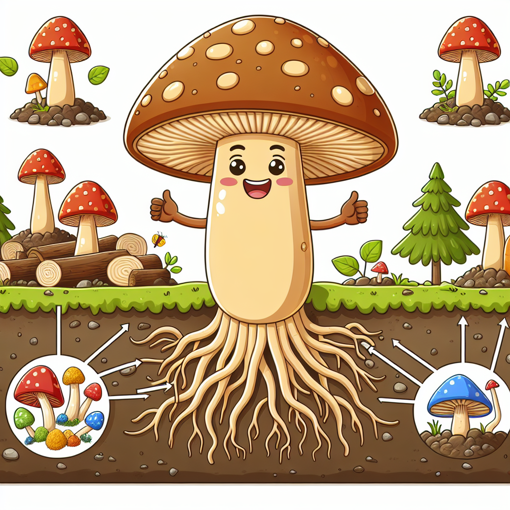

## Let's Discover Something Amazing!

Have you ever noticed those funny-looking mushrooms popping up in your garden or at the park? 🤔 They might seem like just another part of nature, but these incredible fungi are actually nature's recyclers – working hard to keep our planet clean and healthy!

Did you know that without mushrooms, we'd be buried under piles and piles of dead plants and trees? 😲 It's true! Mushrooms play a vital role in breaking down decaying matter and recycling nutrients back into the soil. It's like they're tiny composters, turning waste into food for other plants and trees. How cool is that?

## Time to Get Our Hands Dirty!

Speaking of composting, here's a fun activity to try at home: let's grow our own mushrooms! 🍄 With just a few simple materials, you can watch these amazing fungi sprout right before your eyes.

**What You'll Need:**

- A plastic container with a lid (like an old butter tub)
- Potting soil or compost
- Mushroom spawn or spores (you can find these online or at a garden center)
- A spray bottle with water

**Safety Note:** Be sure to have an adult help you with this activity, and never eat any mushrooms you grow without proper guidance.

**Let's Get Started!**

1. Fill your container about two-thirds full with the potting soil or compost.
2. Sprinkle the mushroom spawn or spores evenly over the soil.
3. Gently mist the soil with water from the spray bottle, being careful not to make it too soggy.
4. Cover the container with the lid and store it in a cool, dark place.
5. Check on your mushroom farm every few days and mist with water if the soil looks dry.

In just a few weeks, you should start to see tiny mushrooms popping up! Isn't that amazing? You're witnessing the incredible recycling power of fungi right in your own home.

**The Science Behind It:** Mushrooms are the fruiting bodies of fungi, which are organisms that play a crucial role in breaking down organic matter. The mushroom spawn or spores you planted contain a network of tiny threads called mycelium. As the mycelium grows and spreads through the soil, it releases enzymes that break down the decaying matter, absorbing nutrients in the process. When the conditions are just right, the mushrooms sprout up to release their spores and continue the cycle of life!

## Mind-Blowing Facts!

- The largest living organism on Earth is a humongous fungus! 🤯 It's a single honey fungus that spans an incredible 2,385 acres (9.6 square kilometers) in Oregon's Blue Mountains. That's bigger than 1,665 football fields!

- Mushrooms are more closely related to humans than they are to plants! 😲 They belong to their own kingdom called Fungi, separate from plants, animals, or bacteria.

- Some fungi can even break down plastic and other tough materials! 🌎 Scientists are studying ways to use these amazing recyclers to help clean up environmental pollution.

## Your Turn to Explore!

Now that you know how incredible mushrooms are, why not become a fungi explorer? Here are some challenges to get you started:

1. Go on a mushroom hunt in your backyard or local park. How many different types can you find? Try sketching or taking photos of the ones you discover.

2. Research a type of mushroom that has special abilities, like bioluminescence (glowing in the dark) or producing antibiotics. Share what you learn with your family or classmates.

3. Design your own experiment to test how different conditions (like light, temperature, or moisture) affect mushroom growth. Remember to ask an adult for help and follow proper safety guidelines.

## The Big Question

Mushrooms might seem small and unassuming, but they play a massive role in keeping our planet healthy. Without these amazing recyclers, the world would be buried under piles of waste! 🌍 So the next time you see a mushroom, remember to thank it for its hard work.

But here's the big question: if mushrooms can break down and recycle so many different materials, what other secrets might they hold for helping us solve environmental challenges? The possibilities are endless when we explore the incredible world of nature's recyclers!
