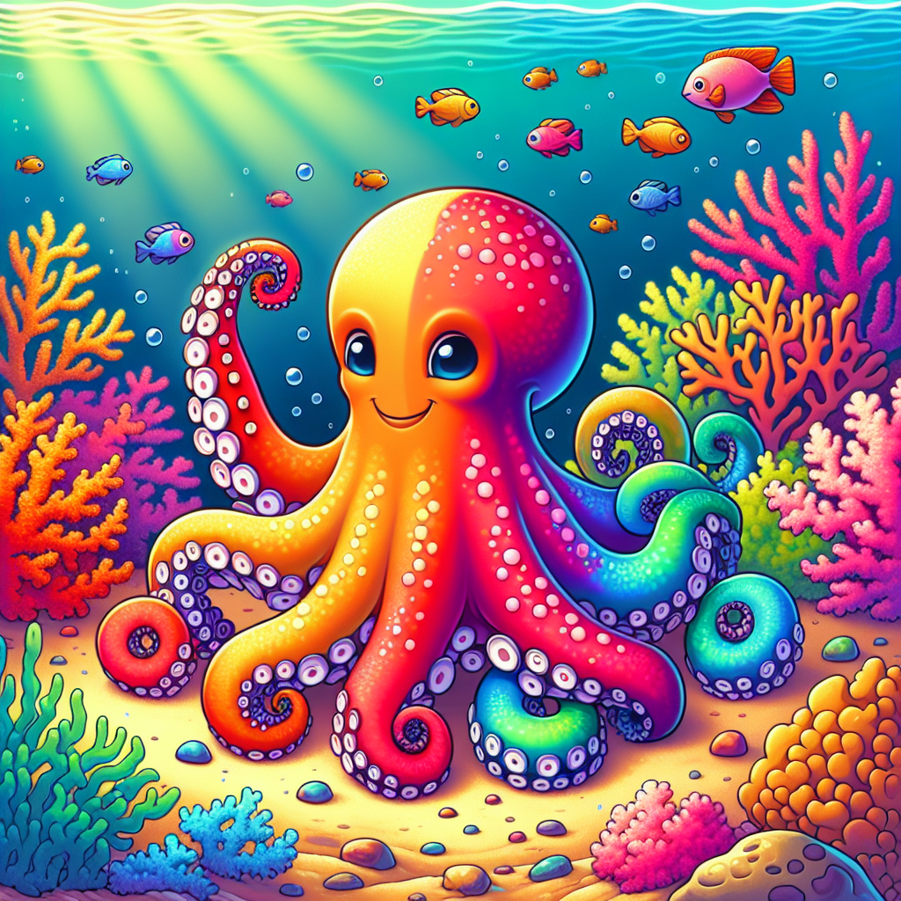

# Colour-Changing Champions: How Octopuses Become Masters of Disguise!

## The Amazing Octopus Trick!

Have you ever wished you could change your appearance in an instant? Imagine if you could match your clothes to your background perfectly, or turn spotty when you're excited and stripy when you're scared! 🐙 This might sound like a superpower from your favourite comic book, but for octopuses, it's just an ordinary Tuesday!

These eight-armed ocean dwellers are nature's ultimate quick-change artists. In less time than it takes you to blink, an octopus can transform from bright red to mottled brown, or from smooth-skinned to bumpy and back again. They don't need a costume change or special effects—their skin does all the work!

But how do they perform this incredible trick? Let's dive beneath the waves to discover the secrets of these amazing creatures!

## The Big Idea: Living Colour Screens

Imagine if your skin was like a living television screen that could change pictures in an instant. That's basically what octopus skin is like! These clever creatures have special cells in their skin called chromatophores, which are like tiny bags filled with coloured pigments (that's the fancy word for natural colouring).

When an octopus wants to change colour, its brain sends signals to tiny muscles attached to these chromatophore bags. When the muscles pull, the bag stretches out like a balloon, making the colour spread and become more visible. When the muscles relax, the bag shrinks back to a tiny dot, hiding the colour!

But that's not all! Octopuses have even more amazing tricks up their eight sleeves:

- They have THREE types of special cells in their skin: chromatophores (for colour), iridophores (for shimmery effects), and leucophores (for white reflections)
- Some octopuses can change their skin texture too, going from smooth to bumpy in seconds
- They can create moving patterns across their bodies, like ripples or waves
- An octopus can match the exact pattern of coral, rocks, or even a chessboard!
- They don't even need their eyes to change colour – their skin can actually sense light directly!

**Did You Know?** 
- Octopuses don't just change colour to hide—they also do it to communicate with other octopuses and to show their feelings!
- The mimic octopus can pretend to be at least 15 different sea creatures, including dangerous ones like sea snakes and lionfish!

### Science Spotlight: Roger Hanlon's Octopus Discoveries

Professor Roger Hanlon has spent over 40 years studying how cephalopods (octopuses, squids, and cuttlefish) change colour. In 2008, he captured the first high-definition video of an octopus changing colour in the wild, which amazed scientists around the world! 

His work has helped us understand how these animals use their camouflage abilities to survive in the ocean. Today, engineers are using what we've learned from octopuses to create special materials that can change colour or texture, which might one day help create better camouflage for soldiers or even medical devices that can blend into the human body. His research shows how studying nature's amazing solutions can help us solve human problems!

## Hands-On Discovery: Make Your Own Colour-Changing Octopus

Let's create a model that shows how octopus chromatophores work!

**Materials you'll need:**
- A clean, empty plastic bottle (500ml size works well)
- Red, blue and yellow food colouring
- A balloon
- A rubber band
- Adult help for cutting the bottle

**Safety Warning:** Ask a grown-up to help with cutting the plastic bottle. Food colouring can stain clothes and surfaces, so wear old clothes or an apron.

**Steps:**
1. With adult help, cut the bottom third off the plastic bottle.
2. Stretch the balloon over the cut end of the bottle and secure it with a rubber band.
3. Put 3-4 drops of each food colouring inside the bottle on the balloon surface.
4. Now for the fun part! Pull the balloon downward (like pulling it into the bottle) - what happens to the colour spots?
5. Now let go - what happens when the balloon goes back to normal?

**The Science Behind It:** When you pull the balloon, it stretches, making the food colouring spots spread out, just like real chromatophores in octopus skin! When you let go, the spots shrink back to small dots. This is similar to how octopus chromatophores work, except in a real octopus, tiny muscles pull on each individual chromatophore to make it expand.

In a real octopus, the brain controls thousands of these colour cells independently, which is much more complex than our model. Also, real chromatophores don't actually mix colours like our food colouring might - they're separate cells with different pigments that work together to create the overall effect.

## Mind-Blowing Octopus Facts!

Get ready for some seriously wow-worthy octopus facts:

- The common octopus has approximately 200 MILLION chromatophores in its skin! That's more than 25 times the number of people living in London!

- Octopuses can change colour in just 0.3 seconds. That's faster than you can say "octopus"!

- Some deep-sea octopuses can create their own light shows using bioluminescence, glowing in the dark depths like underwater fireworks.

- An octopus's skin can "see" light even without using its eyes! Special light-sensing proteins in their skin help them match colours perfectly.

## Explorer's Challenge

Ready to become an octopus expert? Try these activities:

1. **Camouflage Hunt:** Go to a park or garden and try to spot camouflaged insects or animals. How many can you find? What makes their camouflage effective?

2. **Colour Mood Journal:** Create a week-long diary where you draw an octopus each day showing how you feel through colours. Use red for angry, blue for sad, yellow for happy, or make up your own colour code!

3. **Pattern Detective:** Look at different patterned fabrics or wallpapers at home. Which ones would be easiest for an octopus to mimic? Which would be hardest?

4. **Questions to Ponder:** If you could change colour like an octopus, when would you use this ability? How might it change how you communicate with friends?

## The Big Question

Imagine having skin that can change colour, texture, and pattern in less than a second! Octopuses use this amazing ability not just to hide, but to communicate and express themselves. 

Scientists are still discovering new secrets about how octopuses change colour. Could we ever create clothes that change colour like octopus skin? What would you design if you could make colour-changing materials?

The next time you see pictures or videos of octopuses, look closely at their incredible skin. These clever creatures remind us that some of the most amazing technology on Earth isn't made by humans at all—it's been perfected by nature over millions of years!

What other amazing abilities might animals have that could inspire new human inventions? The natural world is full of wonders waiting for young scientists like you to discover!
