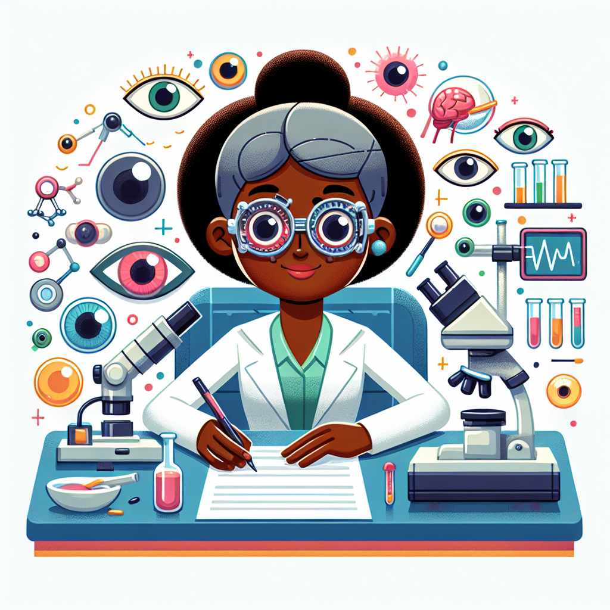

Have you ever wondered how doctors can fix problems inside your body without a single cut? 🔦 Imagine a powerful beam of light that can repair things as tiny as the cells in your eyes! That's exactly what Dr. Patricia Bath invented – a revolutionary kind of laser surgery that has helped millions of people see clearly again.

Her incredible journey started when she was just a young girl, staring up at the stars and dreaming of becoming a scientist. Little did she know, her curiosity about light would one day lead to a mind-blowing breakthrough in eye surgery! Are you ready to discover how Patricia Bath's laser genius works? Let's dive into the amazing world of light, eyes, and vision! 👀

Our eyes are like amazing cameras that focus light to create pictures for our brains. But sometimes, parts of this living camera can get a bit blurry – which is where cataracts come in. A cataract is a cloudy patch that forms on the eye's lens, making vision hazy and difficult.

In the past, removing cataracts required cutting open the entire eye! 😲 Dr. Bath realized there had to be a better way. She thought, "What if we could use a special laser beam to break up the cataract without a single cut?"

You see, lasers create a very focused, precise beam of light that can target specific spots. By carefully aiming a laser, Dr. Bath found a way to dissolve cataracts through a tiny incision, leaving the rest of the eye untouched! Her invention, called "laser phaco," was like having a tiny, powerful repair crew inside the eye. Genius!

### Laser Pointer Experiment

**What You'll Need:**

- A laser pointer (get an adult's help!)
- A few different materials like paper, aluminum foil, fabric, clear plastic
- A dark room or shaded area

**What to Do:**

1. **Safety First!** Never look directly into the laser beam or point it at anyone's eyes. Get an adult to help you with this activity.
2. Take the materials into the dark room or shaded area. This will help you see the laser beam better.
3. Turn on the laser pointer and shine it onto each material, one at a time.
4. Observe what happens – does the laser go through the material? Does it reflect off at an angle? Does it make any patterns or shapes?

**What's Happening?**
The laser pointer creates a very narrow, focused beam of light. When this beam hits different materials, it interacts with them in different ways:

- With paper or fabric, the beam can't pass through easily, so you'll see a bright spot on the surface.
- With aluminum foil or a mirror, the smooth surface reflects the laser beam at an angle, almost like a mini mirror!
- With clear plastic or glass, the laser can pass through easily without being blocked.

This is similar to how Dr. Bath's laser works inside the eye. The laser beam is focused so precisely that it can target and dissolve the cataract without damaging the surrounding areas. It's like having a tiny, powerful spotlight that can reach deep inside the eye!

**Mind-Blowing Facts!**

😲 Did you know that cataracts are the leading cause of blindness worldwide? Dr. Bath's laser invention has helped restore sight to millions!

💡 The word "laser" stands for "Light Amplification by Stimulated Emission of Radiation." That's a huge name for such a tiny beam of light!

🌈 Lasers can come in different colors depending on the type of light they use. Some common laser colors are red, green, blue, and even invisible infrared!

🔭 Lasers aren't just used in eye surgery – they're also found in DVD players, barcode scanners, laser shows, and even some long-distance communication systems!

Now that you've seen how lasers can interact with different materials, here are some fun challenges to try:

1. **Laser Maze:** Use a laser pointer and different household objects to create a maze or obstacle course for the beam to travel through. Can you guide the laser from one point to another without it hitting any objects?

2. **Shadow Puppets:** Shine the laser pointer onto a wall and use your hands or other objects to create fun shadow shapes and patterns. How creative can you get with light and shadows?

3. **Laser Patterns:** Grab a piece of paper and a mirror or two. Can you reflect the laser beam in different directions to create interesting patterns or designs on the paper?

As you explore, think about these questions:

- How does the laser beam behave differently with different materials?
- What other ways could lasers be used in medicine or technology?
- If you could invent a new laser device, what would it do?

Keep your eyes open for more laser adventures – who knows what incredible discoveries you might make next? 🔍

Wasn't Patricia Bath's laser invention simply brilliant? 💡 By combining her curiosity about light, her knowledge of the human eye, and her determination to find a better way, she revolutionized how we treat cataracts and restored vision for millions.

The next time you see a laser pointer or a beam of light, remember the amazing power it holds. A focused beam can cut through materials, reflect off surfaces, or even repair the tiniest parts of our bodies!

Just like Dr. Bath, you too can change the world by exploring the mysteries of science with an inquisitive mind and a willingness to think outside the box. So, what incredible discovery will you dream up next? Perhaps a laser that can... well, you'll have to let your imagination run wild! 🚀
