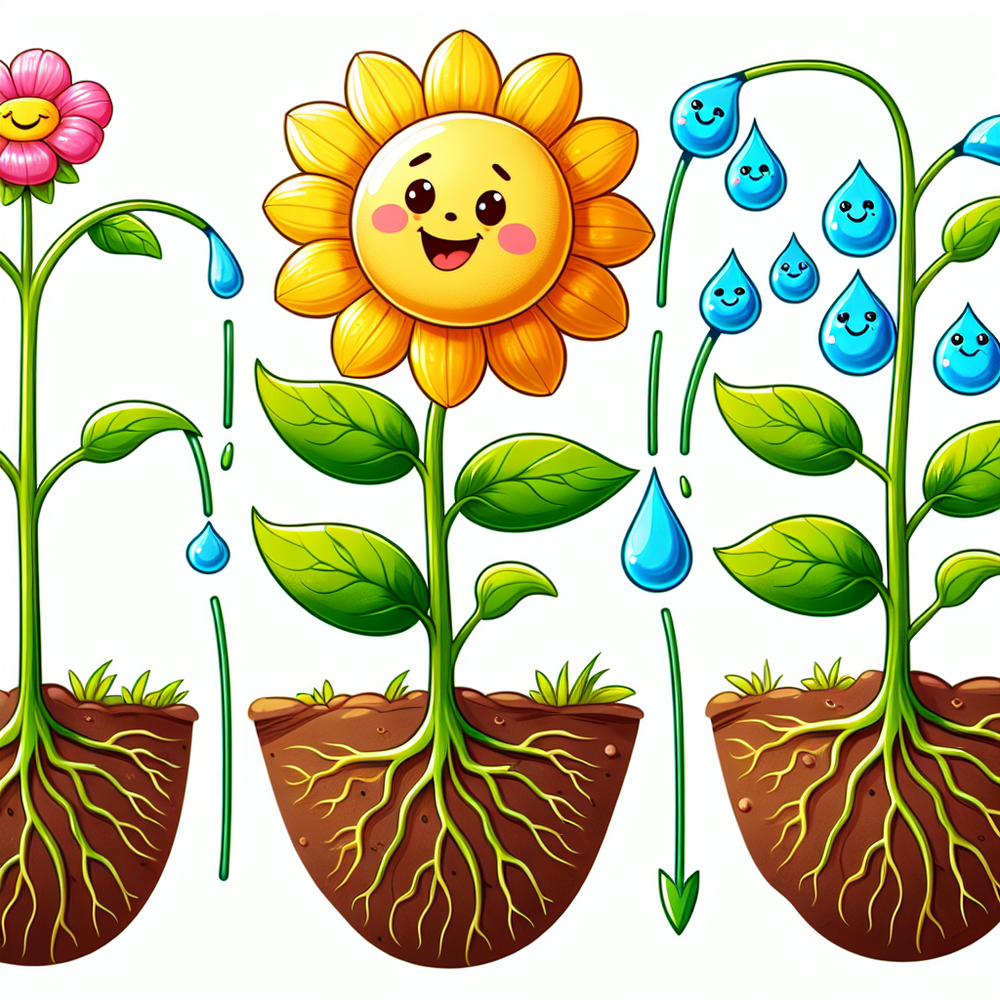

# The Thirsty Plant: Unlocking Nature's Magic Straw!

## Let's Discover Something Amazing!

Have you ever seen a tall tree and wondered, "How does all that water get up there?" 🤔 Plants are pretty amazing – they can suck up water from the ground like a super straw, even reaching the top branches! But how does this magic happen? Get ready to uncover the incredible science behind capillary action!

## Time to Get Our Hands Dirty!

**Safety First:** This experiment involves food colouring, so cover your workspace and wear an apron or old clothes, just in case! Adult supervision is recommended.

**Materials Needed:**

- 2 glasses or jars
- Water
- Food colouring (any colour)
- Paper towels
- Scissors

**Let's Get Started!**

1. Fill one glass about three-quarters full with water and add a few drops of food colouring. Mix well.
2. Fold a paper towel in half lengthwise, then roll it up tightly into a cylinder.
3. Stand the paper towel cylinder up in the empty glass and let the bottom touch the surface.
4. Carefully pour the coloured water into the other glass until it's about an inch deep.
5. Watch closely as the coloured water starts climbing up the paper towel! 🧑‍🔬

**What's Happening?** The narrow spaces inside the paper towel are acting like tiny straws, pulling the water upwards through capillary action! This is the same process that helps plants suck up water and nutrients from the soil. Isn't that amazing?

## Mind-Blowing Facts!

- 🌳 The world's tallest tree, a California redwood, is over 115 metres (379 feet) tall! Its roots can pull water all the way up from the ground using capillary action.
- 🌵 Desert plants like cacti have extra-tiny tubes to help them soak up as much water as possible from the dry soil.
- 📝 The ancient Egyptians used capillary action to make the first pens by soaking a hollow reed in ink!

## Your Turn to Explore!

- 🖍️ Try the paper towel experiment again, but this time, use different materials like string, fabric, or even your own hair! Which ones work best?
- 🍅 Observe the stem of a freshly cut flower or vegetable. Can you see the tiny tubes carrying water up from the base?
- 📐 How high can you make the coloured water climb? Experiment with different paper towel shapes and sizes!

## The Big Question

Capillary action is all around us, helping plants survive and even making our pens work! But here's something to ponder: if you zoomed in really close, would water look like tiny little trains travelling through the plant's pipeline? 🚂 What other surprising places might you find capillary action at work? The natural world is full of wonders waiting to be explored!
