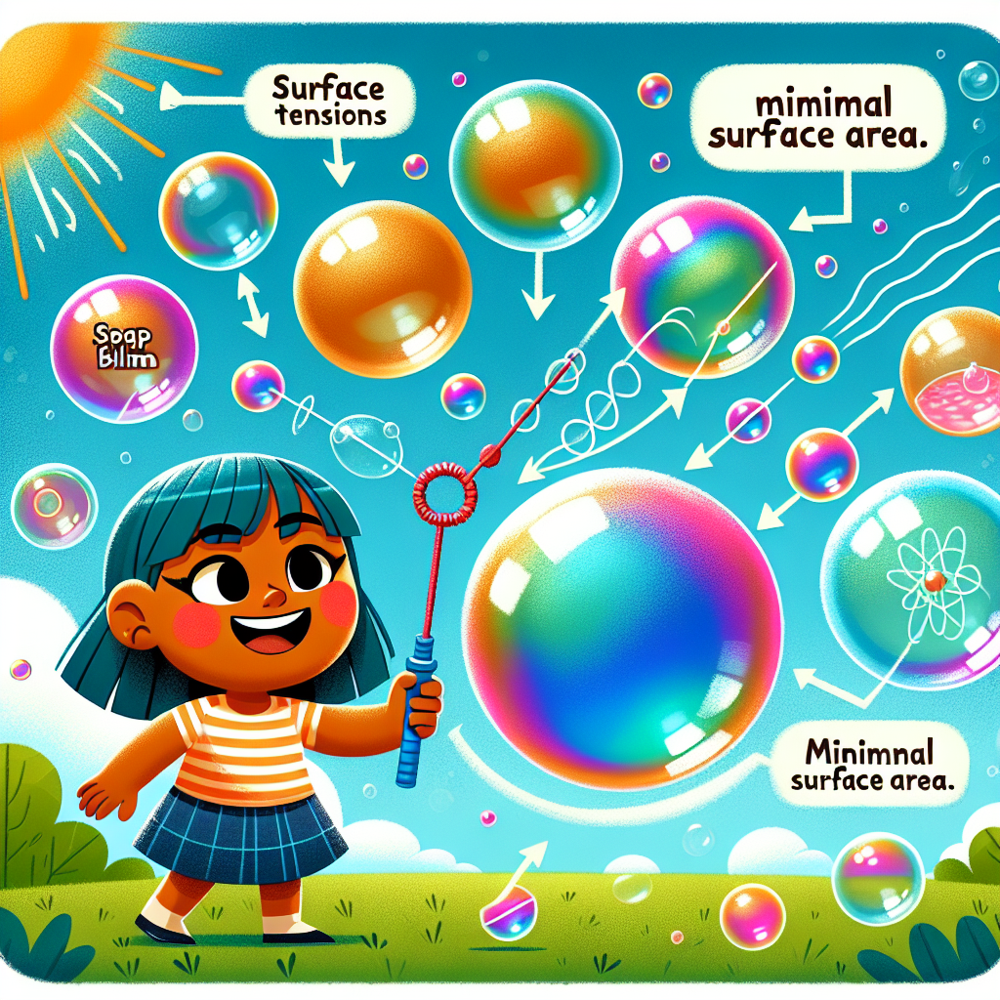

# Bubbles Galore! Why Are They Perfectly Round?

## Let's Discover Something Amazing!

Have you ever blown bubbles and wondered why they're always round? 🤔 It's one of those everyday mysteries that scientists have spent years investigating. Get ready to embark on a bubbly adventure and uncover the fizzy physics behind these miniature marvels!

## The Big Idea

At the heart of a bubble's perfect spherical shape lies a fascinating force called "surface tension." Imagine the bubble solution as a stretchy, elastic sheet made up of millions of tiny molecules. As you blow air into the bubble wand, this elastic sheet forms a thin film around the air pocket, creating a bubble.

But why does it take on a round shape? It's all thanks to surface tension! The molecules in the bubble solution are attracted to each other, trying their best to stick together and minimize the surface area. And the shape with the smallest possible surface area for a given volume is... you guessed it, a sphere!

### Did You Know?

- Bubbles are incredibly thin, with walls only a few hundred molecules thick! 🤯
- The iridescent colours you see in bubbles are caused by light reflecting off the thin soap film.
- Bubbles can form inside other bubbles, creating a "bubble within a bubble" effect!
- Freezing bubbles at the right temperature can create amazingly intricate patterns and shapes.

### Science Spotlight: The Pioneering Work of Agnes Pockels

In the late 1800s, a pioneering scientist named Agnes Pockels made groundbreaking discoveries about surface tension and how it affects the behaviour of liquids. Her work laid the foundation for understanding the physics of bubbles and even helped in the development of modern soaps and detergents. Despite facing many challenges as a woman in science, Pockels persevered and her research has had a lasting impact on fields like chemistry, biology, and even environmental science!

## Time to Get Our Hands Dirty!

Now it's your turn to become a bubble scientist! Let's try a simple experiment to see surface tension in action.

### The Pepper and Soap Experiment

**Materials:**

- A shallow dish or bowl
- Water
- Black pepper
- Liquid soap

**Instructions:**

1. Fill the dish with water and sprinkle some black pepper on the surface.
2. Observe how the pepper spreads out across the water's surface.
3. Put a drop of liquid soap on your finger and gently touch the water's surface.
4. Watch what happens to the pepper as the soap disrupts the surface tension!

**The Science Behind It:** The pepper initially floats on the water's surface due to surface tension. When you add soap, it reduces the surface tension, causing the pepper to move away from the area where the soap touches the water.

**Safety Note:** Be careful not to get soap in your eyes. Ask an adult for help if needed.

## Mind-Blowing Facts!

- The largest bubble ever blown was a whopping 8.13 meters (26.7 feet) in diameter! 🤯 That's about the size of a small hot air balloon!
- Bubbles are used in cutting-edge scientific research, like studying the properties of materials at the molecular level.
- Did you know that some animals, like certain species of frogs and insects, can actually breathe through bubbles? 🐸

## Your Turn to Explore!

- Try blowing bubbles with different soap solutions and see if the size or longevity of the bubbles changes.
- Experiment with different bubble wand shapes and observe how they affect the bubble's formation.
- Can you create a bubble sculpture or even a bubble inside another bubble?

## The Big Question

Now that you know the science behind bubbles, can you think of any other everyday phenomena where surface tension plays a role? Share your ideas and let's keep exploring the wonders of the world around us!

Remember, every time you see a perfectly round bubble, you're witnessing the amazing physics of surface tension in action. Who knew these tiny spheres could teach us so much about the fascinating forces that shape our universe? 🌍🔬
