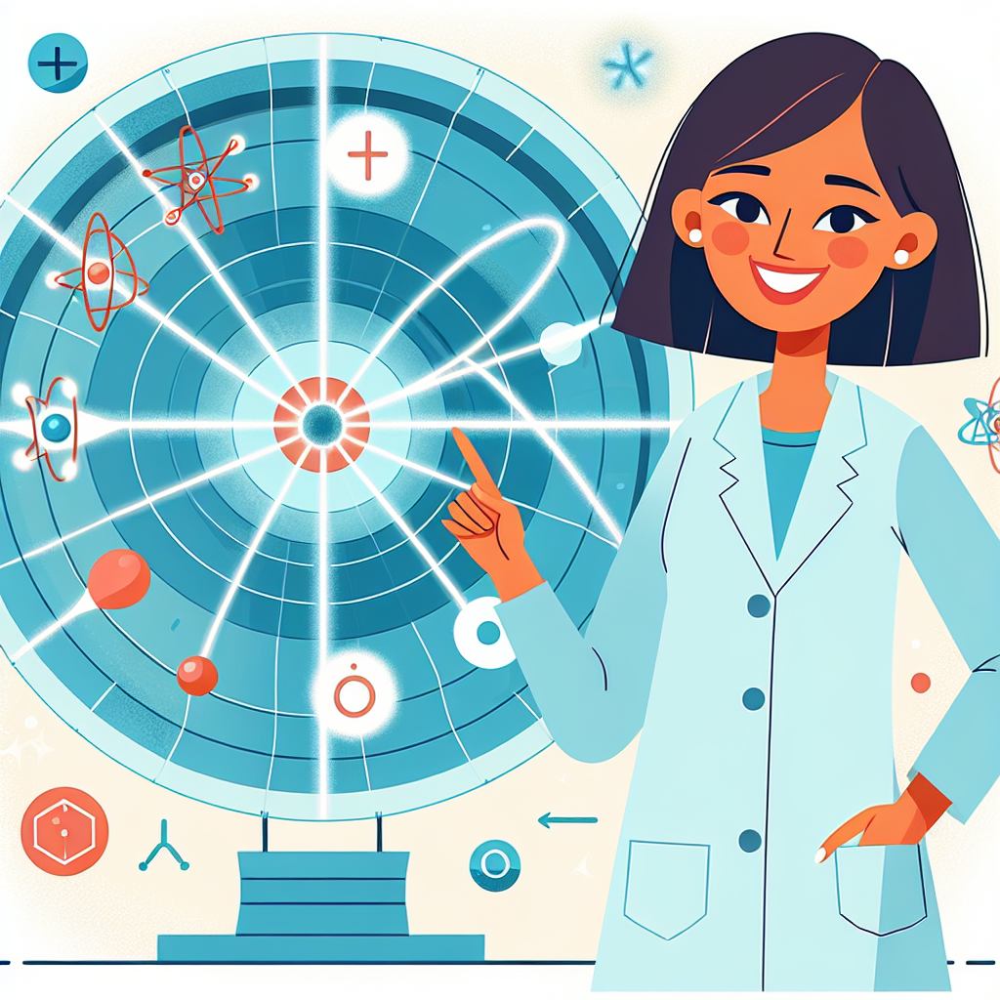

## Let's Discover Something Amazing!

Have you ever wondered what everything around us is made of? 🤔 From the chair you're sitting on to the air you're breathing, it all starts with the tiniest particles known to science – and one remarkable scientist spent her life unlocking their mysteries!

Meet Sau Lan Wu, a particle physics pioneer who helped reveal the hidden world of subatomic particles. Imagine exploring a realm so small, it would make an ant look like a giant! 🐜 That's the incredible scale Wu worked with, studying particles millions of times smaller than a speck of dust. Her groundbreaking discoveries have helped shape our understanding of the universe's most fundamental building blocks.



### The Big Idea

At the heart of particle physics lies the quest to understand the most basic constituents of matter – the particles that make up everything from stars to smartphones. These tiny particles, like quarks and leptons, are the Lego bricks that nature uses to construct atoms, molecules, and ultimately, the world around us.

**Did You Know?**

- Protons and neutrons, the building blocks of atomic nuclei, are made up of even smaller particles called quarks!
- The electron, one of the most familiar particles, is so small that if you lined up a trillion trillion of them, they would still only be about a meter long!

Wu's groundbreaking work focused on studying the behavior of these subatomic particles when they collide at incredibly high energies. By smashing particles together in powerful particle accelerators, scientists like Wu could observe the incredible transformations and interactions that occur at the most fundamental level of matter.

**Science Spotlight:** In the 1950s, Wu conducted a series of experiments that challenged a widely accepted principle known as the "conservation of parity." Her findings showed that certain particle interactions violated this principle, shattering long-held beliefs and paving the way for a deeper understanding of the nature of particles and forces. Wu's work not only advanced particle physics but also helped inspire a new generation of scientists, especially women, to pursue careers in this fascinating field.

### Time to Get Our Hands Dirty!

It's time for a hands-on adventure! Let's explore the world of static electricity and see how it relates to the behavior of particles. All you need is a balloon, a piece of paper, and an adult's supervision.

**Safety First:** Be careful not to rub the balloon too vigorously, as it could cause a small static shock. Ask an adult for help if needed.

**Materials:**

- 1 balloon
- Small pieces of paper or tissue
- A smooth surface (like a table or wall)

**Instructions:**

1. Blow up the balloon and tie it off.
2. Rub the balloon back and forth against your hair or a piece of clothing for about 30 seconds.
3. Bring the balloon close to the small pieces of paper without touching them.
4. Observe what happens!

**Expected Result:** The pieces of paper should be attracted to and stick to the balloon!

**The Science Behind It:** When you rub the balloon against your hair or clothing, you're transferring electrons (tiny particles with a negative charge) from the balloon's surface to your hair or clothing. This leaves the balloon with an overall positive charge, which then attracts the negatively charged pieces of paper. Just like particles in an accelerator, the electrons in this experiment are moving and interacting, creating an observable effect!

### Mind-Blowing Facts!

- A single particle accelerator can be over 16 miles (27 km) in circumference – that's longer than a half marathon! 🏃‍♀️
- Particle collisions in accelerators can reach temperatures over a trillion degrees – hotter than the center of the Sun! 🔥
- The Large Hadron Collider at CERN (the world's largest particle accelerator) produces enough data every second to fill over 100,000 DVDs! 📀

### Your Turn to Explore!

- Try the static electricity experiment with different materials, like a plastic comb or a wool sweater. Can you make the paper pieces jump higher or move in different ways?
- Research other famous particle physicists and their discoveries. Who else helped shape our understanding of the subatomic world?
- Design your own particle accelerator (on paper, of course!). What features would it have, and what kinds of particles would you study?

## The Big Question

Particle physics may seem like a tiny field, but its impact is enormous! From uncovering the fundamental laws of nature to developing life-saving medical technologies, the study of the ultra-small has led to some of humanity's biggest breakthroughs. As you continue your journey of discovery, remember the words of Sau Lan Wu: "The principles of physics, as far as I can see, are true for all times and spaces." What other mind-bending mysteries await us in the realm of the ultra-small? 🔬

```

```
