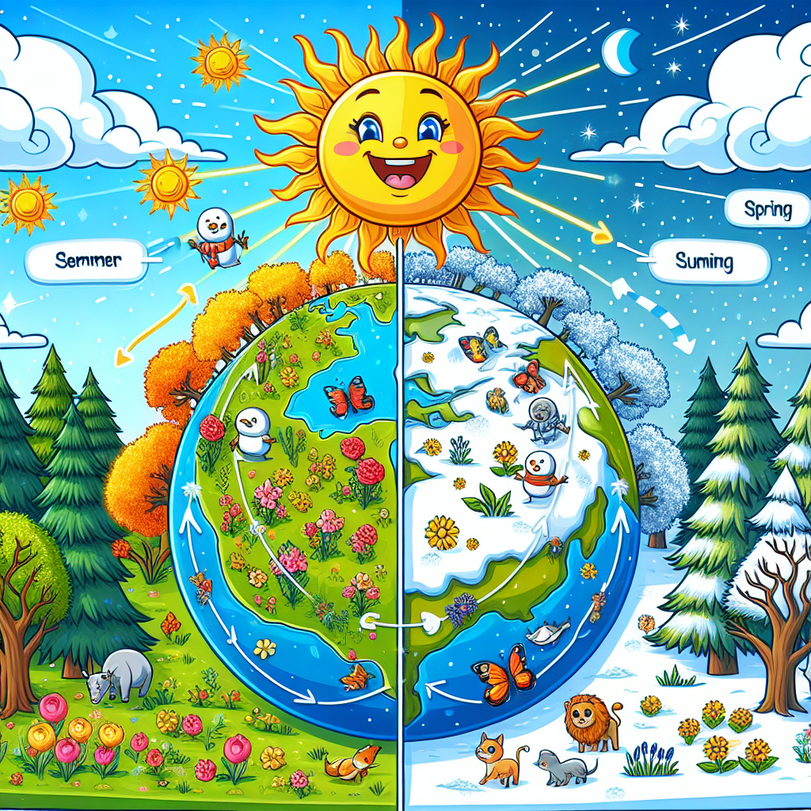

## Let's Discover Something Amazing

How cool would it be if you could travel through the seasons just by spinning around? 🌎 While that's not quite possible, the real reason we experience spring, summer, fall and winter is almost as fun! It's all thanks to the way Planet Earth is tilted on its axis as it orbits the Sun.

Just imagine Earth is a spinning top toy, leaning over a little instead of standing straight up. As it travels around the Sun, different parts of the planet get more or less direct sunlight depending on the tilt. Let's whirl into the wonders of this cosmic tilt-a-whirl!

## Time to Get Our Hands Dirty

> ⚠️ Safety first! This experiment uses a bright light, so make sure you have adult supervision.

### The Spinning Seasons Trick

**Materials Needed:**

- A bright lamp or flashlight
- A ball (a beach ball or globe works great!)

**Steps:**

1. Dim the lights and place the lamp on a table to represent the Sun
2. Tilt the ball at an angle and slowly spin it to orbit the "Sun" lamp
3. Observe how different parts of the spinning ball are exposed to more or less light

**What's Happening?**
As the ball spins with a tilt, you can see how some areas get direct light (summer) while others only get slanted rays (winter). This models how Earth's 23.5° tilt gives us seasons as we orbit the Sun!

## Mind-Blowing Facts

🤯 Did you know that if Earth didn't have a tilt, we wouldn't have seasons at all? The entire planet would be the same temperature all year round!

🌍 It takes Earth 365.25 days to complete one full orbit around the Sun. That's where we get our 365-day calendar year from!

⏱️ While the Northern Hemisphere is having summer, it's actually winter in the Southern Hemisphere because of Earth's tilt! When you're soaking up sun at the beach, kids in Australia are bundling up in coats.

## Your Turn to Explore

Why not try making your own seasons model? You can use a globe or ball, a bright light, and some playdough to sculpt seasons on the spinning model.

Here are some more great questions to explore:

- How would life be different if Earth didn't have seasons?
- Why do some planets, like Uranus, have such an extreme tilt?
- How do scientists study seasons on other planets?

## The Big Question

The next time you see spring blossoms unfolding or feel a winter chill, remember - it's all because of Earth's wonderful tilt towards and away from the Sun! How amazing is it that we get to experience all four seasons just from this cosmic balancing act? Keep exploring the mind-blowing ways our planet's motion creates the cyclical changes we see all around us.
