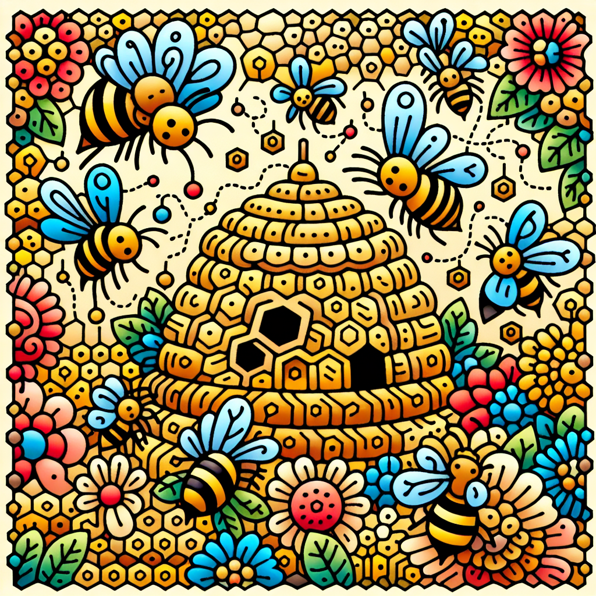

# Buzzy Buddies: The Honey Makers

## A Sweet Introduction

Have you ever wondered how that sticky, golden goodness we love to drizzle on our pancakes or spread on our toast is made? Well, get ready to be amazed because today we're going to explore the secret life of bees and discover how these incredible insects turn flower nectar into the liquid gold we call honey!

## The Nectar Collectors

Bees are nature's expert foragers. They fly from flower to flower, sipping up the sweet nectar that plants produce to attract pollinators. Using their long, straw-like tongues, they slurp up this sugary liquid and store it in a special honey stomach, separate from their regular tummy.

## The Honey Factory

Once a bee's honey stomach is full, it heads back to the hive, where the real magic happens. Inside the hive, the nectar is passed from bee to bee through a process called "regurgitation." Yep, you read that right – the bees basically puke the nectar into each other's mouths!

But don't worry, it's not as gross as it sounds. This process helps to break down the complex sugars in the nectar into simpler ones, making it easier for the bees to digest and store.

## Experiment Time: Make Your Own Honey Candy

Want to see how bees turn that liquid nectar into thick, gooey honey? Try this fun experiment at home:

You'll need:

- 1 cup of sugar
- 1/2 cup of water
- A saucepan
- A wooden spoon
- A candy thermometer (if you have one)

Instructions:

1. In the saucepan, combine the sugar and water.
2. Heat the mixture over medium heat, stirring constantly, until it reaches 300°F (150°C) on the candy thermometer or until a small amount of the mixture dropped into a glass of cold water forms a hard, brittle thread.
3. Carefully pour the hot syrup onto a greased baking sheet or silicone mat.
4. Allow the syrup to cool completely, then break it into pieces.

Voilà! You've just made your own honey candy, similar to the way bees turn nectar into honey by removing the water and concentrating the sugars.

## Fun Bee Facts

- A colony of bees consists of one queen bee, thousands of worker bees, and a few hundred male bees called drones.
- Bees communicate through a special "waggle dance" to tell other bees where the best flowers are located.
- A single bee colony can produce up to 200 pounds of honey per year!
- Honey is the only food that never spoils – archaeologists have found pots of honey in ancient Egyptian tombs that are still edible!

## The Sweetest Conclusion

Bees are truly amazing creatures, and their ability to turn flower nectar into delicious honey is just one of the many wonders of nature. So the next time you enjoy a spoonful of honey, remember the incredible journey it took and the hard work of those buzzy buddies who made it possible.

Why not try your hand at beekeeping or planting a bee-friendly garden? There's so much more to explore in the fascinating world of bees and honey!
