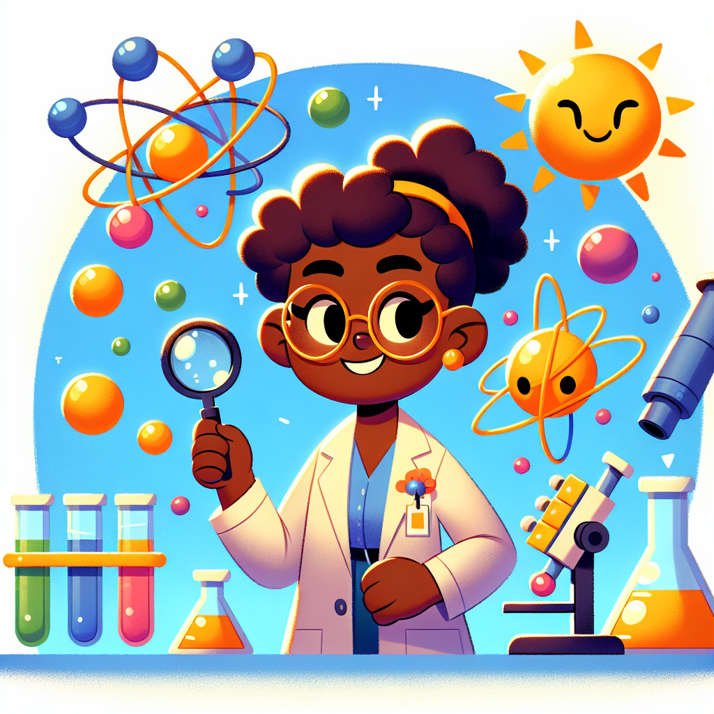

# Cracking Atoms with Dr. Jackson: How One Brilliant Physicist Changed Our World!

## The Amazing Journey of a Science Superstar!

Have you ever wondered what's inside an atom? Or how telephones and mobile phones work so brilliantly? One incredible scientist named Dr. Shirley Ann Jackson has spent her whole life exploring these tiny mysteries! Imagine being so clever that you could study things thousands of times smaller than a grain of sand. That's exactly what Dr. Jackson did, becoming one of the world's most important nuclear physicists. 🔍

What makes Dr. Jackson even more amazing is that when she was growing up, very few women—especially Black women—were encouraged to become scientists. But she followed her curiosity anyway and made history! Just like when you're determined to build the tallest LEGO tower ever, Dr. Jackson was determined to understand the secrets of atoms.

## The Big Idea: Tiny Atoms, Enormous Impact!

Dr. Shirley Ann Jackson is a nuclear physicist—that means she studies the tiniest bits of matter that make up everything around us. Atoms are so small that millions of them could fit on the full stop at the end of this sentence! Yet understanding these tiny particles helps us create electricity, medical treatments, and even mobile phones.

Here are some fascinating facts about Dr. Jackson:

1. She was born in Washington, D.C. in 1946 when segregation was still common in America
2. She became the first African-American woman to earn a doctorate from the Massachusetts Institute of Technology (MIT) in 1973
3. She studied subatomic particles—the tiny bits inside atoms
4. She became the chairperson of the U.S. Nuclear Regulatory Commission
5. She later became president of Rensselaer Polytechnic Institute, one of America's oldest universities
6. Her work has helped make nuclear power plants safer

**Did You Know?** Dr. Jackson invented technologies that led to the creation of caller ID, call waiting, and portable fax machines! Every time your parents check who's calling before answering the phone, they're using technology that came from Dr. Jackson's brilliant ideas.

### Science Spotlight: From Laboratory to Everyday Life

When Dr. Jackson was studying particles in the 1970s, many people couldn't imagine how this work would affect our daily lives. But her research on the way electrons (tiny parts of atoms with electrical charge) behave led to incredible technologies we use every day!

Dr. Jackson's work in theoretical physics helped scientists understand how to use semiconductor materials—special substances that can control electrical currents. These materials are now crucial in making mobile phones, computers, and even solar panels work! During recent health challenges like the COVID-19 pandemic, the telecommunications technologies she helped develop became even more important, allowing people to speak with doctors remotely and stay connected with loved ones while staying safe at home.

What's particularly inspiring about Dr. Jackson is that she didn't just stop at scientific research. She became a leader who helped make rules to keep nuclear power safe, showing that scientists can also be brilliant leaders who help protect people!

## Hands-On Discovery: Make Your Own "Atomic Connections"!

Let's explore how atoms connect to form different materials—just like Dr. Jackson studied in her work!

### Materials You'll Need:
* Different coloured modelling clay or Play-Doh (at least 3 colours)
* Toothpicks
* Paper
* Coloured pencils
* Adult supervision for handling toothpicks

### Safety Warning: 
Toothpicks have sharp ends! Always ask an adult to help, and be careful not to poke yourself or others.

### Instructions:

1. Roll small balls of clay in different colours. These represent different atoms (like oxygen, hydrogen, carbon).
2. Use toothpicks to connect your "atoms" together.
3. Try making different patterns and shapes. Can you make a line? A triangle? A 3D shape?
4. On your paper, draw what you've created and label which real elements your colours might represent.
5. Try breaking your creation apart and rearranging it—this is similar to what happens in chemical reactions!

### Expected Results:
You'll create models that show how different atoms can connect in various ways to form molecules and compounds. Some connections might be stronger than others!

### The Science Behind It:
Real atoms connect through what scientists call "bonds." These bonds happen when atoms share or transfer electrons (tiny negatively charged particles). The way atoms bond determines whether something is a solid, liquid, or gas, and what properties it has. Dr. Jackson studied these connections at an even deeper level, looking at the subatomic particles (protons, neutrons, and electrons) that make up atoms and how they behave.

In real life, atoms don't use toothpicks to connect! Instead, they share or exchange electrons, creating invisible forces that hold them together. Some connections are very strong (like in diamonds), while others are weaker (like in water).

## Fun Facts and Mind-Bogglers!

* Dr. Jackson was nicknamed "Shirley the Great" by other students because she was so brilliant at solving difficult maths problems!

* The particles Dr. Jackson studied are so small that it would take about 10 million atoms lined up in a row to equal the thickness of a sheet of paper!

* Wow statistic: The nuclear power plants that Dr. Jackson helped make safer produce enough electricity to power over 20 million homes in the UK!

* Dr. Jackson's work on telecommunications helped create technology that connects billions of people around the world every day. Every time you video chat with a friend or family member, you're benefiting from science similar to what she studied!

## Explorer's Challenge

Ready to become a science explorer like Dr. Jackson? Try these activities:

1. **Atom Detective**: Look around your home and make a list of 10 different materials (metal, plastic, wood, etc.). Research what atoms they're made of and draw pictures of these atoms.

2. **Communication Investigation**: With an adult's help, learn how telephones have changed over the last 50 years. How have Dr. Jackson's contributions made communication better?

3. **Think about this**: Dr. Jackson succeeded even when many people didn't believe she could become a scientist. What's something you'd like to achieve that might seem difficult? What small steps could you take to reach that goal?

4. **Energy Explorer**: Nuclear energy doesn't produce air pollution like burning coal or gas, but it creates radioactive waste. If you were a scientist like Dr. Jackson, what ideas might you have for creating clean energy?

## The Big Question

Dr. Shirley Ann Jackson showed us that understanding tiny things like atoms can lead to enormous changes in our world. From safer nuclear power to the mobile phones we use every day, her curious mind and determination have touched all our lives.

What tiny mysteries might YOU solve someday? Perhaps there are particles even smaller than the ones Dr. Jackson studied, waiting for a curious young scientist like you to discover them! Or maybe you'll find new ways to use the science we already know to solve big problems like climate change or creating new medicines.

Remember, every scientific journey begins with asking questions and being curious—just like Dr. Jackson did. What questions are you curious about today?
