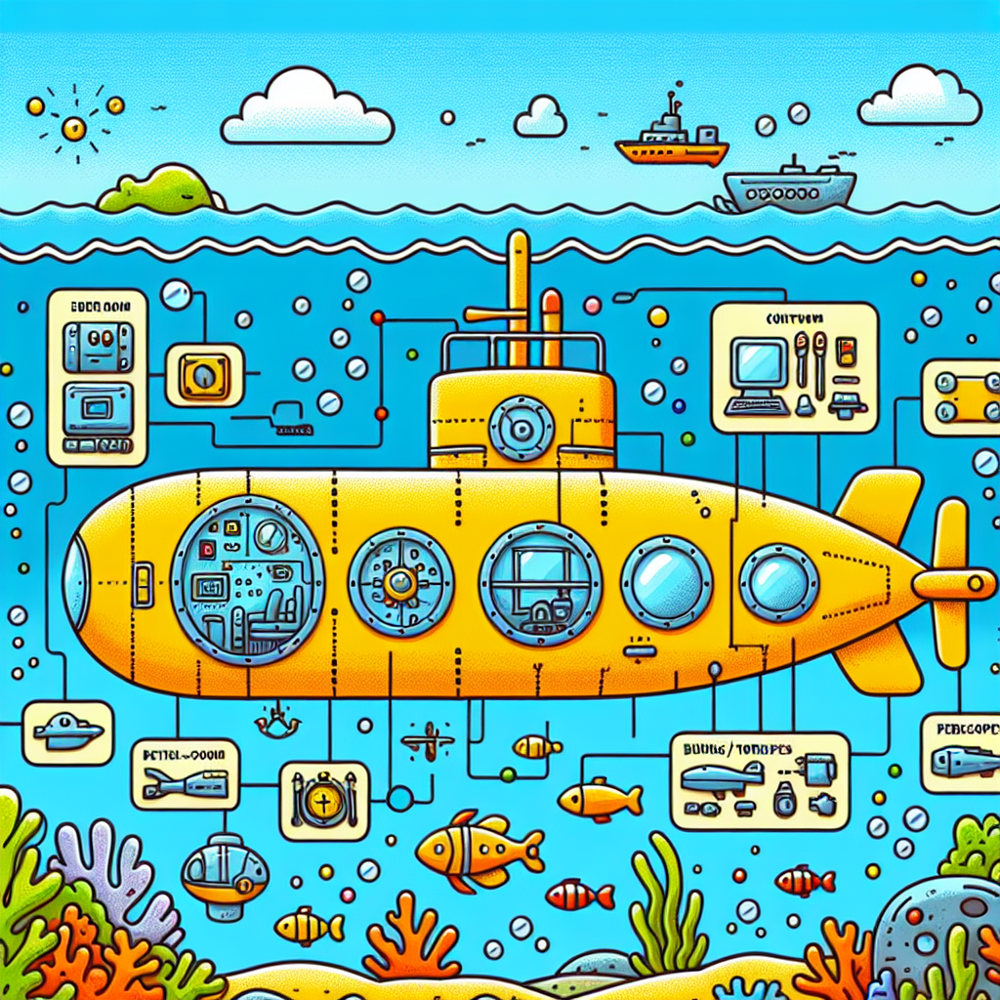

# Submerge into the Secrets of Submarines

Are you ready to explore the depths of the ocean and uncover the mysteries of how submarines stay underwater? Get your diving gear ready because we're about to take a deep dive into the fizzy physics and material mysteries that make these marvellous machines buoyant!

## An Exciting Introduction

Submarines are incredible vessels that can navigate the vast ocean depths, allowing us to explore and study the underwater world like never before. But have you ever wondered how these massive metal machines manage to stay submerged? It's all thanks to a fascinating scientific principle called buoyancy!

## Buoyancy: The Key to Underwater Adventures

1. **Archimedes' Principle**: This principle, discovered by the ancient Greek scientist Archimedes, states that when an object is immersed in a fluid (like water), it experiences an upward buoyant force equal to the weight of the fluid it displaces. In other words, the more water a submarine displaces, the more buoyant force it experiences.

2. **Ballast Tanks**: Submarines have special tanks called ballast tanks that can be filled with water or air. When the ballast tanks are filled with water, the submarine becomes denser and sinks. When the tanks are filled with air, the submarine becomes more buoyant and rises to the surface.

3. **Trim and Depth Control**: By carefully adjusting the amount of water and air in the ballast tanks, submarines can control their buoyancy and maintain a desired depth. This process is called "trimming" and is essential for navigating the ocean depths safely and efficiently.

## Fizzy Submarine Experiment

Now it's time for a fizzy and bubbly experiment! You'll need:

- A plastic bottle (like a soda bottle)
- Baking soda
- Vinegar
- A funnel (optional)

Here's what you do:

1. Fill the bottle about one-quarter full with water.
2. Add a spoonful of baking soda to the bottle.
3. Using the funnel (if you have one), slowly pour in some vinegar.
4. Watch as the chemical reaction between the baking soda and vinegar creates bubbles and makes the bottle rise and fall in the water, just like a submarine!

## Fun Facts

- The first submarine was invented in 1620 by Cornelius Drebbel, a Dutch inventor and engineer.
- Nuclear submarines can stay submerged for months at a time without surfacing.
- Some submarines can dive to depths of over 6,000 meters (nearly 20,000 feet)!

## Conclusion

Submarines are truly incredible machines that allow us to explore the ocean's depths like never before. By understanding the principles of buoyancy, ballast tanks, and trim control, we can appreciate the amazing engineering and physics that go into keeping these vessels submerged. So, the next time you see a submarine, remember the fizzy physics and material mysteries that make it possible!

If you're curious to learn more, why not visit a local aquarium or maritime museum? Or you could even try building your own model submarine using household materials. The underwater world is waiting for you to explore it!
