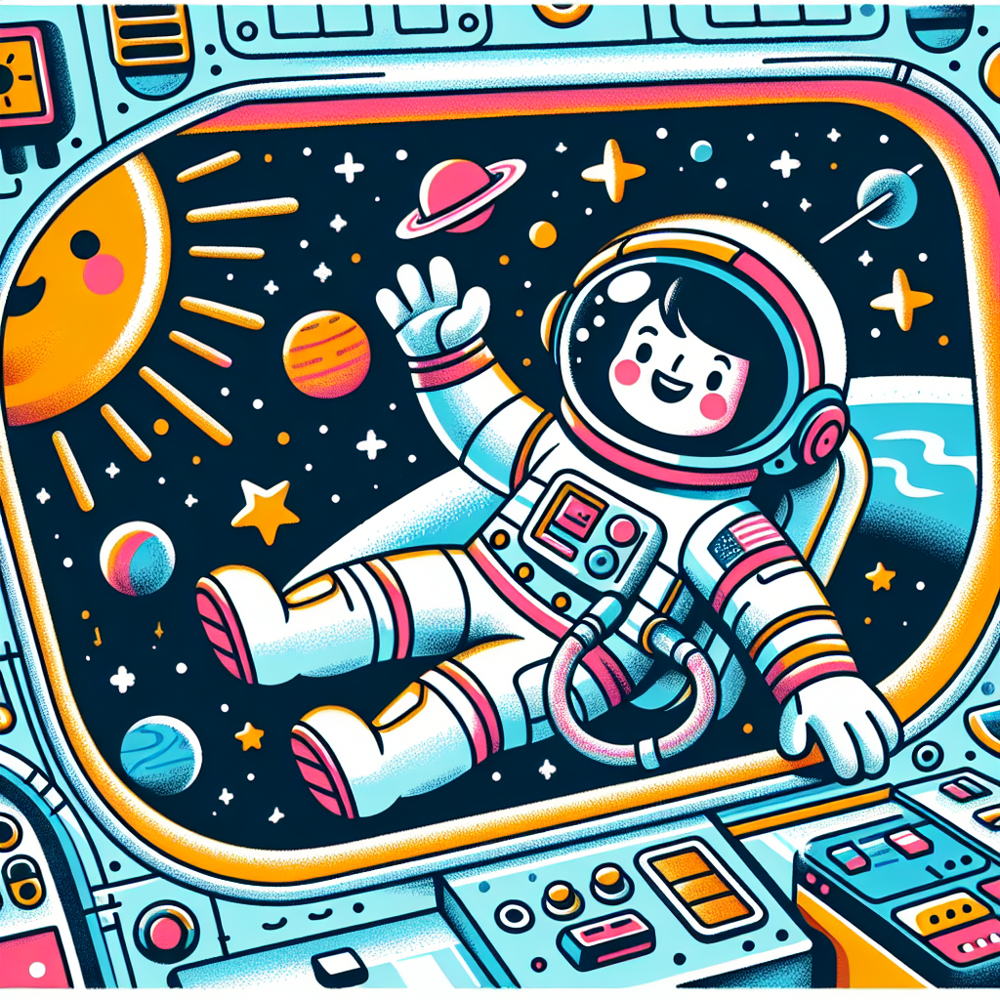

## Let's Discover Something Amazing!

Have you ever dreamed of blasting off into space like a real-life astronaut? 🚀 Well, imagine being the very first woman to leave Earth's cosy embrace and venture into the great unknown! That's exactly what Valentina Tereshkova did when she became the first female cosmonaut in 1963.

Back then, space travel was still a brand-new frontier, and no woman had ever left our planet's atmosphere. But Valentina was determined to reach for the stars! After training hard as a skilled skydiver and amateur parachutist, she was chosen for an incredibly daring space mission.

## Time to Get Our Hands Dirty!

**YOUR MISSION:** Create your own "anti-gravity" funnel and watch as water appears to defy the laws of physics!

**What You'll Need:**

- A plastic bottle
- Some tape
- A piece of string or twine
- Water
- An adult's help

**Instructions:**

1. Ask an adult to carefully poke a small hole in the side of the bottle, near the bottom.
2. Cover the hole with tape, leaving a small flap to open and close it.
3. Fill the bottle about 3/4 full with water and tightly cap it.
4. Tie the string tightly around the bottle's neck, leaving a long tail to swing it by.
5. Go outside and, with an adult's supervision, swing the bottle in a circular motion.
6. Quickly open the tape flap to let air in, then close it again.

**What Happened?** The swinging motion created a centrifugal force that pushed the water away from the hole, allowing air to enter without the water spilling out! This is similar to how astronauts can drink from special bags in zero-gravity conditions.

**Safety Notes:** Do this experiment outside in case of spills. Don't swing the bottle too hard or near anyone's face.

## Mind-Blowing Facts!

- 🌍 Valentina orbited the Earth a whopping 48 times during her historic 3-day mission!
- ⏱️ Her total spaceflight lasted an incredible 70 hours and 50 minutes.
- 🥇 At just 26 years old, she remains the youngest woman ever to travel to space.
- 👩‍🚀 More than 50 years later, only about 60 women have ever been to space!

## Your Turn to Explore!

Now that you've got a taste of space science, why not try these cosmic challenges?

- Design and build your own model spacecraft or spacesuit from household materials.
- Research other pioneering women in STEM and create fun fact cards about them.
- Plan a nutritious meal for an astronaut on a long space mission.
- Investigate how astronauts stay healthy in microgravity conditions.

## The Big Question

Valentina's journey proved that with courage, hard work, and big dreams, anything is possible – even travelling to space! So what amazing adventure would YOU like to embark on if you had the chance? Let your imagination soar!
