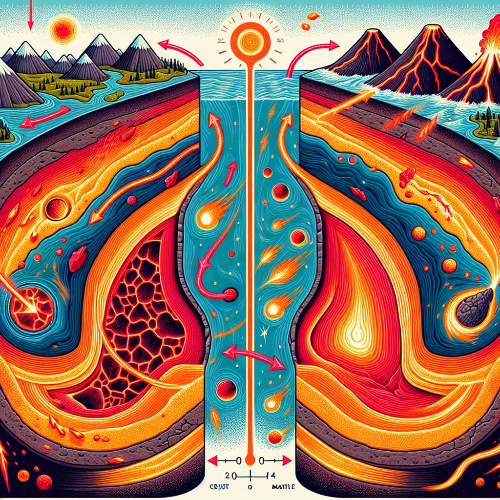

## Can You Keep a Secret? The Earth Can't!

Have you ever seen pictures or videos of volcanoes erupting? 🌋 It's like the Earth is having a massive burp, spewing out red-hot lava, clouds of ash, and gases from deep inside! But why do volcanoes erupt in the first place? Let's dive into the fiery secrets hidden beneath our planet's surface.

## The Big Idea: A Constantly Moving Planet

Our Earth might seem like a solid, unmoving mass of rock, but it's actually full of surprises! The outer layer, called the crust, is made up of huge pieces called tectonic plates that are slowly but constantly moving and shifting.

**Did You Know?**

- There are about 20 major tectonic plates on Earth, and they're all moving at different speeds!
- The fastest plate, the Cocos Plate near Mexico, moves at a zippy 7.8 cm (3 inches) per year – that's about as fast as your fingernails grow!

These plates are like giant jigsaw puzzle pieces floating on top of the Earth's semi-molten mantle, the super-hot layer beneath the crust. As the plates move and grind against each other, enormous forces build up, causing the edges to crumple, crack, or even dive underneath each other.

**Science Spotlight:** In the 1960s, scientists like Harry Hess and Robert Dietz discovered seafloor spreading and plate tectonics, revolutionizing our understanding of the Earth's dynamic surface. Their work helps explain earthquakes, volcanoes, and even how continents move over millions of years!

## Time to Get Our Hands Dirty!

Let's see these tectonic plates in action with a simple experiment! You'll need:

- A shallow pan or baking tray
- Flour
- Food coloring (optional)
- A piece of cardboard or thick paper

🛑 Safety First: Ask an adult for help, and be careful not to make too much mess!

1. Cover the bottom of the pan with a thin, even layer of flour (add a few drops of food coloring if you want).
2. Place the cardboard piece in the center of the flour, pressing down gently.
3. Slowly drag the cardboard piece in different directions, watching how the flour "crust" cracks, wrinkles, and moves!

**The Science Behind It:** The cardboard represents a tectonic plate, and the flour is like the Earth's crust. As you move the "plate," you can see how the crust gets compressed, stretched, and even broken apart – just like real tectonic plates!

## Mind-Blowing Facts!

- The largest volcanic eruption in recorded history was the 1815 eruption of Mount Tambora in Indonesia, which ejected enough ash and debris to lower global temperatures for a year! 🌡️
- If you could gather all the lava erupted by Hawaiian volcanoes in the last 30 years, it would be enough to fill over 10,000 Olympic-sized swimming pools! 🏊‍♀️

## Your Turn to Explore!

- Try making a volcano model using baking soda, vinegar, and some playdough. Can you create a realistic-looking eruption?
- Research the "Ring of Fire," a region in the Pacific Ocean where most of the world's volcanic activity occurs. Why do you think it's called that?
- Imagine you're a volcanologist (a scientist who studies volcanoes). What kind of equipment would you need to study an active volcano safely?

## The Big Question

Volcanoes might seem like terrifying, destructive forces of nature, but they also play a crucial role in shaping our planet's landscape and atmosphere. Without volcanic activity, we wouldn't have fertile soils for agriculture or valuable mineral resources. So, the next time you see footage of a volcanic eruption, remember – it's just the Earth's way of reminding us how alive and dynamic our planet really is! 🌍
