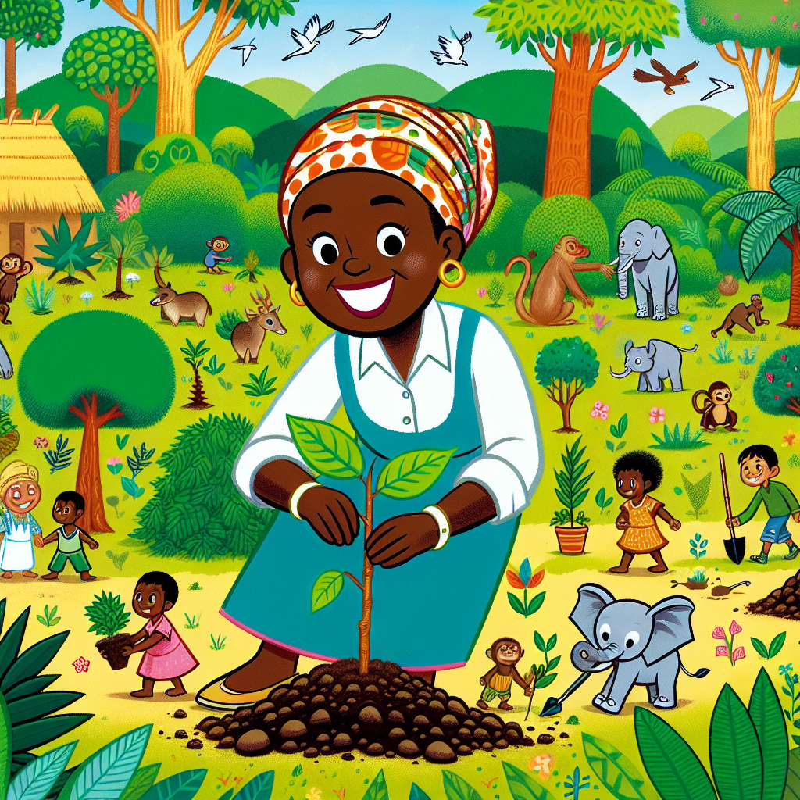

## Can You Hear the Trees Whispering?

Have you ever been out in nature and felt like the trees were talking to you? 🌳 That's exactly how Wangari Maathai felt when she was a young girl in Kenya. She loved listening to the gentle rustling of leaves and imagining the amazing adventures trees must have witnessed over their long lives.

## The Big Idea: One Warrior, Millions of Trees

Wangari grew up to become a brilliant scientist and an unstoppable force for nature. In 1977, she founded the Green Belt Movement, which has now planted over 51 million trees across Africa! 🌳🌳🌳 But Wangari didn't just plant trees – she empowered thousands of women to become "foresters without forests," giving them a way to grow sustainable sources of wood for fuel and earn income.

**Did You Know?**

- 🌳 Trees are like the lungs of our planet, producing oxygen for us to breathe!
- 🌳 Forests provide homes for over 80% of the world's land animals and plants.
- 🌳 One large tree can provide a day's supply of oxygen for up to four people.

Wangari's work showed how trees are vital for human communities too. Healthy forests help prevent soil erosion, provide sustainable wood for fuel and construction, and create green spaces for people to enjoy.

**Science Spotlight:** The "Butterfly Effect" and Wangari Maathai
You may have heard of the "butterfly effect" – the idea that tiny causes can have huge effects over time. Wangari's story shows this beautifully! By starting small (planting just seven trees on Earth Day 1977) and inspiring others, she sparked a worldwide reforestation revolution. Her work even helped promote democracy and women's rights in Kenya. Today, the Green Belt Movement has supporters in over 30 countries!

### Time to Get Our Hands Dirty!

**The Seed Bomb Experiment**
Let's make some "seed bombs" to help grow new trees and flowers! These are little balls of soil, seeds, and other natural materials that you can throw onto empty land to create new green spaces.

_Materials Needed:_

- Potting soil or compost
- Seeds (wildflower mixes work great)
- Water
- Optional: clay powder, compost/manure

_Step 1:_ Mix equal parts soil and seeds in a bowl or bucket. Add just enough water to make a thick, moldable mixture.

_Step 2:_ If using clay powder, mix in a few tablespoons. This helps bind the seed bombs.

_Step 3:_ Roll the mixture into small, firm balls about the size of a cherry tomato.

_Step 4:_ Let the seed bombs dry out completely before use.

_Step 5:_ Find an area that could use some new plant life and throw your seed bombs! Be sure to check for any rules about planting first.

_The Science Behind It:_ The seed bomb's soil provides nutrients for the seeds to sprout, while the outer layer protects them until conditions are right for growth. As the bomb dries, air pockets form inside to allow oxygen and water in when it lands in a good spot.

**Safety First!** Ask an adult before throwing seed bombs, and avoid areas where new plants could be a problem (like farmland). Only use seed mixes labeled for your region.

## Mind-Blowing Facts!

- 🌳 Forests cover about 30% of the world's land area – that's over 15 million square miles!
- 🐘 An estimated 50-90% of all life on Earth lives in rainforest habitats.
- ⏳ The oldest living tree species is the bristlecone pine, with some trees over 4,800 years old!
- 💨 One tree can remove 48 pounds of carbon dioxide from the air each year.

## Your Turn to Explore!

- 🔍 Research plants native to your area and make a guide to help identify them.
- 🥪 Have a "No Food Waste" week and compost any leftovers to make soil for planting.
- 📝 Start a nature journal to record cool plants and critters you see outdoors.
- ♻ Look for ways to reduce, reuse, and recycle more at home and at school.

## The Big Question

Wangari Maathai often said, "Until you dig a seed, you can't know what it will grow." What "seeds" could you plant in your community to create positive change? Maybe you'll grow the next big idea to help make our world a little greener! 🌎
