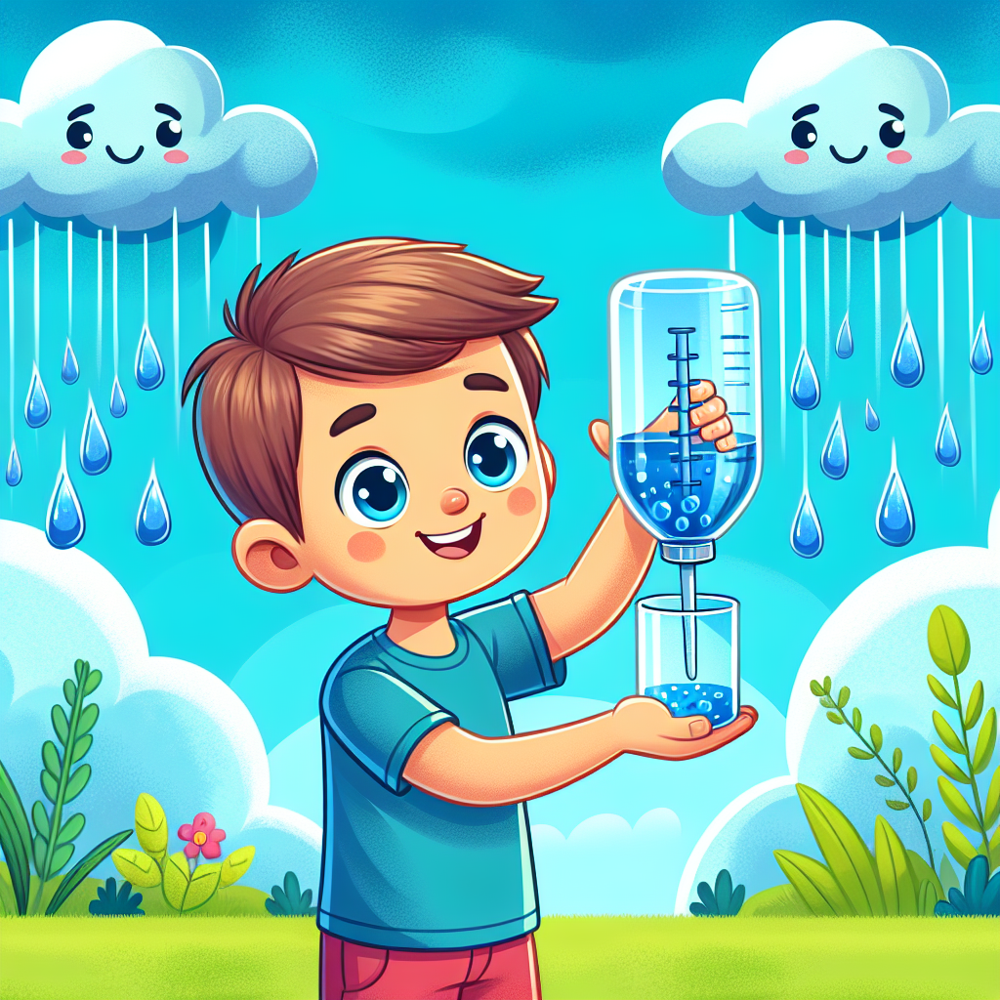

Have you ever jumped in a puddle and thought, "Where did all this water come from?" 🤔 The answer lies way up in the clouds! Rain is an amazing natural phenomenon that helps plants grow, fills up rivers and lakes, and even gives us the water we drink.

But have you ever tried to measure how much rain falls from the sky? It's time to become a weather detective and build your own rain gauge! With this nifty tool, you can keep track of every raindrop and discover just how much precipitation your area receives. Get ready for a splashing good time! 💦

Rain is formed when water vapour (tiny droplets of water) in the clouds gets cooler and starts to condense into larger droplets. As these droplets get heavier, gravity pulls them down towards the Earth's surface – and that's when we experience rain!

Measuring rain is really important for understanding our weather patterns and climate. Scientists use special instruments called rain gauges to collect and measure the amount of rainfall over a certain period of time.

But did you know you can make your own rain gauge at home? It's like having your very own mini weather station! All you need is a few simple materials, and you'll be able to track every raindrop that falls in your backyard or neighbourhood.

### Make Your Own Rain Gauge

**Materials Needed:**

- A clear plastic bottle (like a 2-litre soda bottle)
- Permanent marker
- Scissors
- Ruler
- Modelling clay or plasticine
- Small pebbles or stones

**Safety Note:** Be careful when using scissors and ask an adult for help if needed.

**Adult Supervision:** You may need an adult to help with cutting the bottle.

**Step 1:** Use the permanent marker to draw a line around the bottle about 10 cm from the bottom. This will be the water collection area.

**Step 2:** Carefully cut off the top part of the bottle above the line you drew. This will be the funnel for catching raindrops.

**Step 3:** Use the ruler to measure and mark centimetre lines on the side of the bottle, starting from the bottom. These will be your measurement lines.

**Step 4:** Place a small ball of modelling clay or plasticine at the bottom of the bottle. This will help weigh it down and keep it steady.

**Step 5:** Add a few small pebbles or stones to the clay. This will prevent the rain gauge from blowing over in the wind.

**Step 6:** Find a level spot outside, away from trees or buildings, and place your rain gauge there. Make sure the funnel part is facing upwards to catch the rain.

**What's Happening?** As raindrops fall into the funnel, they will collect in the bottom part of the bottle. The measurement lines on the side will help you see how much rain has accumulated over time. Isn't it amazing how a simple bottle can turn into a powerful weather-tracking tool?

## Fun Facts and Mind-Bogglers

- Did you know that a rain gauge is also called a udometer or a pluviometer? Those are some fancy words for a simple but important instrument!

- The highest rainfall ever recorded in a single year was a whopping 26.47 metres (86.9 feet)! That's taller than a three-story building! This incredible downpour happened in Cherrapunji, India, in the year 1861.

- Some animals, like the Mexican moss frog, can actually survive being dried out completely and then "come back to life" when it rains again! 🐸

- Rain is not just water – it can also contain tiny particles of dust, smoke, and even bacteria that get swept up into the clouds. That's why rainwater sometimes has a slightly different taste or smell.

## Explorer's Challenge

Now that you've built your own rain gauge, it's time to put your weather detective skills to the test! Here are some challenges for you:

- Keep a daily record of the rainfall measurements in your area. Can you spot any patterns or trends?
- Research the different types of precipitation (rain, snow, sleet, hail) and learn how they form.
- Try making a simple weather vane or anemometer (wind speed meter) to complement your rain gauge.
- Investigate how rainfall affects the environment around you, such as plant growth or water levels in nearby streams or ponds.

Don't forget to share your discoveries with your friends and family! Who knows, you might inspire them to become weather watchers too.

## The Big Question

You've learned so much about the wonders of rain and how to measure it. But have you ever thought about where all that water goes after it falls to the ground? 🤔

Some of it evaporates back into the air, some gets absorbed by plants and soil, and some flows into rivers, lakes, and oceans. It's all part of the amazing water cycle that keeps our planet alive and thriving. What other secrets of the water cycle can you uncover?
