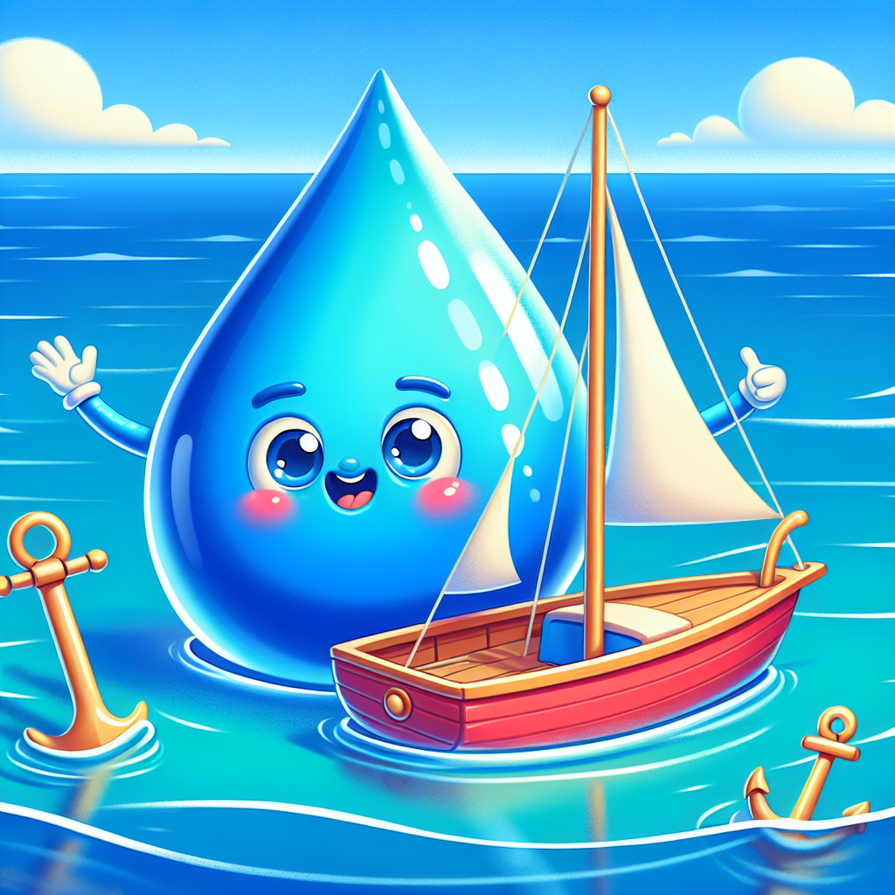

## Let's Discover Something Amazing!

Have you ever wondered why huge ships can float on water without sinking? 🚢 It seems like a bit of magic, doesn't it? But behind this watery wonder, there's an incredible scientific concept called buoyancy!

Buoyancy is the force that allows objects to float or sink in a liquid. It's like an invisible hand pushing up on anything placed in water, counteracting the pulling force of gravity. The more buoyant an object is, the better it can float!

## Time to Get Our Hands Dirty!

### The Cartesian Diver Experiment

Let's see buoyancy in action with this classic science experiment! Here's what you'll need:

**Materials:**

- A plastic bottle with a tight lid (a clear one works best)
- A pen casing or small plastic straw
- Some modelling clay or blu-tack
- Water

**Safety Note:** This experiment involves some squeezing of the bottle, so adult supervision is recommended, especially for younger scientists.

**Steps:**

1. Fill the bottle about 3/4 full with water and put the lid on tightly.
2. Mould a small amount of clay around one end of the pen casing/straw to make it heavy enough to sink.
3. Carefully drop your "diver" into the bottle.
4. Give the bottle a gentle squeeze and watch what happens!

**What's Happening?** When you squeeze the bottle, you increase the pressure inside, which causes the trapped air around the diver to compress. This increases the diver's density, making it sink. When you stop squeezing, the air expands again, decreasing the density and allowing the diver to float back up!

## Mind-Blowing Facts!

- Did you know that a solid steel ball would float on the liquid metal mercury? 🥈 It's all about their different densities!
- The largest floating vessel ever built is the Seawise Giant oil tanker, which was over 1/3 of a mile long! 🚢🏭
- Some plants and insects can walk on water using a clever trick called surface tension. It's like having sticky water feet! 💧🐞

## Your Turn to Explore!

🔍 Here are some challenges for you to investigate buoyancy further:

- Collect different objects and predict whether they will sink or float in water before testing them out.
- Design a foil boat that can hold as many coins or marbles as possible without sinking.
- Research Archimedes and his famous "Eureka!" moment about buoyancy.

## The Big Question

Why do you think some things float better than others? What factors might affect an object's ability to float or sink? Keep exploring and unravelling the mysteries of buoyancy! 🐋
